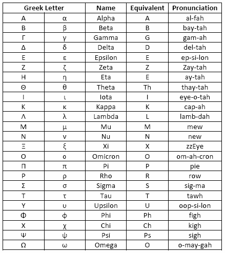

---
author:
- Phil 234
title: Overview
...

Chronology of Major Historical Events {#chronology-of-major-historical-events .unnumbered}
=====================================

-   c. 12th Century BCE: Trojan War, North Turkey, semi-mythical,
    the last year is recounted in Homer’s *Iliad*

-   8th Century BCE: Greek colonies populate southern Italy, Ionia
    (western Turkey), and elsewhere, Greek religion described by Hesiod
    holds sway

-   585 BCE: Thales’ alleged prediction of an eclipse, the “beginning”
    of ancient philosophy

-   6th–5th Century BCE: Presocratic Philosophy, centered around
    Asia Minor (Turkey), Greece, and Southern Italy

-   490 BCE: First Persian Invasion of Greece, under Darius
    1

-   480 BCE: Second Persian Invasion of Greece, under Xerxes
    (famous Battle of the 300 at Thermopylae), Athens is becoming center
    of Greece

-   470/69 BCE: Socrates is born in Athens

-   431–404 BCE: Peloponnesian War between Athens and Sparta, ends
    with Athens’ defeat

-   428/27 BCE: Plato is born, studies with Socrates

-   399 BCE: Socrates is executed for impiety and corrupting the
    youth of Athens

-   387 BCE: Plato establishes the Academy

-   384 BCE: Aristotle is born in Stagira, Macedonia

-   c. 363 BCE: Aristotle goes to study at Plato’s Academy

-   356 BCE: Alexander the Great, son of King Phillip of
    Macedonia, is born

-   348 BCE: Plato dies. Aristotle leaves the Academy and Athens,
    moves to the island of Lesbos and establishes the studies of botany
    and zoology

-   343–340 BCE: Aristotle tutor Alexander in Macedonia

-   334/35 BCE: Aristotle establishes the Lyceum in Athens

-   336–323 BCE: Alexander the Great conquers “all”, initiating
    the Hellenistic Age (*Hêllas* = Greece)

-   323 BCE: Aristotle flees Athens 

-   322 BCE: Aristotle dies

-   196–86 BCE: Gradual takeover of Greece (and “Asia”) by
    Rome

-   31 BCE: Battle of Actium ends Roman civil wars; Octavian
    becomes *de facto* emperor (recognized more formally in 27 BCE);
    transition from Roman Republic to Empire

-   1st–5th Century CE: Spread of Christianity (towards the end of
    this period, it is adopted by many Roman elite, replacing dominance
    of polytheistic, “pagan” religion)

-   476 CE: Rome finally conquered, Western Roman Empire falls
    (but lives on in the East, centered around Constantinople until 1453
    CE (when Conquered by Ottoman Empire and renamed “Istanbul”))

-   529 CE: Justinian, emperor of Eastern Roman Empire, declares
    all pagan schools closed, i.e., the Academy and the Lyceum, marking
    the end of “ancient” philosophy (but much of it lived on, for
    example in Islamic and Christian philosophy)

Major Philosophical Periods and Philosophers {#major-philosophical-periods-and-philosophers .unnumbered}
============================================

-   Presocratic: 6th–5th Century BCE (centered around Asia Minor
    (Turkey), Greece, and Southern Italy) (**NB**: Several of these
    thinkers were contemporary with or even younger
    than Socrates)

    -   Thales’ alleged prediction of an eclipse in 585 BCE
        traditionally marks the “beginning” of Ancient Philosophy
        (so, Ancient Philosophy spans from 585 BCE–529 CE)

    <!-- -->

    -   Major philosophers: Thales, Anaximander, Anaximenes,
        Xenophon, Heraclitus, Parmenides, Zeno, Anaxagoras, Empedocles,
        Leucippus, Democritus

    -   Sophists: Mix of rhetoricians, politicians, and itinerant
        teachers who taught “success” at political life for a fee (much
        maligned by Plato)–Gorgias, Protagoras, Melissus

-   Classical: 5th–4th Century BCE (centered around Athens)

    -   Socrates: 470/69–399 BCE (executed for impiety and
        corrupting the youth)

    -   Plato: 428/27–348 BCE (“student” of Socrates; founded the
        Academy appx. 387 BCE)

    -   Aristotle: 384–322 BCE (went to study at Plato’s Academy
        at age 17, left after Plato’s death (aged 37); founded the
        Lyceum 335 BCE)

-   Hellenistic: 3rd Century BCE–2nd Century CE (centered around
    Athens, (later) Alexandria, and (even later) Rome)

    -   Major philosophers and “schools”: Epicureanism (Epicurus,
        Lucretius), Stoicism (Zeno, Cleanthes, Chrysippus, Posidonius,
        Seneca, Marcus Aurelius), Skepticism (Plato’s Academy beginning
        under Arcesilaus, Cicero, Sextus Empiricus)

        -   Some people distinguish an “Imperial” period
            (corresponding to the time of the Roman Empire), containing
            Cicero, Seneca, Marcus Aurelius, and others. But, these
            thinkers mainly just advanced earlier
            Hellenistic philosophy.

-   “Late Antiquity”: 2nd–6th Century CE

    -   Neoplatonism (Plotinus); Rise of Christianity and
        Christian Philosophy; Many commentaries on Aristotle (Alexander
        of Aphrodisias, Simplicius, Philoponous)

The Central Task of the Historian of Philosophy {#the-central-task-of-the-historian-of-philosophy .unnumbered}
===============================================

-   Determine what view the historical figure is presenting

-   Determine what reasons the historical figure offers to commend
    that view

-   Determine why those reasons might have seemed to that figure
    to be good reasons to accept that view

-   Determine whether and why you agree or disagree with the
    view

Methodological Principles {#methodological-principles .unnumbered}
=========================

-   Ancient $\neq$ Dumb

-   Principle of Charity: If two interpretations are equally
    consistent with the text, attribute the more philosophically
    interesting view to the author.

-   Principle of Humility: Be humble in your approach to
    these texts. If you have an interpretation that attributes an absurd
    view to a thinker, you should suspect that you haven’t exactly
    figured out what the view is. These views (like all views) can be
    challenged, but must be challenged *respectfully*.

Greek Alphabet {#greek-alphabet .unnumbered}
==============

