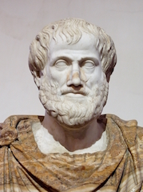

# Ethics: Happiness, Friendship & the Good Life

## Course Information
+ [Syllabus](Syllabus.pdf)
+ [Grading information](/Teaching/Grading/)
+ [Resources](/Teaching/Resources/)
+ [Contact information](/Contact)
+ [Office hours](/Contact/Office)
+ [Blackboard](http://blackboard.njcu.edu) 

### Greek Links 

+ [A nice documentary on Ancient Greece](https://www.youtube.com/watch?v=-dwWocwd160)
+ [An interactive site about Greece](http://www.ancientgreece.co.uk/)
+ [An interactive version of Raphael's *School of Athens*](http://agutie.homestead.com/files/school_athens_map.html)
+ [The Acropolis reconstructed](https://www.youtube.com/watch?v=DMccsbWFAok)
+ [General introduction to Aristotle](http://plato.stanford.edu/entries/aristotle/)
+ [Documentary about Aristotle](https://www.youtube.com/watch?v=QesWw3Zz0Ms)

### Gobbets

+ 12 reading quetions will be assigned. Each reading question consists in several gobbets. For informations about gobbets, see the following guide by the Classics Department at Oxford University [here.](Gobbets/Guide.pdf)

### Assignments Due

Complete by 3pm on the first day of the week (the date in the brackets).

+ **Week 2 (9/12/16).** Complete by Monday. Please purchase the textbook by week 3. 
	+ [*Nicomachean Ethics*, Book 1, ch.1--6](Book1.pdf) (read the first seven pages)
	+ [Aristotle's *Nicomachean Ethics*: An Introduction](Pakaluk.pdf) (read pp.38--46 and as much of chapter 1 as you can)

+ **Week 3 (9/12/16).** See the sylabus for the required reading. 
	+ [Gobbets](Gobbets/1), i.e., reading question 1. This is due by Monday 9/19 at 12pm on Blackboard. (Please note that I won't continually remind you of the due dates. Assignments are always due on the relevant Monday through Blackboard at 12pm. The syllabus has full details).  

+ **Week 4 (9/26/16).** See the syllabus for the required reading.
	+ [Gobbets](Gobbets/2), i.e., reading question 2. This is due by **Monday at 3pm** through Blackboard. Note the updated time for submissions. This will be retained for the semester. I won't remind you of this due date for later weeks. 
	+ [Essay 1](Essays/1). This is due by Monday at 3pm through Blackboard. I won't remind you of this due date for later weeks. 

+ **Week 5 (10/3/26).** 
	+ [Gobbets](Gobbets/3), i.e., reading question 3. 
	+ [Essay 2](Essays/2)
	
+ **Week 6 (10/10/16).** 
	+ [Gobbets](Gobbets/4), i.e., reading question 4. 
	+ [Essay 3](Essays/3)

+ **Week 7 (10/17/16).** 
	+ [Gobbets](Gobbets/5), i.e., reading question 5. 
	+ [Essay 4](Essays/4)

+ **Week 8 (10/24/16).** 
	+ [Gobbets](Gobbets/6), i.e., reading question 6. 
	+ [Essay 5](Essays/5)
 
 + **Week 9 (10/31/16).** 
	+ [Gobbets](Gobbets/7), i.e., reading question 7. 
	+ [Essay 6](Essays/6)

 + **Week 10 (11/7/16).**
	+ [Gobbets](Gobbets/8), i.e., reading question 8.
	+ [Essay 7](Essays/7)

 + **Week 11 (11/14/16).**
	+ [Gobbets](Gobbets/9), i.e., reading question 9.
	+ [Essay 8](Essays/8)

 + **Week 12 (11/21/16).**
	+ [Gobbets](Gobbets/10), i.e., reading question 10.
	+ [Essay 9](Essays/9)
	
 + **Week 13 (11/28/16).**
	+ [Gobbets](Gobbets/11), i.e., reading question 11.
	+ [Essay 10](Essays/10)