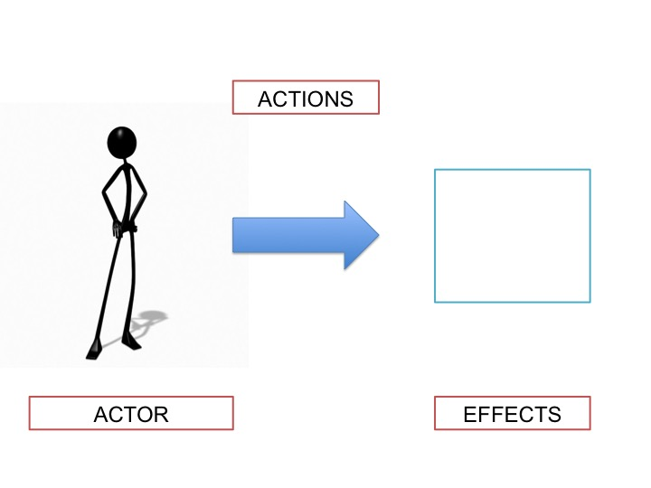

# Ethics

## Introduction ##

Ethics is one of the main specialities in philosophy. It is also the one that everyone has already had some familiarity. You have already had debates with family and peers about what's right or wrong. Even if you have had no debates, you already have opinions on a large number of these claims. 

Try this as an introspection exercise: for each statement indicate whether you agree, disagree, or have no opinion. 

1. Cheating on your partner is never permissible. 
4. Stealing is never permissible.  
5. It is never permissible to hit someone. 
3. Lying is never permissible. 
5. Killing another person is never permissible.
6. Abortion is never permissible
7. The death penalty is permissible on some occasions. 
8. Torture is permissible on some occasions. 
9. Eating meat is never permissible.  
10. I should donate to charity when I can. 

I suspect you agreed with some of these claims, but not others. I imagine you also 

## Ethics and Reasons

There is a distinction between descriptive and normative facts. The former are facts are about how the world is. The latter are facts are about how the world should be. Compare the following two claims: 

1. "I am eating sugar"
2. "I should not be eating sugar."

Morality is part of normativity. Moral judgements are about (i) how a person should act and (ii) what kind of character a person should have.

1. "Sonya is taking an exam" is a fact about what Sonya is currently doing. It says nothing about what she should be doing. 
2. "Sonya should not cheat in the exam" is a fact about how Sonya should act (irrespective of whether she does in fact act in this way.)

Moral judgements are rational. That is, we normally give reasons to support our moral judgements. Sandra should not cheat *because it is unfair to the other students*. Fairness to others is being offered as a reason to not cheat. Not all reasons are good reasons. Suppose someone claimed that Sandra should not cheat because Hermione would never cheat and one should be like Hermione. Well this seems a poor reason for our actions. 

**Ethics** is the study of reasons. It is a study of the reasons for moral judgements, which judgements are good and which are bad. The marks of a moral reason: 

1. They are overriding---morality trumps law.  
2. Impartial----apply to everyone equally, equals should be treated equally. 
3. Universal---apply to everyone
4. Are reason based---not mere emotion, or bias, but reasons that can be evaluated.  
5. Objectiv. 

### Ethical Theories

There are 3 main ethical theories. These offer standards for judging actions and persons. That is, these theories offer general claims about the appropriate reasons for morality. To introduce you to these theories, first look at this chart: 

The actor represents each of us. It's the person whose actions will be evalutated. The arrow represents the various actions people perform, e.g., walking, punching, complementing, stealing, eating meat, taking drugs, and so on and so on. The box represents the effects of our various actions. If punching someone causes them pain, then pain is an effect of punching, an action. If eating meat were to cause indigestion, then indigestion is the effect of eataing meet. 

Each moral theory proposes to explain why actions are moral or immoral, in otherwors, they to propose to explain, for each action, whether we are obligated to perform it, or whether we are prohibited from performing it, or whether it is neither.  

1. **Consequentialism** claims that the rightness and wrongness of an action depends solely on their consequences, on their effects. It says that to determine the morality of an action we are to ignore the actor side of the diagram. Their motives, intentions, and so on are irrelevant. All that matter says the consequentialist is the effects of the action.  
2. **Deontology** claims that the rightness and wrongness of an action depends entirely on the intrinsic nature of the action. It says that we are to ignore both the actor and the effects side of the diagram. Neither the motives or character of the actor is relevant in determining the morality of their actions. Neither is the effects of their actions. Some actions, the deontologist claims, are just inherently wrong, e.g., murder. 
3. **Virtue Ethics** claims that the rightness and wrongness of an action depends entirely on the character of the person performing that action, on the actor. Virtue ethics denies that the morality of our action has anything to do with the consequences or the intrinsic nature of the acts. It depends entirely on whether the action came from a person who is virtuous. 

## A Challenge to Ethics: Moral Relativism ##

Moral relativism says that there are no general moral truths, truths that hold for all people and all times. The moral relativist says that what's true varies either by person or culture. 

Moral relativism is easily misunderstood; it's far more radical than you might initially think. Distinguish these two claims: 

1. Culture A believes that abortion is immoral. Culture B believes that abortion is morally permissible. 
2. Abortion *is* morally permissible in Culture B, but not in Culture A.

Moral relativism is defending Claim 2, which is much stronger than claim 1. We might compare Claim 2 to the claim that, say, what's tasty is relative to a person. Suppose we ask, for isntance, whether celantro is tasty. A relativist about taste will say that there is no facts about taste that apply to everyone; celantro tastes horrible to one person, but not to another person. If that is right, a person can never be wrong as to whether cilantro is tasty. If they find it tasty, it is is tasty, but to them. If someone claims it is horrible, you cannot claim they have made a mistake. For it will be horrible, but to that person. 

Similarly, the moral relativist claims that there are no *objective* moral standards, standards by which we can judge various moral opinions for their worth; there is no possibility of genuine moral disagreement say the moral relativist. 

### Subjective Relativism ###

**Claim:** An action is morally permissible if someone approves of it. An action is immoral if someone disapproves of it. If Fred says that cheating is immoral, then it is moral for him. if Ed says cheating is moral, then it is moral for him. 

### Culture Relativism ###

**Claim:** If a culture approves of an action, then that action is moral for them. If a culture disapproves of an action, then that action is immoral for them. 

### Objections to Relativism ###

1. It is invalid. 
2. Undermines moral progress.
3. Undermines moral heroes. 
4. Legitimizes moral villains. 

####Objection 1: Cultural Difference Argument in Invalid####

1. The Greeks believed it was wrong to eat the dead, whereas the Callatians believed it was right to eat the dead.
2. Therefore, eating the dead is neither objectively right nor objectively wrong. It is merely a matter of opinion, which varies from culture to culture.

**Cultural Differences Argument**

1. Different cultures have different moral codes.
2. Therefore, there is no objective truth in
morality: Right and wrong are only matters of opinion, and opinions vary from culture to culture. 

**An Example to Illustrate the Problem with this argument**

1. The Classical Greeks believed that the Earth was a sphere, whereas the ancient Norse believed that the Earth was flat.
2. Therefore, the claim that the Earth is a sphere is neither objectively right nor objectively wrong. 

**Another Example**

1. The vast majority of South Koreans believe that climate change is caused by human activity, whereas the vast majority of Tanzanians do not believe that climate change is caused by human activity. 
2. Therefore, the claim that climate change is caused by human activity is neither objectively true nor objectively false. 

