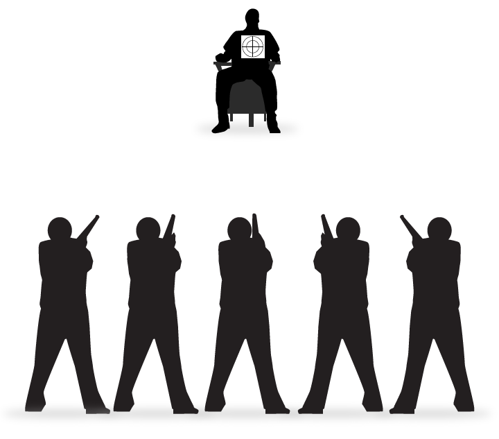
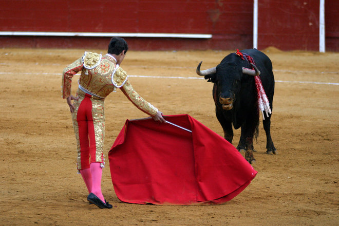

## Introduction

(Don't cover immediately after functionalism next time)
(Consider covering mental content after functionalism and then consciousness)

Mental causation is common place. Every time we act on a choice, intentionally move our body,  a mental state is causing a physical reaction. Mental causation is important to our concepts of agency, to our idea of performing actions intentionally. An action is not a mere bodily motion like involuntarily blinking your eye. It is something you do intentionally. We can only distinguish mere bodily movement from an action if there exists mental causation, i.e., if there are intentions, mental states, that cause physical reactions. There are strictly four type of phenomena that might constitute an instance of mental causation: 

+ Mental to mental causation, e.g., beliefs lead to another belief

+ Physical to mental causation, e.g., perception causes a perceptual experience

+ Mental to physical causation, e.g., beliefs and desires cause actions

+ Physical to physical causation, e.g., heating causes water to boil

Our main interest is mental to physical causation. We would like to know what mechanism or process a mental event manages to initiate, or insert itself into, a causal chain of physical events. It certainly seems that mental events insert themselves into such causal chains, but it is hard to reconcile to explain how this is so given an apparent clash between distinctive features of the mental and the requirements for entering into causal chains of physical events. The main problem we will focus on is called the causal exclusion argument, which, as the name suggests, claims that mind is excluded from playing any causal roles. To motivate the objection, we need to take a stand back and understand 

Causation is standardly taken as a relation that holds between two events, whereby the first event, e1, is the cause of the second event, e2. Examples include: the cue striking the cue ball is the cause of cue ball moving. The heat radiating from the heater is the cause of the ambient temperature increasing. The wind blowing is the cause of the windmill turning. 

There are many interesting questions we can ask about causation, about what the relation is, about how one event could every bring about another, etc. But here we will focus on some common, but not universally accepted, claims about causation. We have already said that causation occurs between two events; each event has only one cause. Many also agree that for one event e1 to be the cause of e2 the following must obtain: 

1. e1 and e2 are spatially contiguous. 
2. e2 immediately succeeds e1 in time. 
3. e1 is sufficient for e2. 

Claim 1 states that causation require spatial contact. Consider the cue moving the cue ball. The cue touches the ball and energy is transferred from one to the other. Claim 3 does not state that all causation requires energy transfer, but it does require that events can only enter into a causal relation if they are in the same location. Two events separated by millions of mile cannot enter into direct causal contact.  

Claim 3 states that the occurrence of one event, e1, necessitates the occurrence of the other event, e2. What does this mean? 

First, it means that if e1 occurs, e2 occurs. This is the simplest way of putting the point. If the cue striking the ball causes it to move, then the former event entails the occurrence of the latter event. 

Second, it means that if e2 had not occurred, e1 would not have occurred. Consider the cue striking the cue ball. This causes the ball to move. Imagine a world exactly like our world in all respects, but it is a world in which the cue ball is not moving at exactly that time. Claim 3 tells us that there will be no cue striking that cue ball either. In other words, claim 3 states that if one thing genuinely causes some later thing, then if the later thing hadn't happened, the earlier thing wouldn't have happened either. 

Third, it means that there is no other event, e, such that had e occurred without e1, e2 would still have occurred, or had e1 occurred without e, e2 would not have occurred. It means, for instance, that there is no event like the shaking of my hand, or air hitting the cue ball, such that had these occurred without the cue striking the cue ball, the ball would still have moved. And there are no such events such that had they not occurred, the cue would strike the ball and the ball would not move.

One 

Each effect has only one sufficient immediate cause. But cause can be complex. It can mean the conjunction of lots of things happening at that time. 

## Epiphenomenalism

**Epiphenomenalism:** mental events are caused by physical events, but they cannot cause anything else.

There are four basic models of mind-body interaction. These are:

Interactionism:
: the view that the mind and the body directly cause things to happen in each other. This was Descartes' view. We saw that he argued that the mind and body directly interact via the pineal gland. We also saw the difficulties that face this view. 

Parallelism:
: the view that the mind and the body act "in parallel," but never casually interact directly. Versions of this view were defended by Malebranche and Leibniz in response to problems the saw with Descartes' substance dualism. In different ways, both claims that God explains why mind and body can act in parallel.  

Reductionism:
: the view that the mind just is the body, and so whatever causal efficacy the physical has, the mental also has. This is the view of those who defend the identity theory of the mind. If mental states are identical to psycho-neural states, mental causation is nothing mysterious at all.  

Epiphenomenalism:
: the view that only the body has causal powers, but the mind is causally inert, i.e., the view that mental cannot cause physical events. 

## Evidence for epiphenomenalism

1. Brain damage
2. Animal behavior

## Problem 1

1. If mental events have no causal powers, then they are in total causal isolation from the rest of the world -- their existence would be inexplicable since they have no causes; they would make no difference to anything else since they have no effects.
2. If anything is both causeless and effectless, then it cannot really exist.
[Alexander's Dictum]
3. According to epiphenomenalism, mental events have no causal powers whatsoever.
4. Therefore, under epiphenomenalism, mental events are not real. ⇒ [Mental Irrealism]

## Problem 2: Agency

**Agency:** If agent S desires something and believes that doing A is an optimal way of securing it, S will do A.
 
**Rationality:** Reasons are the causes of our actions.

1. We perform actions for reasons. 
2. The reasons for which we perform an action are the cause of that action.
3. Actions involve bodily movements. 
3. Therefore, reasons are the cause of bodily movement. 
4. Therefore, mental events cause bodily events. 
5. If epiphenomenalism is true, mental events cannot cause bodily events.
6. If epiphenomenalism is true, we do not perform actions for reasons. 

## Causal Exclusion Problem

+ P1. M is a cause of p

**Causal Closure of the Physical Domain:** If a physical event has a cause (occurring) at time t, it has a sufficient physical cause at t.

+ Example 1: If the glass breaking has a physical cause at 10am, the glass breaking has a sufficient physical cause at 10am

+ Example 2: If the water boiling has a physical cause at 2pm, the water boiling has....? 

+ Example 3: If my leg moving has a physical cause at 9am, my leg moving has a sufficient physical cause at 9am

+ P1. m is a cause of p
+ P2. p is a cause of P...from causal closure
+ P3. m ≠ p
 

**Exclusion Principle:** No event has two or more distinct sufficient causes, all occurring at the same time, unless it is a genuine case of overdetermination.

Causal overdetermination would occur if some event had more than one independently sufficient causes. This is best illustrated with an example. Consider multiple bullets hitting a person at the same time. 

Which bullet killed the defendant? It's not an easy question to answer. The defendant being killed is an event. Call it e2. This event is caused by some other event, e1. What is that event? Each shooter is an expert. Any of them alone would hit the target. If only the left most shooter was there, his shot would have killed the defendant. So perhaps e1 is the shot fired from the left most shooter. But the right most shooter too is an expert shot. If only they had shot, their shot would have killed the defendant too. This suggests that e1 is the shot fired from the right most shooter. The same goes for each of our shooters in the picture. Each of their shots is sufficient by themselves for bringing about e2. But above we stated that each event has only one cause. So e2 must have only one event as its cause. Of course, it can be true that e2 has only event as its cause and still be true that something else could have sufficed. For instance, Socrates died from drinking hemlock. The hemlock was the one cause of his death. While this was both a single cause and sufficient for the effect, something else could have played this role if things had gone differently, e.g., the poisoner used arsenic instead. Similarly, our defendant should be killed by only one sufficient cause, but our diagram suggests that there were 5 independently sufficient causes! That is, it seems that each bullet independently killed the defendant. This, of course, seems counterintuitive. Presumably, it is only one bullet that caused the death. Overdetermination would occur if there were more than one sufficient cause. Overdetermination does not seem possible. 

+ P1. m is a cause of p
+ P2. p is a cause of P...from causal closure
+ P3. m ≠ p
+ P4. Mental causation is not an instance of overdetermination.

**But P1--P3 entail** that this is case of overdetermination!!! Since there is a contradiction between P1-P4, at least one of these claims is false. Which should we reject? 

Many claim we should reject P1. Our argument against mental causation looks then like this: 

+ P1. m is a cause of p
+ P2. p is a cause of P...from causal closure
+ P3. m ≠ p
+ P4. Mental causation is not an instance of overdetermination.
+ C1. Hence, m is not a cause of p, and (1) is false
+ C2. Hence, Mental events never cause physical events.

> Suppose that a mental event, m, causes a physical event, p. The closure principle says that there must also be a physical cause of p—an event, p , occurring at the same time as m, that is a sufficient cause of p. This puts us in a dilemma: Either we have to say that m = p-namely, identify the mental cause with the physical cause as a single event—or else we have to say that p has two distinct causes, m and p , that is, it is causally overdetermined. The first horn turns what was supposed to be a case of mental-to-physical causation into an instance of physical-to-physical causation, a result only a reductionist physicalist would welcome. Grasping the second horn of the dilemma would force us to admit that every case of mental-to-physical causation is a case of causal overdetermination, one in which a physical cause, even if the mental cause had not occurred, would have brought about the physical effect. This seems like a bizarre thing to believe, but quite apart from that, it appears to weaken the status of the mental event as a cause of the physical effect. To vindicate m as a full and genuine cause of p, we should be able to show that m can bring about p on its own, without there being a synchronous physical event that also serves as a sufficient cause of p. According to our reasoning, however, every mental event has a physical partner that would have brought about the effect anyway, even if the mental cause were taken out of play entirely (Kim pp)

### Responses 

Reduction Strategy: For every mental property M, there is some physical property P with which M can be reductively identified.

Supervenience Strategy: Mental properties supervene upon physical properties, and supervening properties can be causally relevant if their base properties are causally relevant.

Realization Strategy: Mental properties are realized by physical properties, and mental properties are causally relevant if their realizing base properties are causally relevant.

Dual Explanandum Strategy: There are different ways to explain how M and P are causally relevant.

### Supervenience 

Yablo 

- There is a difference between determinates and determinables. 
- Scarlet and crimson are each determinates of the determinable red. 
- Rectangular is a detminate of shape
- Determinables supervene upon their determinates: no words in which the determinable does not appear if one of the determinates is instantiated. 
- Yablo argues that determinates and determinables do not exclude each other. 
- Does a bull charge because it sees red or crimson?  
-   “P determines Q (P>Q) only if: 
    (i)  necessarily, for all x, if x has P then x has Q; and 
    (ii) possibly, for some x, x has Q but lacks P.” (p. 252)

Q:  Can my physical properties be determinates of my thinking properties?

Yablo’s Answer:  Yes.  He thinks that this answer is suggested by the asymmetric necessitation of the mental by the physical.

Suppose you are sitting on a branch. The branch snaps suddenly and you fall. *Snapping* is a determinable and *snapping suddenly* is one of its determinates. If the causal exclusion problem works for mental causation, doesn't it also exclude the possibility that both snapping and snapping suddenly are relevant to my falling. This example and other like it are used to show that properties related as determinable-determinate do not causally exclude one another.

> Such a view is in fact implicit in the reigning orthodoxy about mind-body relations, namely, that the mental is supervenient on, but multiply realizable in, the physical.” (p. 254)

> “Almost whenever a property Q is prima facie relevant to an effect, a causally sufficient determination Q’ of Q can be found to expose it as irrelevant after all.” (p. 258)
    
> ...any credible reconstruction of the exclusion principle must respect the truism that determinates do not contend with their determinables for causal influence (p.259).

Problem: While this approach has intuitive appeal, it is not clear that a determinate does not causally exclude the determinable. Consider the determinable, being colored, which has as its determinates, redness, yellowness, and greenness. The determinable is certainly present when any of these properties is present, but different effects ensue upon the instantiation of these properties. If, for instance, a driver detected a green light, she would have continued driving, but if she had detected a red light, she would have brought her car to a full stop. It appears that the determinable, being colored, was not relevant to either outcome since it was present with opposite outcomes
