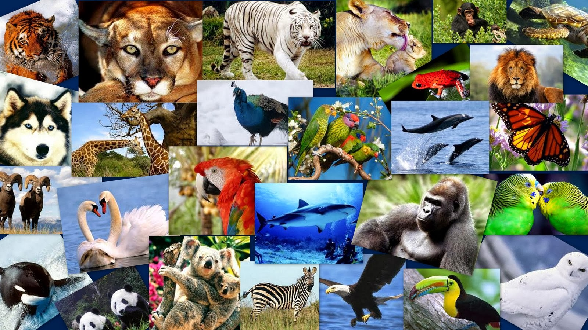

## Consciousness

Two problems: 

1. What is the nature of consciousness? 
2. How does the brain give rise to consciousness?

> But what consciousness is, we know not; and how it is that anything so remarkable as a state of consciousness comes about as the result of irritating nervous tissue, is just as unaccountable as the appearance of the Djin when Aladdin rubbed his lamp in the story, or as any other ultimate fact of nature (Huxley). 

## “What Is It Like to Be a Bat?”

- Thomas Nagel, 1974 paper. 
- Restored consciousness as a central problem in philosophy and neuroscience. 
  > The most important and characteristic feature of conscious mental phenomena is very poorly understood (436).
- Argues for the subjective character of consciousness. 

## What is Consciousness? 

Conscious Creatures: 

> It is not analyzable in terms of any explanatory system of functional states, or intentional states, since these could be ascribed to robots or automata that behaved like people though they experienced nothing (436).

Nagel uses the examples of bats to argue for the 'what it's like' quality of consciousness: 

- Bats are mammals.
- They have conscious experience. 
- Bats use echolocation to navigate and perceive objects. 
- Both sonar and vision are regarded as perceptional experiences.
- What it's like to see a bug is different from what it's like to echolocate that bug. 
- What it's like to a human differs from what it's like to be a bat.

> The problem is not confined to exotic cases, however, for it exists between one person and another. The subjective character of the experience of a person deaf and blind from birth is not accessible to me, for example, nor presumably is mine to him. This does not prevent us each from believing that the other's experience has such a subjective character.(440)

“What it is like” refers to the specific qualitative character of experiences, e.g., the redness of a visual percept, the hurtfulness of a pain, the smell of fresh newsprint, the tactile feel of a cool marble surface, etc. These qualitative aspects of experiences are now called “qualia” (“quale” for the singular).

## Types of consciousness

> fundamentally an organism has **conscious mental states** if and only if there is **something that it is like to *be* that organism**-something it is like *for* the organism (436)

Awareness:
: attending to something, e.g., I am conscious of the time. (Not our primary interest). 

State Consciousness (two ideas): 
: a mental state is a conscious state just in case the subject whose state it is is conscious of it.
: a state of a creature is conscious if there is something it is like to be in that state.

Some conscious states
1. Pain: there is something it is like to experience pain in a burned finger. 
2. Vision: there is something it is like to see a large red circle painted on a white wall.
3. Smell:  there is something it is like to smell a rotten egg. 

Some non-conscious states
1. Bodily states: there is nothing that is like to have hair grow (though there is something that is like to *feel* your hair grow. 
2. Your age and weight. 

Creature (subject) Consciousness: 
: A conscious creature is one that is capable of having conscious states.

+ According to Nagel, “our own mental activity is the only unquestionable fact of our experience”, meaning that each individual only knows what it is like to be them (Subjectivism). 
+ Objectivity, requires an unbiased, non-subjective state of perception. For Nagel, the objective perspective is not feasible, because humans are limited to subjective experience.
+ The reason is that every subjective phenomenon is essentially connected with a single point of view, and it seems inevitable that an objective, physical theory will abandon that point of view.

