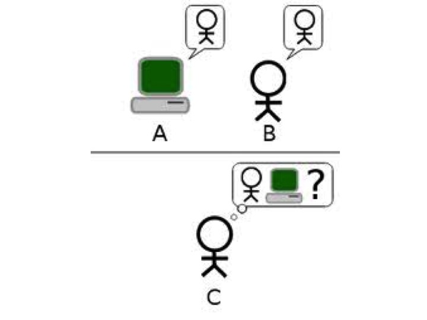

 Mind and Body
===========================

Sample Theories of Mind

1.  Dualism.

2.  Identity Theory.

3.  Functionalism.

Dualism
=======

-   Dualism says that states and processes of the mind are separate from
    states and processes of the brain.

-   Consider an experience of pain, or of seeing something, or of having
    a mental image. Dualism says that these experiences are not
    identical to states and processes of the brain, even if they are
    correlated with them.

Identity Theory
===============

-   The identity theory of mind says that states and processes of the
    mind are identical to states and processes of the brain.

-   Consider an experience of pain, or of seeing something, or of having
    a mental image. The identity theory of mind says that these
    experiences are identical to brain states and/or processes, not
    merely correlated with them.

Functionalism
=============

.

-   Functionalists says that states and processes of the mind are
    defined by the causal roles they play in the cognitive system as a
    whole, i.e., what it is to be a particular state just is to bring
    about some result given some input.

-   Consider an experience of pain, or of seeing something, or of having
    a mental image. Functionalism says that all there is to such an
    experience is that being in one and getting a particular input
    results in a particular output.

-   Pain: all there is to being in pain is that it disposes you to
    respond in certain ways given certain inputs, e.g. it disposes you
    to say ‘ouch’ when you scrap your knee. The pain state existed, it
    is just defined by the job it does, namely, disposing you to respond
    in way given certain inputs.

An Analogy
==========

-   Functionalists say that for every functionally defined mental state,
    there is something which realizes that state, i.e., plays the role
    given in the state.

-   Very different kinds of entities might play the very same role.

-   Consider the heart. What it is to be a heart is to pump oxygenated
    blood to the issues. Different kinds of entities made from different
    materials, having different structures, and even operating in
    different ways may all still count as being hearts because they each
    pump oxygenated blood to the tissues.

Does he have a heart?
=====================

The function of the heart is to pump oxygenated blood to the tissues. To
determine, then whether Tin Man has a heart, we have to determine
whether this job is being performed in his body, i.e., determine whether
any blood is being pumped around his body. If there is blood being
pumped, then we can infer that he must have a heart—the thing that
causes the pumping. Similarly, if mental states are functional states,
we can determine whether an entity has a particular mental state by
determining whether or not the job associated with that mental state is
being performed in that entity.

The Chinese Room Thought Experiment
===================================

Weak vs. Strong AI
==================

Weak Artificial Intelligence (WAI) Computers give us a
powerful tool to study the mind.

Strong Artificial Intelligence (SAI)

-   An appropriately programmed computer is a mind, where a computer is
    a machine whose operation is defined as an instantiation of a
    computer program.

-   Mental states are defined functionally, e.g., understanding a
    sentence is a mental state that plays a functional role, namely,
    disposes the entity who possess that state to respond in various
    ways given certain inputs.

-   Given certain inputs, the computer performs in the way specified in
    the functional definition of understanding. This means it must
    possess understanding, i.e. it’s possession of understanding is what
    explains why it responds appropriately to certain inputs.

Strategy
========

-   Accepts WAI.

-   Objects to SAI by describing a thought experiment, the Chinese Room
    Thought-Experiment, which seems to show that understanding is not
    merely a state which causes you to respond appropriately to certain
    inputs.

-   Responds to various objections.

Input:
:   Chinese symbols that unbeknown to Searle are questions in Chinese.

Data-Base:
:   Boxes of Chinese symbols.

Program/Instructions:
:   Book of instructions for manipulating the symbols.

Output:
:   Chinese symbols that unbeknown to Searle are answers in Chinese.

Imagine a native English speaker who knows no Chinese locked in a room
full of boxes of Chinese symbols (a data base) together with a book of
instructions for manipulating the symbols (the program). Imagine that
people outside the room send in other Chinese symbols which, unknown to
the person in the room, are questions in Chinese (the input). And
imagine that by following the instructions in the program the man in the
room is able to pass out Chinese symbols which are correct answers to
the questions (the output). The program enables the person in the room
to pass the Turing Test for understanding Chinese but he does not
understand a word of Chinese.

Digestion Time
==============

What does Searle think his Chinese Room thought-experiment shows?

-   Would SAI say that Searle understands the Chinese stories? Why, why
    not?

-   How exactly does Searle’s apparent lack of understanding threaten
    SAI?

Relation to Turing Test
=======================

Does Searle’s thought-experiment allow us to draw any conclusions about
the adequacy of Turing’s “imitation game,” which is supposed to stand in
for the question “Can machines think”?

Questions? General Comments?
============================

Objections & Responses
======================

1.  The Systems Reply

2.  The Robot Reply

3.  The Brain Simulator Reply

4.  The Combination Reply

5.  The Other Minds Reply

6.  The Many Mansions Reply

Systems Reply
=============

The systems reply objects that even though the human inside of the
Chinese room doesn’t understand Chinese, nevertheless the entire system,
including books and pieces of paper, does understand Chinese.

The Fallacy of Composition
==========================

The fallacy of composition arises when one infers that something is true
of the whole from the fact that it is true of some part of that whole.
For example, this is a fallacy:

1.  Searle’s hand weighs 2lb.

2.  Searle’s hand is a part of him.

3.  Searle weighs 2lb.

Response
========

But Searle thinks that this objection, in addition to being incredible,
overlooks the fact that the same thought-experiment can be run even if
we assume that the human has internalized all of the books and other
parts of the system.

Review
======

1.  If Strong AI is true, then there is a program for Chinese such that
    if any computing system runs that program, that system thereby comes
    to understand Chinese.

2.  I could run a program for Chinese without thereby coming to
    understand Chinese.

3.  Therefore Strong AI is false.

The Robot Reply
===============

Searle’s Response
=================

The Many Mansions Reply
=======================

Reply Even if current computers cannot understand, we will
probably be able to build machines that process in whatever way is
required for understanding.

Searle’s Response Even if we could build such computers,
the reply trivializes the claims of SAI because SAI is supposed to give
us insight into what understanding is, i.e., that it is a functionally
defined state.

Brain Simulator Reply
=====================

If we could make a computer that exactly parallels whatever goes on in a
fluent Chinese speaker’s brain when he or she understands Chinese, then
that computer would understand Chinese.

Searle’s Response
=================

But Searle responds that even in such a case, there would be no
understanding, because you could just change the original thought
experiment so that the man in the room turns on and shuts off water
valves that correspond to the neural firings of a Chinese speaker. In
such a case, the man doesn’t understand.
