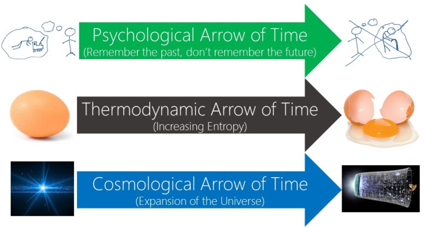
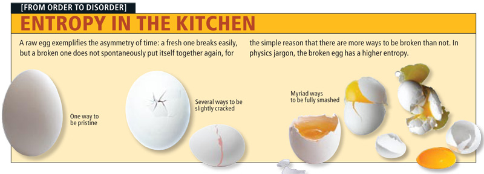

## Introduction

Which of these two videos is in reverse? 

<iframe width="560" height="315" src="https://www.youtube.com/embed/g_a3TQ9L9cM" frameborder="0" allow="accelerometer; autoplay; encrypted-media; gyroscope; picture-in-picture" allowfullscreen></iframe>

<iframe width="560" height="315" src="https://www.youtube.com/embed/D-eDNDfU3oY" frameborder="0" allow="accelerometer; autoplay; encrypted-media; gyroscope; picture-in-picture" allowfullscreen></iframe>

Find out here: 

<iframe width="560" height="315" src="https://www.youtube.com/embed/SI5-UQKQVIM" frameborder="0" allow="accelerometer; autoplay; encrypted-media; gyroscope; picture-in-picture" allowfullscreen></iframe>

## The Arrow of Time

Must time flow in the direct that it does? In other words, must the events in time follow the course that we normally take them t, e.g., must my retirement happen after my school graduation? The answer seems 'yes'. Our question is why this is so. Why couldn't the events in time flow in the opposite direction than they do? Many think the answer relies on three other arrows (see textbook): 

1. the thermodynamic arrow: the direction from order to disorder;
2. the psychological arrow: the direction from perceptions of events to the memories of those events;
3. the causal arrow: the direction from cause to effect.

## The Thermodynamic Arrow

Second Law of Thermodynamics: 
: Where any change occurs in an isolated system, entropy either stays constant or increases.

<iframe width="560" height="315" src="https://www.youtube.com/embed/YM-uykVfq_E" frameborder="0" allow="accelerometer; autoplay; encrypted-media; gyroscope; picture-in-picture" allowfullscreen></iframe>

The thermodynamic analysis of time order: 
: event A is earlier than event B if and only if the universe is, when B occurs, in a higher state of entropy than it is when A occurs.

## The Psychological Arrow

The psychological analysis of time oder: 
: A is earlier than B if and only if A is the content of a memory at the same time that B is the content of a perception.

The modified psychological analysis of time oder: 
: A is earlier than B if and only if there exists an experience e and a memory of that experience m such that either
1. A is simultaneous with e and B is simultaneous with m, or
2. A is simultaneous with e and B is between e and m, or
3. B is simultaneous with m and A is between e and m, or
4. A and B are between e and m, and A is between e and B, or
5. e is between A and B, and B is between e and m, or
6. A is between e and B, and B is between e and m, or
7. B is between A and e, but m is not between e and B, or
8. A is between m and B, but e is not between A and m. 

## The Causal Arrow

