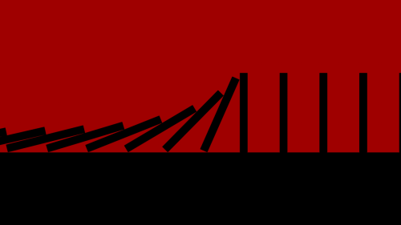

## The Causal Arrow

 

To motivate the causal arrow, we need to first talk generally about causation. Causation is standardly taken as a relation that holds between two events, whereby the first event, e1, is the cause of the second event, e2. Examples include: the cue striking the cue ball is the cause of the ball moving, the heat radiating from the heater is the cause of the temperature rising, the wind blowing is the cause of the windmill turning, etc. 

There are many interesting questions we can ask about causation, about what the relation is, about how one event could ever bring about another, etc. But here we will focus on some common, but not universally accepted, claims about causation. We have already said that causation occurs between two events. Many also agree that for one event e1 to be the cause of event e2, the following must obtain: 

1. e1 and e2 are spatially contiguous. 
2. e2 immediately succeeds e1 in time. 
3. e1 necessitates e2.

Claim 1 states that causation requires spatial contact. Consider the cue moving the cue ball. The cue touches the ball and energy is transferred from one to the other. Claim 1 does not state that all causation requires energy transfer, but it does require that events in a causal relation are in the same location. Two events separated by millions of miles cannot enter into direct causal contact.  

Claim 2 states that a cause must occur immediately prior to its effect. Consider the cue moving the cue ball. The event of the cue touching the cue ball happens immediately before the ball begins to move. Likewise, my hand touching the glass occurs immediately before the glass falls over. In both cases, the cause of the outcome was an event that immediately preceded the outcome. Note that claim 2 is a claim about immediate and direct causes. There can be chains of indirect causes that are separated by a period of time. For instance, my friend dares me to play pool; I accept; I move the cue against the cue ball; the cue ball moves. My friend's dare happened well before the ball moved, but you might still think that the dare caused the ball to move. But this is not in tension with claim 2. Claim 2 does not apply to remote or indirect causes. It is a claim about immediate and direct causes.

Claim 3 states that the occurrence of one event, e1, necessitates the occurrence of the other event, e2. What does this mean? First, it means that if e1 occurs, e2 occurs. This is the simplest way of putting the point. If the cue striking the ball causes the ball to move, then the former event entails the occurrence of the latter event. It would be impossible for the former event to occur and the latter not to occur.  

It also means that if e2 had not occurred, e1 would not have occurred. Consider the cue striking the cue ball. This causes the ball to move. Imagine a world exactly like our world, but it is a world in which the cue ball is not moving. Claim 3 tells us that there will be at least one further difference between our world and that imaginary world: there will be no cue striking that cue ball either. In other words, claim 3 states that if one thing genuinely causes some later thing, then if the later thing hadn't happened, the earlier thing wouldn't have happened either. 