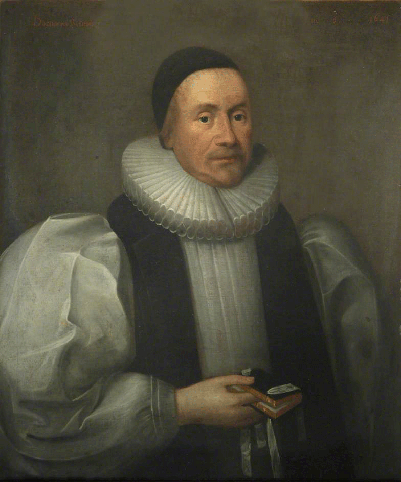

## God's Time

James Ussher (1580-1655) asked when the Universe was created. His answer: 6:00 p.m. on Saturday, October 23rd, 4004 B.C. How did he get that date? 

+ Looking at a variety of ancient texts, he discovered that King Nebuchadnezzar II of Babylon died in 562 B.C. 
+ Going through the Old Testament, he added the ages of the prophets and the reigns of the kings that came before Nebuchadnezzar. He decide that was 3,442 years. Here's an example from *Genesis* 5:
> When God created mankind, he made them in the likeness of God. 2 He created them male and female and blessed them. And he named them “Mankind”[a] when they were created. 3 When Adam had lived 130 years, he had a son in his own likeness, in his own image; and he named him Seth. 4 After Seth was born, Adam lived 800 years and had other sons and daughters. 5 Altogether, Adam lived a total of 930 years, and then he died. 

> 6 When Seth had lived 105 years, he became the father of Enosh. 7 After he became the father of Enosh, Seth lived 807 years and had other sons and daughters. 8 Altogether, Seth lived a total of 912 years, and then he died. 

> 9 When Enosh had lived 90 years, he became the father of Kenan. 10 After he became the father of Kenan, Enosh lived 815 years and had other sons and daughters. 11 Altogether, Enosh lived a total of 905 years, and then he died. 
> 12 When Kenan had lived 70 years, he became the father of Mahalalel. 13 After he became the father of Mahalalel, Kenan lived 840 years and had other sons and daughters. 14 Altogether, Kenan lived a total of 910 years, and then he died.

> 15 When Mahalalel had lived 65 years, he became the father of Jared. 16 After he became the father of Jared, Mahalalel lived 830 years and had other sons and daughters. 17 Altogether, Mahalalel lived a total of 895 years, and then he died.

> 18 When Jared had lived 162 years, he became the father of Enoch. 19 After he became the father of Enoch, Jared lived 800 years and had other sons and daughters. 20 Altogether, Jared lived a total of 962 years, and then he died.

> 21 When Enoch had lived 65 years, he became the father of Methuselah. 22 After he became the father of Methuselah, Enoch walked faithfully with God 300 years and had other sons and daughters. 23 Altogether, Enoch lived a total of 365 years. 24 Enoch walked faithfully with God; then he was no more, because God took him away.

> 25 When Methuselah had lived 187 years, he became the father of Lamech. 26 After he became the father of Lamech, Methuselah lived 782 years and had other sons and daughters. 27 Altogether, Methuselah lived a total of 969 years, and then he died.

> 28 When Lamech had lived 182 years, he had a son. 29 He named him Noah and said, “He will comfort us in the labor and painful toil of our hands caused by the ground the Lord has cursed.” 30 After Noah was born, Lamech lived 595 years and had other sons and daughters. 31 Altogether, Lamech lived a total of 777 years, and then he died.

> 32 After Noah was 500 years old, he became the father of Shem, Ham and Japheth.

+ 3,442 years before 562 BD gets us to 4004 B.C. 
+ Ussher notes that he apples were ripe in the Garden of Eden, so it must have been fall. He suggested the autumn equinox as likely. 
+ *Genesis* suggests each day began in the evening, so he believed the world was created in the evening. 

## The Big Bang

But we now believe that the universe is 13.9 billion years old! 

<iframe allowfullscreen width='640' height='360' src='//assets.nationalgeographic.com/modules-video/latest/assets/ngsEmbeddedVideo.html?guid=00000161-d7f6-dcda-a37f-d7f68e230000' frameborder='0' scrolling='no'></iframe>

## The Beginning of Time? 

Does the beginning (and end of) the universe imply the beginning (and end of) time itself? Should a theist accept that God existed before his act of creation? Should we accept that some period of time existed before the big bang, that the singularity existed for a period of time before the big bang occurred? Recall that an Absolutist about time believes that time exists independently of any process or change. The relationalist denies this. Deciding whether time existed before the universe began may help decide this debate. 

## Arguments that time had no beginning 

### From the nature of beginning 

2. If Bob began to exist, then there was one time when he did not exist and a later time when he did exist. 
3. If time began to exist, then there was one time when time did not exist and a later time when time did exist. 
4. It is contradictory to claim that there was a time when time did not exist. 
5. Therefore, time could not have had a beginning. 

### From the first moment 

Time has a beginning if there was a first moment of time. This argument shows that this is impossible. 

1. Every moment is (at some time) present.
2. The present is the boundary between past and future.
3. If there was a first moment of time, it could not have been present--because there can be no past at the beginning of time  (from 2).
4. There was no first moment of time (from 1 & 3).
5. Time has no beginning (from P4).

### The Principe of Sufficient Reading

*The Principle of Sufficient Reason* states that for everything that occurs at a given moment, there is always an explanation, a cause, of why it occurred at precisely that moment and not at some other moment. In general, if event x causes event y, then x occurs some time before y occurs. 

1.  Student task: how might this principle be used to argue that time has no beginning? 
2.  Possible rebuttals?

## Argument that time has a beginning 

1. If time had no beginning, then an infinite amount of time has already passed.
2. If an infinite amount of time has passed, then it is possible for an infinite series to be completed,
3. It is not possible for an infinite series to be completed.
4. An infinite amount of time has not passed (from 1--3).
5. Therefore, time had a beginning.

Questions: 

-   Can an infinite series have no beginning or last member?
-   Suppose that time is an infinite series with no first member. Then there must be some series of states that has no beginning. The causal explanation goes on forever.

