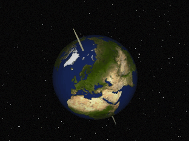
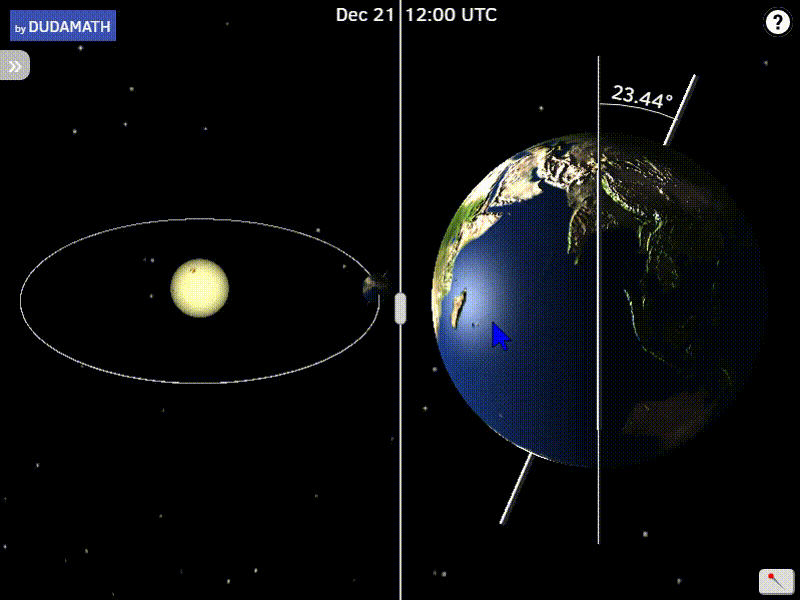

# Years, months, and days. 

## Various units of time

Years, months, and days correspond to various natural and regular patterns. Weeks do not. It is arbitrary that we have seven days in our week, and it is arbitrary that they are called what they are: 

| Day       | Saxon God | Latin         |
| --------- | --------- | ------------- |
| Sunday    | Sun       | Dies Solis    |
| Monday    | Moon      | Dies Lunar    |
| Tuesday   | Tiw       | Die Martis    |
| Wednesday | Woden     | Dies Mercurii |
| Thursday  | Thor      | Dies Jovis    |
| Friday    | Frigg     | Dies Veneris  |
| Saturday  | Seterne   | Dies Saturni  |

It is easier to understand how we came to divide the calendar into years, months, and days.

 

A **solar year** is the amount of time it takes Earth to complete one elliptical orbit around the sun. It is equal to 365.2422 solar days.

A **solar day** is the amount of time it takes Earth to rotate around its axis with respect to the sun. This averages 86,400 seconds. But, since Earth has an elliptical, and not a perfect orbit, day lengths can vary by several seconds. 

A **lunar month** is the amount of time between two consecutive same phases of the moon, e.g., the amount of time from one full moon to the next full moon. It averages 29.53 solar days. 

The names for the months derive from the Romans:

| Month     | Latin                 | Note                                    |
| --------- | --------------------- | --------------------------------------- |
| January   | Janus                 | God of doors                            |
| February  | februo                | month of sacrifices and feasts          |
| March     | Mars                  | God of war. Start of the fighting year. |
| April     | Contested. Maybe Apru | Another name for Aphrodite.             |
| May       | Maia                  | Goddess of growth.                      |
| June      | Juno                  | Queen of the Gods                       |
| July      | July                  | Julius Caesar                           |
| August    | August                | Augustus                                |
| September | septem                | seven                                   |
| October   | octo                  | eight                                   |
| November  | novem                 | nine                                    |
| December  | decem                 | ten                                     |

**Seasons** are divisions in the year marked by variations in daylight, temperature, rainfall, etc. These correlate with different stages of the Earth's orbit around the sun. Seasons vary by hemisphere. They also can change from year to year. During the equinox, daytime and nighttime are equal. The summer solstice has the longest daytime of the year. The winter solstice has the shortest.

| Year | Equinox Spring | Solstice Summer | Equinox Autumn | Solstice Winter |
| ---- | ------------------- | -------------------- | ------------------- | -------------------- |
| 2019 | March 20            | June 21              | September 23        | December 22          |
| 2020 | March 20            | June 20              | September 22        | December 21          |

## Calendar uses

We use calendars to map out various stages of the year. Why? What are the practical benefits in knowing, say, how many months are left in the year, or in knowing when we will reach the summer solstice? 

+ The Ancient Egyptians structured their year around the annual flooding of the Nile. The flooding season, Akhet, ran from June-September. The Growing Season, Peret, ran from October-February. The Harvesting Season, Shemu, ran from March-May. Farmers obviously needed to know how much time they had to plant seeds, harvest crops, prepare for the next season, etc
+ Identify 3 ways that we use the calendar in modern society, e.g.. TV executives plan what shows will play in the Fall. 

## Calendar Problems

We organize our months by the moon and our years by the sun. The history of the calendar is a history of how to bring these two cycles into alignment: the number of days in a year does not divide into an even number of true lunar months. Possible solutions: 

1. Stipulate that a month is 30 days and a year comprises 12 months. This results in a year of 360 days. But we then lose 5 days per year, 50 per decade, and 500 per century.
2. Use a more precise length for the month and assume that there are 12 months in a year. This results in a year of 354 days. But we then lose 11 days per year, 110 years per decade, 1100 per century.
3. Egyptians: 12 months of 30 days plus a special 5 day period at the end of the year for religious celebrations. This results in a year of 365 days. Much better! But a year is  365.2422 days per year. So, the Egyptians lost a day every four years, 10 days every forty, and 100 days every four hundred years. 
4. Babylonians: 7 years of 13-month years alternated with 12 years of just 12-month years. This is what the Jewish calendar is based upon: a leap month of 30 days is added on the 3rd, 6th, 8th, 11th, 14th, 17th, and 19th years. But this is still imprecise: it predicts that 6936 days pass every 19 years. But it's really 6939.60. So, this calendar loses 3.6 days every 19 years. 
5. Romans: the Republic used a calendar of 12 lunar months with extra days or months to keep sync with the seasons. This was decided by the priesthood and was open to abuse. They increased or decreased the year based upon who was in office, rents, and taxes, etc. Julius Caesar adopted the following reform: 3 out of every 4 years would be 365 days in length; the fourth would be 366 days long (giving an average of 3651/4 days). Every year divisible by 4 is a leap year. Bar February, months were 30 or 31 days long. Our seventh is named after Julius Caesar. Our eight month is named after Augustus, who lengthened it to 31 days to match the length of Caesar's month. The Julian calendar still lost 11 minutes per year. 
6. Catholic Church: By the 1500s, the Julian calendar was 10 days out of sync. Easter Sunday would eventually fall during the summer! Pope Gregory reformed the calendar: Since the Julian calendar lost 3 days every 402 years, only calendar years divisible by 400 are leap years, e.g., 1600, 2000, 2400, etc. This is too fast. We gain one day every 3,300 years. 

## Problems  

+ When Julius Caesar reformed the calendar, he needed to restart the year. In 46BC, he ordered the year last 445 days. 
+ When Gregory reformed the calendar, he had to make up the lost days from the Julian calendar. So, October 4th, 1582 was followed by October, 15th. 
+ While most Catholic countries followed Gregory's reform. Great Britain waited until 1751. They needed to catch up with the colonies: September, 2, 1752 was followed by September, 14, 1752. (They also moved the New Year to January, 1 and not March, 25.)

1. Caesar was born on 12th July, 100 BC. How long ago was this? When did the second millennium truly begin? 
2. How might losing days from a calendar change be problematic? Think here of practical, legal, fiscal, social, and personal challenges. Who do you think should decide your calendar? 

## Gregorian Calendar

<iframe width="740" height="416" src="https://www.youtube.com/embed/YTOr8_ILqGw" frameborder="0" allow="accelerometer; autoplay; encrypted-media; gyroscope; picture-in-picture" allowfullscreen></iframe>

