# Hours, days, and seconds 

## Some terminology

There are 60 seconds in a minute, 60 minutes in an hour, and 24 hours in a day. Why these numbers? The Sumarians, c. 4000 BC, used the duodecimal system (based on 12) and sexagesimal system (based on 60) for counting. That's different from our current decimal system, but it has some advantages. A dozen, 12, is a highly composite number. This means that it has many non-trivial divisors---2,3,4, and 6. Likewise, 60 is highly divisible. There were many practical benefits for ancient cultures in basing their number system on these numbers, e.g., apportioning land, rations, etc. How might we use our hands with these count systems? 

The Egyptians adopted these counting systems and divided daylight into 12 units. They called each devision a *perior*. This is where our word 'hour' comes from. The Egyptians eventually noticed that certain stars appear first in the horizon and decided to divide the night into 12 hours. Thus, a day came to have 24 hours. 

Minutes and seconds have a far different history. The Babylonians based their counting on sexagesimal (60) system. They divided a circle into 360 parts. One degree is one 360th part of a full circle; it is the measure of an angle: 

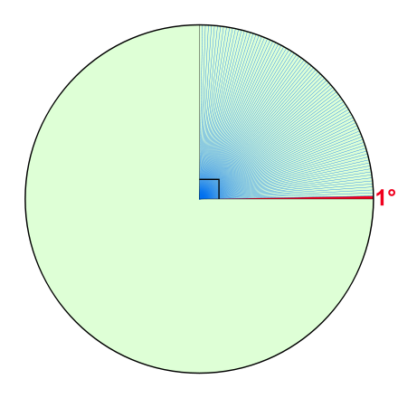

Eratosthenes in the third century developed the notion of longitude and latitude. It was later used by Hipparchus to identify any place on the map. Latitude is measured from the equator to 90&deg; north and 90&deg; south. Longitude is (now) measured  180&deg; east or west from Greenwich. Longitude and latitude seems to allow a grid that provides a unique location for any point on Earth.  But, obviously, the degrees are too big for any practical purpose. Claudius Ptolemy, 200 years after Hipparchus, divided each degree into 60 parts. He called each division the *pars minuta prima*, or first small part. This is where the word 'minute' comes from. He divided minutes into 60 *pars minuta secunda.* This means second small part and is where our word 'second' derives. 

Note that minutes and seconds were first used as divisions of degrees. In 1267, Roger Bacon adopted these divisions for the hour. The hour was thus divided into sixty minutes and minutes into sixty seconds. 

## Measuring Time

It is important that we can measure the passing of time accurately. If someone runs a four minute mile today, then the four minutes should last just as long as the four minutes it took Roger Bannister to run the very first four minute mile in 1954. The Ancient Greeks thought it important that speakers be allocated the same amount of time in court cases; I should be given the same amount of time to defend myself against a charge that you have been given to defend against a similar charge. The examples are endless. 

>  A time chart from the Systems and Procedures Association of America, for example, suggests target times for activities like these: open and close file drawer, no selection = .04 seconds; desk, open center drawer = .026 seconds; close center drawer = .027 seconds; close side drawer = .015 seconds; get up from chair = .033 seconds; sit down in chair = .033 seconds; turn in swivel chair = .009 seconds; move in chair to adjoining desk or file (4 ft. max.) = .050 seconds.(Levin, 'The Geography of Time', p.71)

Identify 3--5 practical uses of accurately judging how many hours, minutes, and seconds have passed. 

## Longitude

[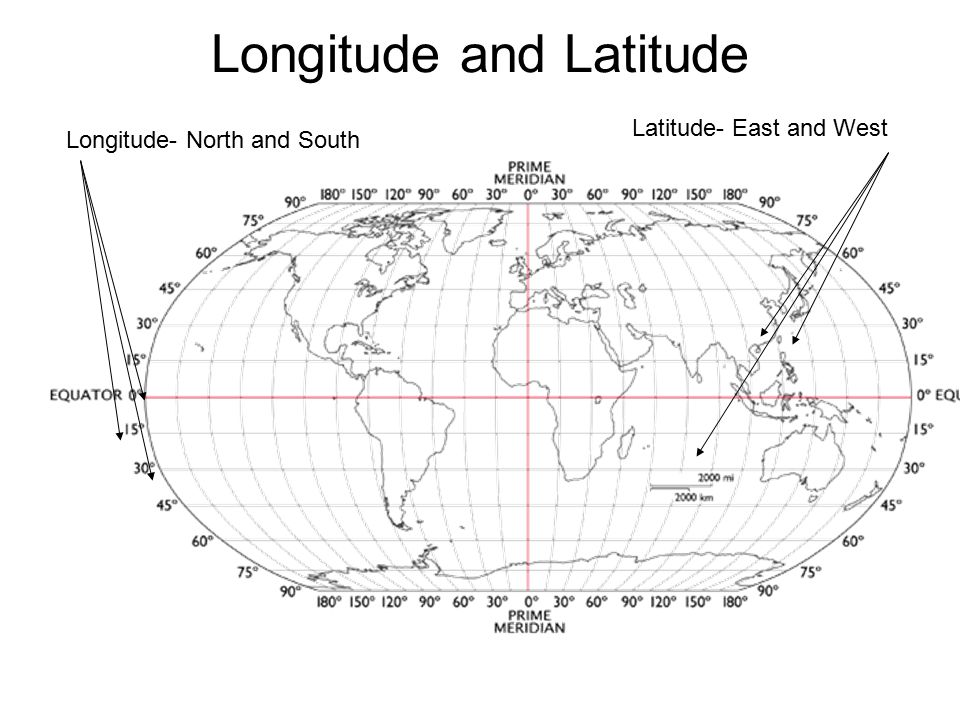](https://www.youtube.com/watch?v=-8gg98ws2Eo)

Local solar time at a location varies by one hour for every 15 degrees change of longitude (360 degrees divided by 24 hours). Thus, there is a direct relationship between time and longitude. If we know the time at a fixed point far from us when some event occurs, the difference between the time at that location and our apparent local time would give our position relative to that location. Finding apparent local time is relatively easy, e.g., it's noon when the sun is at its highest point in the sky. But if I mark noon right now, what time is it, say, two thousand miles away? If I knew, I could determine my longitude. But how do I know what time is it two thousand miles away? 

## Various clocks

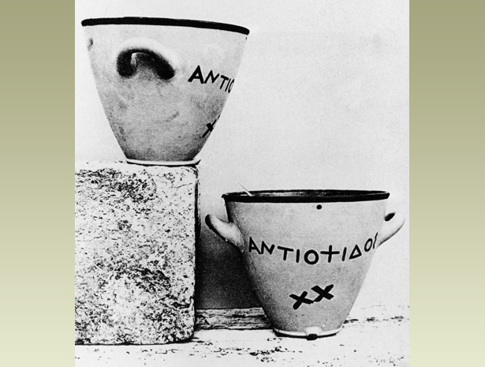

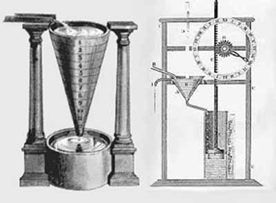

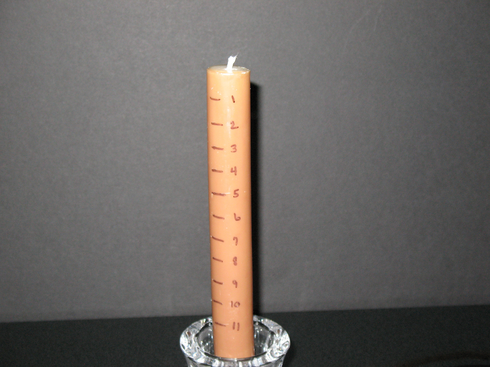

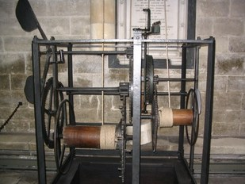

In 1275, the mechanical clock is invented in England by an Italian monk. It is driven by the slow pull of a falling weight. It is used to strike a bell at certain pint in the day---'clock' is from the Celtic 'clocca', bell, or from the German 'cloc'.  They ring the bell 5 times during the day to tell you when to pray. 

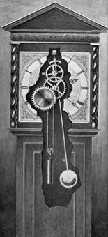

In 1656, the first pendulum clock is patented by Christian Huygens. The time it takes to swing is not dependent on its weight, but on its length. Minute hands are added to clocks in 1680. Second hands are added in 1690. 

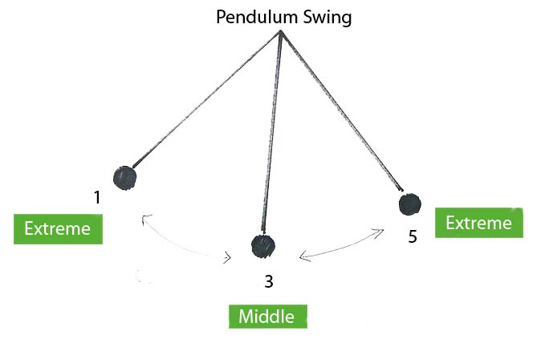

1812: Breguet creates a watch to fit on a wrist (the first wristwatch), for Caroline Murat, Queen of Naples.

## John Harrison

[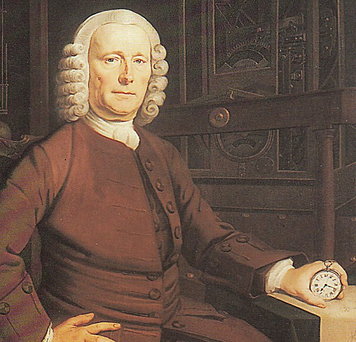](https://www.youtube.com/watch?v=T-g27KS0yiY)

## Atomic Clocks

[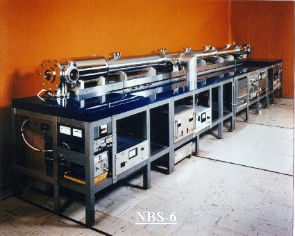](https://www.time.gov)

## Standardization 

In 1860, there were 70 time zones in America. This caused significant difficulties with weather forecasting, shipping, trains, etc. Each city and town, in effect, was on its own time. 

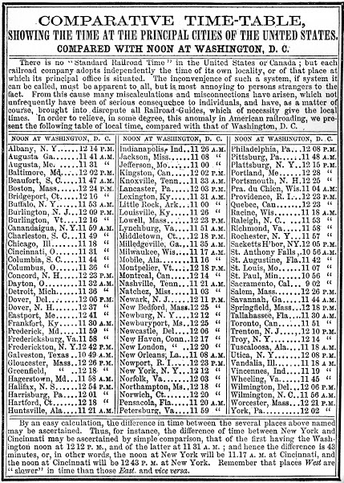

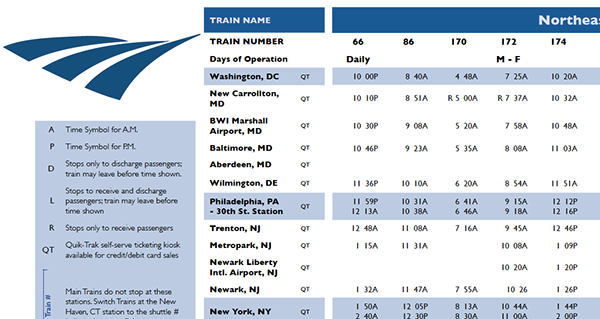

In 1918, the Standard Time Act is passed and establishes four time zones. 

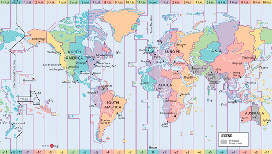

## Give us back our time!

These are taken from 'A Geography of Time', p.73: 

> The New York Herald in 1883 observed that standard time ''goes beyond the public pursuits of men and enters into their private lives as part of themselves.''

> ''Let us keep our own noon,'' demanded the prestigious Boston Evening Transcript. 

> The Louisville Courier Journal referred to standardization as ''a monstrous fraud,'' ''a compulsory lie,'' and ''a swindle.'' A letter to that newspaper asked, ''if anyone has the authority and right to change the city time without the consent of the people, and what benefit Louisville can derive from it?'' The editors responded that no such authority ruled, and no benefit seemed likely from what was ''only a disguised step towards centralization...a stab in the dark at our cherished State's rights. After they get all our watches and clocks ticking together,'' the editors asked in reflexive alarm, ''will there not be a further move to merge the zone states into districts or provinces?''

## Is time a fictional master?

> When I was alive, I believed---as you do---that time was at least as real and solid as myself, and probably more so. I said ''one o'clock'' as though I could see it, and ``Monday'' as though I could find it on a map... Like everyone else, I lived in a house bricked up with seconds and minutes, weekends and New Year’s Days, and I never went outside until I died, because there was no other door. Now I know that I could have walked through the walls. (Peter Beagle, 'The Last Unicorn')

