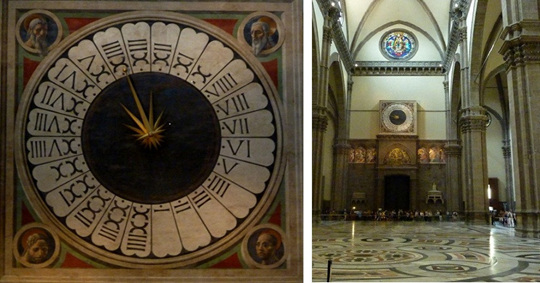

## Hours, days, and seconds 

### Some terminology

There are 60 seconds in a minute, 60 minutes in an hour, and 24 hours in a day. Why these numbers? It is somewhat arbitrary. 

The Sumarians, c. 4000 BC, used the duodecimal system (based on 12) and sexagesimal system (based on 60) for counting. That's different from our current decimal system, but it has some advantages. A dozen, 12, is highly composite number. This means that it has many non-trivial divisors---2,3,4, and 6. Likewise, 60 is highly divisible. There were many practical benefits for ancient cultures in basing their number system on these numbers, e.g., apportioning land, rations, etc. How might we use our hands with these count systems? 

The Egyptians adopted these counting systems and divided daylight into 12 units. They called each devision a *perior*. This is where our word 'hour' comes from. The Egyptian eventually noticed that certain stars appear first in the horizon and decided to divide the night into 12 hours. Thus, a day came to have 24 hours. 

Minutes and seconds have a far different history. The Babylonians based their counting on sexagesimal (based on 60) system. They divided a circle into 360 parts. One degree is one 360th part of a full circle; it is the measure of an angle: 

Eratosthenes in 3rd century developed the notion of longitude and latitude. It was later used by Hipparchus to identify any place on the map. Latitude is measured from the equator to 90&deg;  North and 90&deg; South Pole. Longitude is (now) measured in 180&deg: east or west from Greenwich. Longitude and latitude seems to allow a grid that provides a unique location for any point on Earth.  But, obviously, the degrees are too big for any practical purpose. Claudius Ptolemy, 200 years after Hipparchus, divided each degree into 60 parts. He called each division the *pars minuta prima*, or first small part. This is where the word 'minute' comes from. He divided minutes into 60 second *pars minuta secunda.* This means second small part and is where our word 'second' derives. 

Note that minutes and seconds were fused as divisions of degrees. In 1267, Rogert Bacon adopted these divisions in dividing the hour. The hour was thus divided into sixty minutes and minutes into sixty seconds. 

## Measuring Time

It is important that we can measure the passing of time accurately. If someone runs a four minute mile today, then the four minutes should last just as long as the four minutes it took Roger Bannister to run the very first four minute mile in 1954. The Ancient Greeks thought it important that speakers be allocated the same amount of time in court cases; I should be given the same amount of time to defend myself against a charge that you have been given to defend against a similar charge. The examples are endless. 

>  A time chart from the Systems and Procedures Association of America, for example, suggests target times for activities like these: open and close file drawer, no selection = .04 seconds; desk, open center drawer = .026 seconds; close center drawer = .027 seconds; close side drawer = .015 seconds; get up from chair = .033 seconds; sit down in chair = .033 seconds; turn in swivel chair = .009 seconds; move in chair to adjoining desk or file (4 ft. max.) = .050 seconds.(Levin, 'The Geography of Time', p.71)

Identify 3-5 practical uses of accurately judging how many hours, minutes, and seconds have passed. 

## Longitude

Local solar time at a location varies by one hour for every 15 degrees change of longitude (360 degrees divided by 24 hours). Thus, there is a direct relationship between time and longitude. If the navigator knew the time at a fixed reference point when some event occurred at the ship's location, the difference between the reference time and the apparent local time would give the ship's position relative to the fixed location. Finding apparent local time is relatively easy, e.g. it's noon when the sun is at its highest point in the sky. But if I mark noon right now, what time is it, say, two thousand miles away? If I knew, I could determine my longitude. But how do I know what time is it two thousand miles away? 

## Various clocks

'Clock' is from the Celtic 'clocca', bell, or from the German 'cloc'. In 1275, 1275: The mechanical clock is invented in England. An Italian monk designed the first mechanical clock. The clock was driven by the slow pull of a falling weight, basically like a very big hour hand. 

1300–1364: Three mechanical clocks are built to be displayed in public areas in Italy. An astronomical clock is introduced by Jacopo di Dondi in Padua in 1334; another clock, with a mechanism that strikes a bell to mark the hours, is completed in 1335 in Milan; and a third, which tracks hours, the sunrise, and the days of the month, is built by Giovanni de Dondi in Pavia in 1364.

1370: The first mechanical striking clocks appear in France and England.

HomeHistoryMechanical vs QuartzBuild a WatchTypesLinksContact
MECHANICAL WATCH
WELCOME TO THE WORLD OF MECHANICAL WATCHES
The History of Mechanical Watches
The Origin of Mechanical Clock (1275~1795)
Picture
1275: The mechanical clock is invented in England. An Italian monk designed the first mechanical clock. The clock was driven by the slow pull of a falling weight, basically like a very big hour hand. 

1300–1364: Three mechanical clocks are built to be displayed in public areas in Italy. An astronomical clock is introduced by Jacopo di Dondi in Padua in 1334; another clock, with a mechanism that strikes a bell to mark the hours, is completed in 1335 in Milan; and a third, which tracks hours, the sunrise, and the days of the month, is built by Giovanni de Dondi in Pavia in 1364.

1370: The first mechanical striking clocks appear in France and England.

1400: Blacksmiths begin making clocks with loud bells in them to ring the hours, for use in the hallways of large mansions.

16th Century: Iron, a key element in clock design, is pushed aside in favor of brass, bronze, and silver; development of spring-powered clocks.

1541: The Swiss watch industry is born. Reformer John Calvin of Geneva bans people from wearing jewelry, altering the future of Switzerland. Geneva's jewelers are forced to learn another craft and are taught the art of watchmaking by refugees from France and Italy.

1574: The first known pocket watch is created, but the inventor remains unknown. The watch, crafted in bronze, depicts Saint George slaying a dragon on the front and the Crucifixion on the back.

1656: The first pendulum clock is patented by Christian Huygens.

1680: The first minute hands are added to clocks.

1690: The second hand makes its first appearance on clocks, though the novel idea does not become common practice.

1700: Clock ownership becomes widespread; manufacturers design clocks in all sizes and styles: ranging from grandfather type clocks, called 'longcases', to decorative table clocks adorned with enamel paintings.

1715: Englishman George Graham invents the deadbeat escapement, a new type of mechanical escapement that offers greater precision.

1770: Abraham-Louis Perrelet invents a self-winding mechanism.  Also, Jean-Antoine Lepine creates a thinner movement, called the Lepine calibre, enabling watchmakers to make flatter watches that can be carried in "fob" pockets to conceal them from potential thieves. The Lepine calibre is still in use today.

1795: Abraham-Louis Breguet invents the tourbillon escapement.
The Birth of Wrist Watch (1812~2000)
Picture
Queen of Naples (Caroline Murat)
1812: Breguet creates a watch to fit on a wrist (the first wristwatch), for Caroline Murat, Queen of Naples.

1820: The keyless clock emerges, doing away with the need to use a key for winding or setting.

1822: Nicolas Rieussec files a patent for a "timekeeper or device to measure the distance traveled, called a seconds chronograph". This is the birth of the era of the chronograph, or stopwatch.

1830: Breguet introduces watches equipped with a button for setting the time.

1904: Santos-Dumont orders wristwatch from Louis Cartier. The original watch is on display at the Paris Air Museum next to the 1908 Demoiselle, the last plane Santos-Dumont built.

1914: By the end of World War I, wearing a wristwatch is the preferable form of timekeeping.

1927: Charles Lindbergh completes the first transatlantic solo flight, from New York to Paris, in 33 hours and 30 minutes while wearing a wristwatch by Longines, the official timekeeper of this historic journey. Shortly after, Longines and Lindbergh develop the Lindbergh Hour Angle watch.

1929: Antoine LeCoultre unveils for the world the smallest mechanical watch movement, the Caliber 101. It is listed in the Guinness Book of World Records.

1930: Breitling Watch Company patents the first stopwatch.

1957: America's Hamilton Watch Company produces the first successful electric watch.

1960: Bulova Watch Company builds the Accutron tuning fork watch, which uses an inch-long tuning fork instead of an escapement to power the oscillating circuit.

1962: Rado becomes known as originator of the scratch-proof watch with the release of the DiaStar I, made of hard metal.

1963: Seiko develops quartz-crystal, battery-powered chronometers.

1969: Astronaut Neil Armstrong wears an Omega Speedmaster on his spaceflight to the moon. 

1979: The Delirium is introduced as the thinnest watch in the world, measuring 1.98 mm.

1989: Patek Philippe creates the Calibre 89 to celebrate its 150th anniversary. The watch is deemed the most complicated in the world, with 33 complications, or special features.

1996: The Breitling Emergency watch—equipped with a transmitter that broadcasts a distress signal to rescuers—helps save the lives of the crew of the Mata-Rangi expedition when their reed raft breaks up in a storm off the Chilean coast.

1999: Watch brands turn to space-age materials such as titanium and carbon fiber. TAG Heuer launches the Kirium T15, the first sports watch crafted in grade 5 titanium.

2000: Watch companies such as Ulysse Nardin and Patek Philippe begin using high-tech materials like silicon and ceramic in their movements.

                                                                                                                                                                                            Reference: Tourneau, . "History of Timekeeping." . Tourneau. Web. 6 Dec 2013.
POWERED BY  
Create your own unique website with customizable templates.
Get Started
History of timekeeping:  https://www.youtube.com/watch?v=At5atF4mKiU

\item Mechanical clocks that ring the bell 5 times to day to tell you when to pray. In towers. No clock face. Any other clocks only have hours.
\item Pendulum. Late 1500s Gaillielo. The time it takes to swing is not dependent on its weight, but on its length. 1656 Christian Hyuges invest pendulum Holland. Towards 1690, we see first clock face with hands and minutes. 
\item There is no accurate timekeeping, but standaridization. Problems with weather forecasting and trains. Each city and town would be on own time. You set your clock to their standard.
\item 1860 about 70 time zones in America. 
\item 1883 Rial roads establish 4 time zones. 1918 fed puts the 4 into law. 

## John Harrison

