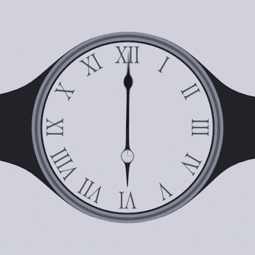
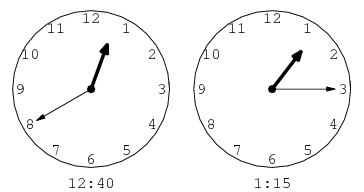
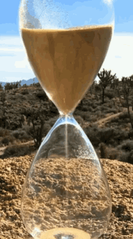
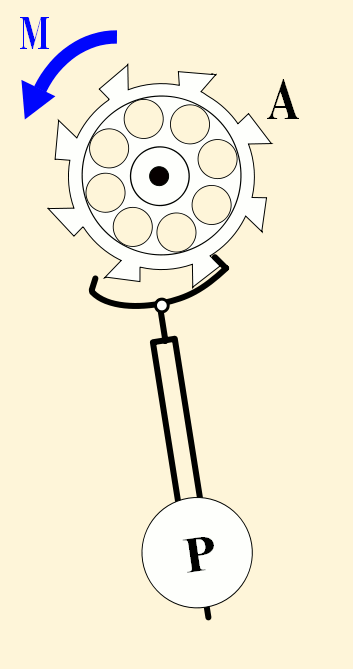
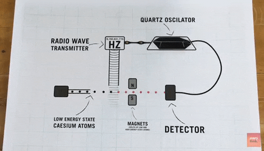

## Accurate clocks

Clocks count some event that occurs at regular intervals, e.g., they count the swings of a pendulum, or the grains of sand falling down the hourglass. Call whatever clocks count 'ticks'. The duration between ticks should be the same duration. 

Congruence: 
: If duration A and duration B are the same duration, then A and B are congruent. 

Synchrony: 
: Two clocks are synchronized if a) they agree on the time, and b) tick at the same rate, i.e., if the durations between the respective ticks they count is congruent. 

Precision: 
: A clock is precise if its replicas remain synchronized with one another.  

Accuracy is something different. Intuitively, an accurate clock is one that judges two durations of time as congruent only when they are congruent, i.e., only when they are of the same duration. In practice, clocks are considered accurate only when they are synchronized with the standard clock: 

+ A perfectly **accurate** non-standard clock shows that it is time t just when the standard clock shows that it is time t.  

Every clock measures some process. What process should the standard clock measure? Would any of these suffice? Why not? 

 

Do you have any suggestions? 

## The standard clock

Today, our standard clock is based on the rate of decay of cesium. The basic idea is to use the radiation emitted from this type of atom as the regular process by which to define our standard clock. Here is a depiction of an atomic clock: 

The clock is able to detect the radiation emitted by the cesium and translate it into a measure of time. A tick of the atomic clock is just the period, what is called an oscillation and vibration, of a certain kind of radiation emitted by the cesium. A standard second has been defined as 9,192,631,770 of these periods. If all of this is too complicated, just think of an atomic clock like this: 

 

Think of a standard second as 9,192,631,770 shakes of this crystal. A non-standard clock is accurate if it registers the same time as a standard clock, i.e., your wristwatch is accurate only if it says, say, that ten seconds have passed just when the atomic clock says that 10 seconds have passed (where 10 seconds just means 10*9,192,631,770 'shakes'.)

But what does it mean for the atomic clock, now our standard, clock to be accurate? Surely, it is accurate only if the durations between the ticks it measures are congruent. But what does it mean for those durations to be congruent other than the clock registers them as congruent? 

## Diagnosis

Consider the relationship between various measurement devices and what they measure:

 

We can see the heights we wish to measure. Likewise, we can hear the notes whose pitch we wish to measure. But can we see, hear, or in anyway directly sense the time we use clocks to measure? Consider some simple clocks: 

These clocks measure the passage of time, we think, through a certain change. We use the flow of sand, or the swing of the pendulum, to indicate to us that time is passing. If the process is regular, we assume the clocks are ticking along accurately with the flow of time. But how can we know that the process is regular unless we can somehow have direct access to time? Consider again the atomic clock. Of course, we can judge our pendulum clock's accuracy by comparing its time to the time of the atomic clock. But how can we judge the accuracy of the atomic clock without some further process to compare the atomic clock too? 

It seems we could only truly assess the accuracy of the clock if we could survey time itself, not any process or change. 

Conventionalism: 
: Two given successive intervals of time are congruent because the clock we choose as our standard registers them as congruent. 

Objectivism: 
: Two given successive intervals of time are congruent regardless of whether the clock we choose as our standard registers them as congruent. 

Consider the value of $10. Its value is merely a matter of convention, a convention of what we as society are willing to exchange goods and services for. Consider the fact that 5+5=10. It is matter of convention what words and symbols we use to give these numbers. It is not a matter of convention that the numbers referred to with these symbols have the value they do. Objectivists, say that it is not a matter of convention whether two intervals of time are congruent (though it is obviously a matter of convention what names we give to such intervals). The conventionalist says that congruency is a matter of convention. Once we arrive at the standard clock, nothing else can be said. 
