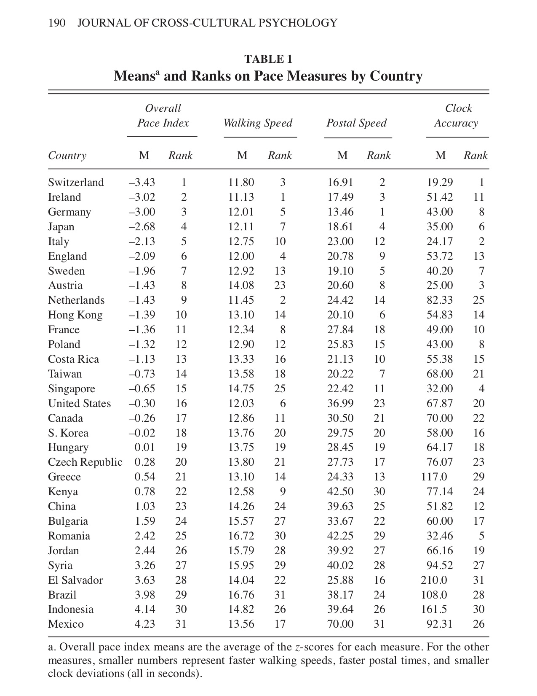

## Tempo

The tempo of a piece of music is the speed at which it is played

<iframe width="560" height="315" src="https://www.youtube.com/embed/wfF0zHeU3Zs" frameborder="0" allow="accelerometer; autoplay; encrypted-media; gyroscope; picture-in-picture" allowfullscreen></iframe>

<iframe width="560" height="315" src="https://www.youtube.com/embed/Wl-iVPwa_QE" frameborder="0" allow="accelerometer; autoplay; encrypted-media; gyroscope; picture-in-picture" allowfullscreen></iframe>

We can extend the idea of tempo in music to think about tempo in lives. 

<iframe width="560" height="315" src="https://www.youtube.com/embed/XOSTHbXDaTE" frameborder="0" allow="accelerometer; autoplay; encrypted-media; gyroscope; picture-in-picture" allowfullscreen></iframe>

The rate at which people perform standard activities seems to vary with the following: 

1. Economics. 
2. Industrialization. 
3. Population size.
4. Climate.
5. Cultural Values. 

## Psychological Time

+ Duration is the time that an event lasts. 
+ An experienced duration is the time we experience an event as lasting. 
+ An event may take, say, 40 minutes, but we experience it as lasting more or less than 40 minutes. 
+ Under “normal” conditions people on the average estimate the passage of an hour as a little more than 67 minutes.

### Examples

<iframe width="560" height="315" src="https://www.youtube.com/embed/-L5zyYdT5Yw" frameborder="0" allow="accelerometer; autoplay; encrypted-media; gyroscope; picture-in-picture" allowfullscreen></iframe>

+ Michael Siffre spent two months in an 8 x 13 foot “isolation unit” (a nylon tent) in a cave, on a glacier, 375 feet below the surface of the earth. He experienced hour-long intervals as lasting, on the average, more than two hours. Judged that the experiment was only in its thirty-fourth day when he was brought back to the surface after two months: 
 > Although it’s only six or seven o’clock in the evening, according to my time graph, I’m beginning to yawn. This is ridiculous! It means I am losing a half day every twenty-four hours! Every time I wake up, I am convinced it’s too early, that it’s only two or three o’clock in the morning. And when I am hungry, I suspect that it’s eleven o’clock. And the lapse of time between these two periods (seems) very short . . . Soon after eating a meal I am sleepy; and then I think it must be four o’clock in the afternoon.

+ Trauma
	1. Experiment 1: Students observed a faked assault lasting 34 seconds, but estimated the crime to have endured, on the average, 81 seconds.
	2. Experiment 2: Participants watched a short videotape of a bank robbery and, 48 hours later, estimated the duration of the tape. Observers, on average, described the 30-second tape as having lasted for about 150 seconds. 
	3. Researchers in Portland asked victims of 212 crimes to estimate how long it took police to arrive on the scene. They were then able to match respondents’ recollections of these time intervals with official police records of the same incidents. All but two estimated that the police had taken longer to arrive than they actually had. About half of these estimates were off by more than 15 minutes. Perhaps most remarkably, close to 10 percent of the victims overestimated by two hours or more.

### Factors that affect the psychological clock

<iframe width="560" height="315" src="https://www.youtube.com/embed/8vTdCwBW5kc" frameborder="0" allow="accelerometer; autoplay; encrypted-media; gyroscope; picture-in-picture" allowfullscreen></iframe>

<iframe width="560" height="315" src="https://www.youtube.com/embed/aIx2N-viNwY" frameborder="0" allow="accelerometer; autoplay; encrypted-media; gyroscope; picture-in-picture" allowfullscreen></iframe>

1. Pleasantness.
2. Degree of Urgency.
2. Amount of activity. 
3. Variety .
4. Time-free tasks.
