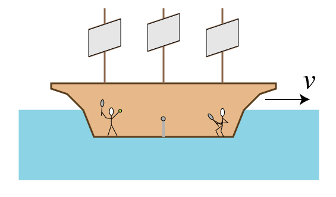
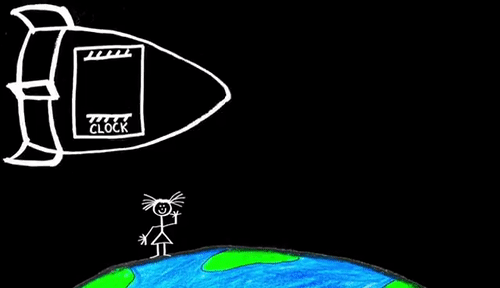

## Introduction

In 1905, Albert Einstein published 'On the Electrodynamics of Moving Bodies'. A somewhat innoncent title for an otherwise world changing paper. The paper defends what we now call special relativity, a theory that built on prior discoveries, but, nevertheless, showed that we had fundamentally misunderstood the nature of time and space. While this is not a physics class, no class on time would be complete without some discussion of Einstein's radical discoveries. While avoiding the many complications, we will focus on three upshots of his view, (1) time dilation, 2) the relativity of simultaneity, and 3) the twin paradox. 

## Relative Velocity

How fast are you moving? Let us recall a basic definition of velocity: 

>  $$ V = \frac{X_1-X_2}{t} $$

'V' is velocity. '$X_1$' is the initial position of the moving body, '$X_2$' is the final position of the moving body. *'T'* is the time taken. If we subtract the distance between the final and initial position of our moving body, we can simplify the formula as follows: 

>  $$ V = \frac{\Delta_x}{t} ​$$

Let's try some simple examples: 

> Sophia runs a race. The distance between the start line and finish line is 400m. It takes 80 seconds for her to complete it. How quickly did she run? 
>
> A rocket leaves Earth and travels for 60 million kilometers before reaching Mars. It travelled for 300 days. How quickly did the rocket travel? 

So, it seems easy to determine if you moved during some period of time. Just examine whether there is any distance between where you were at the beginning and end of that duration. But think again about Sophia. Suppose she runs her race on an aircraft carrier that was traveling at full speed. How much distance is there between the point at which Sophia starts her run and the point she ends her run? This is a bit trickier. If we mean points on the aircraft carrier, the answer is 400 m. But if we mean in relationship to the point of departure, the answer is something else: 

> Suppose that the ship is traveling at 80 m/s. How far has it travelled by the time Sophia has completed he run? 
>
> Suppose also that Sophia is running the same direction the ship is traveling in. How much distance has passed from the location of the ship at the start of her run and the end of her run? 

These are easy questions. They point to the fact we measure how quickly something moves relevant to something else. For instance, are you reading this while sitting on a train? If so, you might think you are moving at the train's speed, e.g., 20 mph. What if you are walking the length of the train as it is in motion? Perhaps you are moving  24 mph, where this is equal to the speed of the train plus the speed of your walking. What If you are sitting in a chair at home? You may be tempted to answer that you are moving 0 mph.  After all, you are not on a moving train or bus. But you are located in something that moves! The Earth is traveling at 67,000 mph around the sun. 

So, how fast are you really moving, and not merely moving in relation to something else?  According to Newton and defenders of absolutism, this question is a legitimate one. For, according to them, space and time exist independently of anything that exists in space and time. If all physical entities were destroyed, space, a kind of empty receptacle, would still exist. So too would time. On such a view, absolute motion and absolute time exists. The distance you really move is a distance in absolute space. But, physics abandoned Newton's notion of absolute space. Even if it were to exist, we cannot measure any absolute distance. All we have empirical access to are physical bodies and the distances between them. This has led in part to physicists since Galileo to think that motion is relative. Consider this ship: 

   

How quickly does the table-tennis ball move? According to Galileo, the question can only be answered by asking it relative to some observer. Relative to the table tennis player, the velocity of the ship is irrelevant to answering this question. The ball is moving relevant to the player at, say, 50 mph. But what about those of us on the beach who are watching the ship pass by, and are watching the table tennis players through a window? From our perspective the ball is traveling at 50 mph plus the velocity of the ship, say, 20 mph. So, the ball moves 70 mph relative to us and 50 mph relative to the player on the ship. 

One surprising upshot of Galileo's work was that we can only measure the velocity of something relative to what we have experimental access to. From what you are experiencing right now, you cannot determine the Earth's speed. In a similar way, if you were inside the hull of a windowless ship that was on a smooth sea, you could not tell if the ship was moving or at rest. Suppose you wish to measure how fast the ball is moving. Your answer will not depend on whether the ship is moving. Relative to you, the ball's velocity has nothing to do with what is happening outside the ship. 

## Things get weird 

By the time Einstein was working, physicists had agreed that the speed of light is a constant, it travels just short of 300 million meters per second. That's fast! The speed of light is commonly referred to know by just *c*. Einstein shows that the simple intuition about relative motion and the fact that time always travel at the same speed has surprising upshots for the nature of time. The Theory of Special Relativity has two postulate: 

First postulate: 
: The laws of physics are the same and can be stated in their simplest form in all inertial frames of reference.

Second postulate: 
: The speed of light c is a constant, independent of the relative motion of the source.

By reference frame, we just mean the place that you are making your observation. An inertial reference frame is one that is not acceleration. Einstein asked us how to maintain both postulates when comparing what seems to be the relative velocity of light. Consider this example: 

 

Suppose there is one person on the rocket. We have two observers, one on the planet and the other on the rocket. Suppose our rocket pilot shoots a laser in her ship. How fast is the light traveling? Well, we know it must be c. If our rocketeer measures its speed, their result will be c. If the observer on Earth measures that velocity, we might expect it to be greater than c. That's the result of measuring from the beach the table tennis ball's velocity on the ship; we added the result of the sailor and the velocity of the ship. But nothing can travel faster than the speed of light. Our observer on Earth must also get a result of c! So, why is that mysterious? The problem arises if we ask how far the light has travelled. Let us say that from the perspective of the rocketeer, the light has travelled 300 m. For simplicity, let's pretend that light travels at 30 m/s.

>  $$ 30m/s = \frac{300}{t} ​$$

How much time has passed on the rocketeer's clock? 

Now let us ask about the planeteer. How far has the light travelled from their perspective. It clearly has gone further than 300m; if it did, then they would be traveling at the same velocity as the rocket.  

>  $$ V = \frac{600}{t} $$

What values should we provide for t and V? Our intuition is that it should be the same as what we included for the rocketeer. But if we do that, how quickly will the light be traveling from our perspective? Twice the rate that is possible! It just can't go faster than c, which we are pretending is 30m/s. So, we know that the following is true: 

>  $$ 30m/s = \frac{600}{t} $$

What should we provide for t? Odd, right? From the rocketeer's perspective, they have travelled a certain distance in the time registered on their watch. But from the planet bound observer, they have travelled further and more time has passed. 

Here is a simple version of all this:

<iframe width="560" height="315" src="https://www.youtube.com/embed/AInCqm5nCzw" frameborder="0" allow="accelerometer; autoplay; encrypted-media; gyroscope; picture-in-picture" allowfullscreen></iframe>

