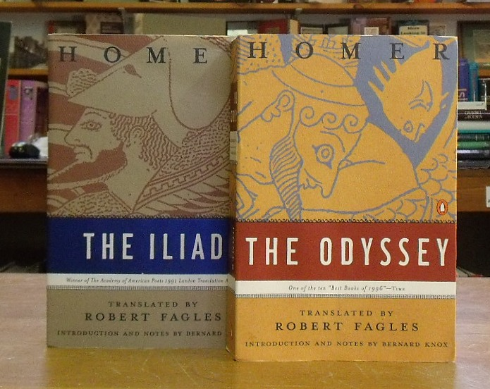
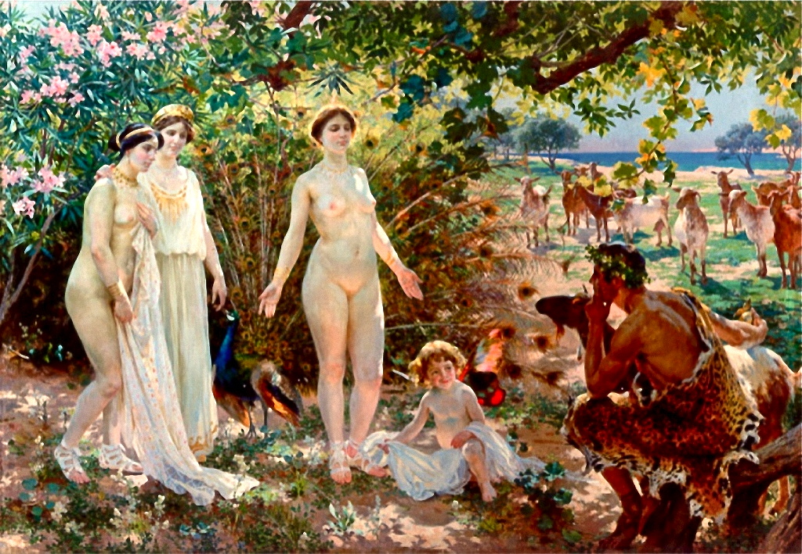
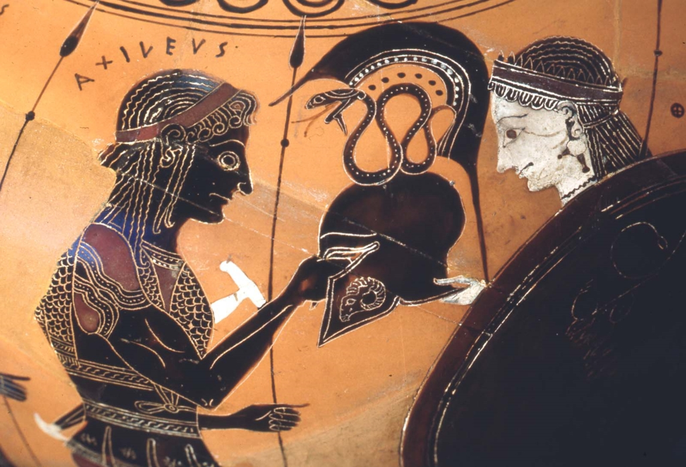
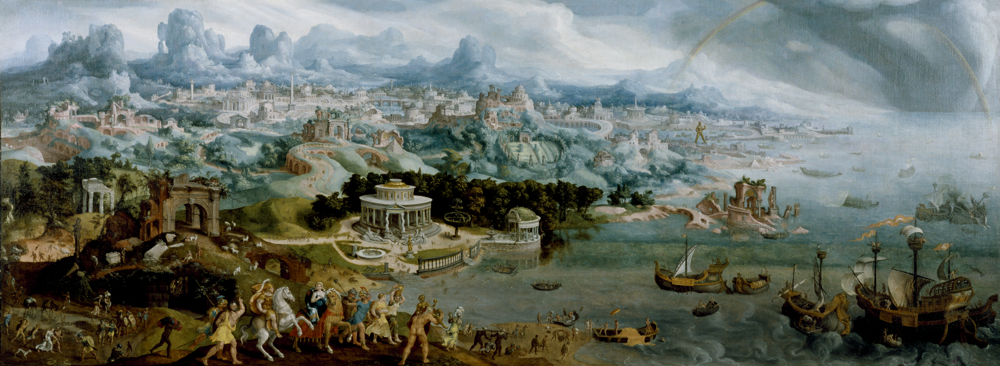
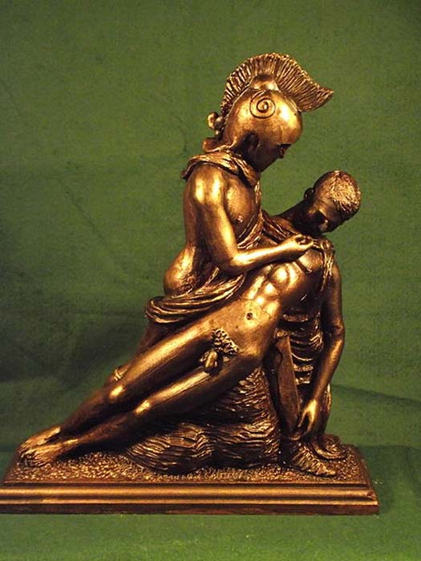
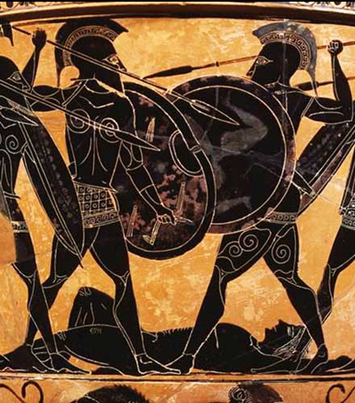
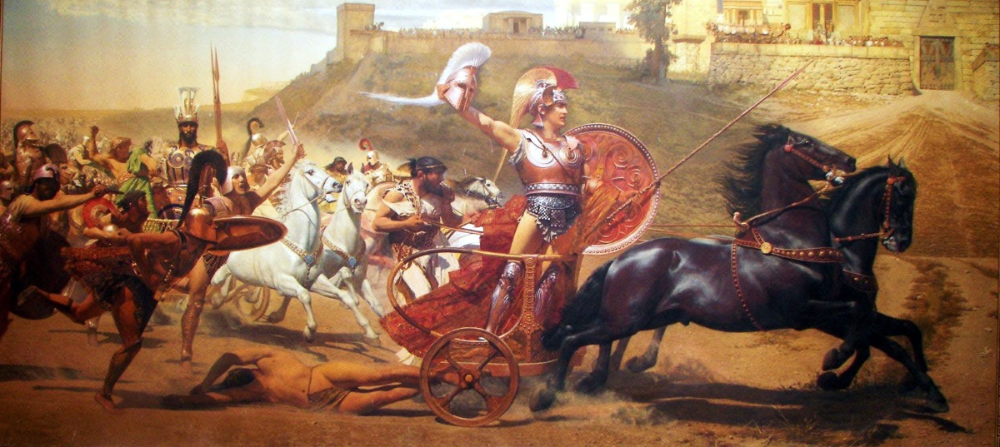
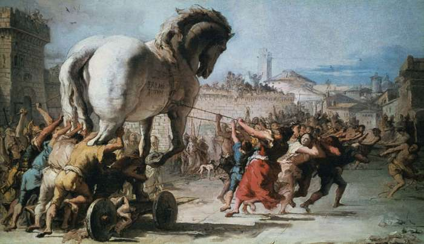
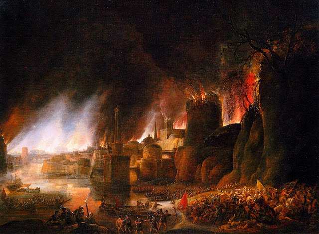

The *Illiad* begins: 

> Sing, Goddess, of the rage of Peleus' son Achilles, the accursed rage that brought great suffering to the Achaeans. 

 

Homer, *Odyssey*, 5.365-70]
> While he pondered thus in mind and heart, Poseidon, the earth-shaker, made to rise up a great wave, dread and grievous, arching over from above, and drove it upon him. And as when a strong wind tosses a heap of straw that is dry,and some it scatters here, some there, even so the wave scattered the long timbers of the raft.

Homer, *Iliad*, 4.124-32]
But when he had drawn the great bow into a round,
the bow twanged and the string sang aloud, and the keen arrow leapt,
eager to wing its way amid the throng.
Then, O Menelaus, the blessed gods, the immortals, forgat thee not;
and before all the daughter of Zeus, she that driveth the spoil,
who took her stand before thee, and warded off the stinging arrow.
She swept it just aside from the flesh,
even as a mother sweepeth a fly from her child when he lieth in sweet slumber;