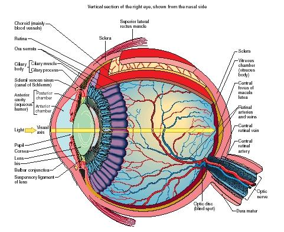

## Introduction ##

Non-philosophers often claim that their belief in God is a matter of faith. God's existence, they claim, is something that cannot be proved or disproved. Instead, they claim that one must take a 'leap of faith' and accept that he does, in fact, exist. 

Philosophers disagree. Since Aristotle in the 4th Century BC, philosophers have offered a number of arguments both for and against his existence. We are concerned in this handout with one argument for his existence, the Design Argument. Different handouts will introduce further arguments for his existence as well as arguments against his existence.

## The Design Argument ##

One of our arguments for God's existence, the Design Argument, is a topic of public controversy. Several states in the U.S. require high school biology teachers to teach, or at least mention, the possibility that an intelligent designer, as opposed to natural selection (see below), is responsible for the existence of life. Whether they realize it or not, these states are taking a side in a contentious philosophical argument. I'll first outline the argument before discussing some objections to it. 

The Design Argument begins by noting that the world and its inhabitants are beautifully complex entities. Consider the eye. Our ability to see requires incredibly fine calibrations of the light cones inside the eye. Some have argued that this complexity is evidence for God, an intelligent designer. These philosophers argue that the only way such complexity could exist is if God exists and created it.   

One influential version of the Design Argument comes from William Paley, an English Philosopher who died in 1805. Paley asks us to imagine encountering a stone in a field. There is nothing surprising about the stone being in that field. It was likely there for an indefinite period of time. Now suppose you walk a little further in the field and encounter a watch. It's very likely that you will stop and ask yourself where the watch came from. It seems impossible that it could just have been in the field for an indefinite period of time. 

Why? What distinguishes the watch from the stone? Upon inspecting the watch, you will discover that it has several parts that are put together for a purpose, e.g., the parts are so formed and adjusted as to produce motion, and that motion so regulated as to tell time. You also discover that if the different parts had been differently shaped, or of a different size, that the device would never have told time. 

Discovering the complexity of the watch, you likely will conclude that the watch must have had a maker; that there must have existed, at sometime, and at some place or other, a maker or makers, who formed the watch for the purpose of telling time. The stone, in contrast, has no similar complexity. It does not have parts put together for some purpose. We have no reason, then, to think that the stone, as opposed to the watch, was put together by some maker. 

## The Structure of the Argument ##

Paley's interest is God, not watches. He discusses watches to illustrate a general point about complexity, design, and creators. He thinks that these general points will apply to organisms just as much as to watches, and thus show that organisms too must have creators:

1. If an object contains various parts that are arranged to achieve some purpose, then that object exhibits a design. 
2. Organisms have parts that are arranged to achieve some purpose.
3. Therefore, organisms exhibit a design.
4. If an object exhibits a design, then it was created by an intelligent designer.
5. Therefore, organisms were created by an intelligent designer.
6. Therefore, God exists.

Paley argued for Premise 1 *via* the analogy of the stone and watch. The reason why we think the watch was designed, but the stone was not, is precisely the fact that the parts of the watch are perfectly arranged for the purpose of telling time. The parts of a stone, on the other hand, are not arranged to achieve any obvious purpose. 

Support for Premise 2 comes from our detailed studies of organisms and their parts. Any physiology textbook will tell you the purpose of each bodily system. Our heart pumps oxygenated blood to the extremities. Our eyes and hears collect information about our environment. Each of these bodily parts has a purpose that is achieved only because of the intricate make up of those parts; if the cones in the eye are not situated correctly, vision will not be produced. 

Premises 3 is an inference from our two earlier premisess.  

Premise 4 is controversial, and we will have more to say about it below. For the moment, notice that we normally would conclude that an object exhibiting some design, like a watch, was created by some designer. 

Premise 5 is an inference from earlier premises, and 6 states our conclusion. Paley thinks that if organisms have a creator, then  God is that creator, and, so, God exists. 

 

## Objections & Responses ##

I have presented Paley's argument as a deductive one. Evaluating a deductive argument requires us to determine whether the argument is valid and sound. (If you don't remember these distinctions, please study Ch.1.3 again. These notions will be used in each module.)

It is also important in evaluating philosophical arguments to distinguish between objections that are easy to respond to *vs.* those that are not easy to respond to, perhaps because those objections are fatal. 

Our first three objections are easy to respond to, the fourth is not. In what follows, I will first list each objection, then offer some notes on how the objection speaks to the original argument. I will also outline Paley's response to the first three objections.  

### Objection 1

**Objection:** since we have never seen a watch made or know how to make one, we cannot conclude that someone made the watch.

**Notes:** Let's think about how this objection is meant to work. Is it attacking the validity or soundness of Paley's argument? The complaint, again, is that unless we had seen someone making the watch, we could not conclude that someone made the watch. Looking again at 1-6, it's clear that this objection is really trying to deny Premise 4. It's claiming that while something may appear designed for some purpose, it does not thereby follow that we know it was designed by a creator for that purpose.  Since the objection is rejecting a premise, the objection is claiming that the argument is not sound. 

**Response:** Paley denies that we need to know how a watch is made in order to conclude that the watch has a maker. He points out that we extoll the artist who can do something we cannot do, e.g., we praise the software engineer for their creation even if we have no idea how they created it. I know, say, that MS Word was created by someone even though I have no idea who created it or how they did it. 

**Notes:** Paley responds to the objection by pointing out that it relies on a false claim, namely, that we can only know that X has a maker if we know who made X and how X was made.

### Objection 2 

**Objection:** There are some parts of organisms that seem to serve no function, e.g., the appendix.

**Notes:** Again, ask yourself is this objection attacking the validity of the argument or is it attacking a premise? Looking again at 1-6, you'll see that the objection is attacking Premise 2, which says that organisms have parts so arranged to achieve some purpose. This objection points out that there are some parts of an organism that serve no purpose at all.

**Response:** Paley responds by clarifying Premise 2. Premise 2 does not require that every part of the organism serves some purpose. His argument works as long as there are some parts that do; there is still an explanation that is required of how those parts serve the purpose they do. Paley also observes that the objection concedes to him that organisms have parts that are purposive; the objector cannot distinguish parts that do not have purposes from those that do unless she concedes that there are parts of the latter kind. In addition, we may note that while organisms may have some parts that serve no purpose, these are few in number compared to the vast majority of parts that do. 

### Objection 3

**Objection:** Organisms are produced from organisms through normal sexual and asexual reproduction. A baby chipmunk is not produced by God, but by his or her parents. 

**Notes:** Again, our first task is to see whether the objection is attacking the validity or soundness of the argument. In this case, it is the former. The objection does not deny any premise. It denies that the conclusion follows from the premises, i.e., it denies that the argument is valid. How? Look again at 6, which states the conclusion. 6 claims that God exists. This is supposed to follow from Premise 5, the claim that organisms have a creator (which itself follows from previous premises). But, the objector presses, just because organisms have creators, it does not follow that the creator must be God. Parent chipmunks create babies. A scientist might create an organism in a lab. In each case, the organism has a creator who is someone other than God. It seems, then, that 5 could be true and 6 false (because we can conceive of something other than God which creates organisms.) Since the premises could be true and the conclusion false, the argument, the objection claims, is invalid.   

**Response:** Paley responds by denying that the objector has provided examples of creation that do not involve God. He first observes that organisms can only replicate because they contain within themselves a reproductive system, a system of parts that precisely serve the role of reproduction. Since these parts have a purpose, they have a design, and hence, Paley, claims a creator. He asks us to imagine an inventor who creates a robot who can collect material in the workshop and create new robots by itself. This first robot creates new robots, robots that are not directly created by the inventor, but the first robot can only make new robots because it was created with the right parts and instructions to allow it do so. So, Paley accepts that organisms create other organisms, however, he claims that the only feasible explanation for the ability of organisms to reproduce is that there exists a God who created organisms with that ability. 

## A Fatal Objection?

The most powerful objection to the Design Argument comes from evolutionary biology. For our purpose, we can take evolutionary biology to attack Premise 4. It claims that organisms came to be how they are, came to display the purposive behaviors that they do, by completely random forces. This is a philosophy course, so I won't assume that you have studied biology. Instead, I provide here two of the simplest and shortest YouTube videos that will help you understand the very basics of evolutionary biology: 

+ [Random Mutation:](https://www.youtube.com/watch?v=GhHOjC4oxh8) small changes in inheritable traits passed down through generations over long periods of time. 
+ [Natural Selection:](https://www.youtube.com/watch?v=0SCjhI86grU)
the phenomenon that determines which traits survive and are passed down through generations. 

After watching these two videos, you should see how evolutionary biology attacks Premise 4. It claims that the appearance of design does not entail the existence of a creator. Instead, the existence of design is explained by two chance processes.  1) There are random mutations in the genes that are transmitted from parents to offspring, mutations that result in slight changes of appearance, function, and behavior. 2) By pure chance, some of these changes provide to offspring an advantage in their environment; they find it easier to get food, or escape predators, or escape disease, etc. These advantages allow those offspring to breed. Thus the genes responsible for the advantages are passed on.

What's key to note here is that this is all by chance, not by some creator's intent. It is pure chance that those changes were advantageous in that environment. In a different environment, those changes would provide no advantage at all. Indeed, they are as likely to be a disadvantage: offspring in that environment with those changes might be more prone to an illness, easier prey, less likely to find food, and so less likely to survive and reproduce.  
 
 

