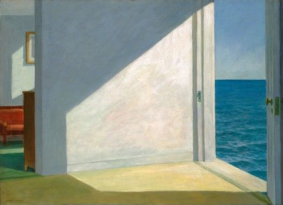

# Course Information
+  [Syllabus](Syllabus.pdf)
+ [General Education at NJCU](http://www.njcu.edu/department/general-education)
+ [Signature Assignments at NJCU](http://www.njcu.edu/academics/general-education/signature-assignment-information-students)

# Withdrawal Dates

|         	 |     |
| :-------------: | ------------- |
| Sept 9 | Final day to Add/Drop for 100% refund of tuition and fees and correction of class schedules. |
| Sept 30 | Final day to withdraw from a course (s) for a 50% refund of tuition and fees with a “W” grade. Form must be submitted to the Registrar's Office, Hepburn Hall Room 214.|
| Nov 1  | Final day to withdraw from a course (s) for a “W” grade.|

# Materials 

Links to notes, readings not in the textbook, and optional videos & readings are below by clicking the relevant links. Consult the syllabus for a full list of what is required for each week. 

+ [Topic 1: An Examined Life](Intro)
+ [Topic 2: A Meaningful Life](Meaning)
+ [Topic 3: A Religious Life](God)
+ [Topic 4: A Free Life](FreeWill)
+ [Topic 5: A Natural Life](Mind)
+ [Topic 6: An Ethical Life](Ethics)		

