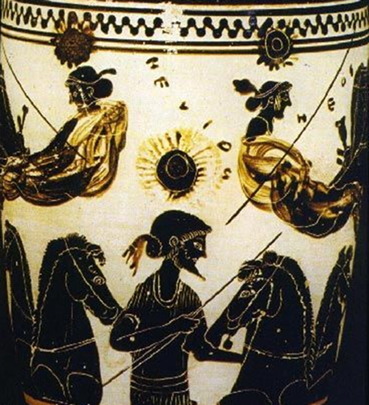

# Module 1: Generation & Destruction

## Week 1: Parmenides' Challenge

+ Required reading not in the Textbook
  + ['On Nature',](text) Parmenides

+ [Notes](notes)

+ Optional reading
   + ['Presocratic Themes',](Pres.pdf) D. Sedley 
   + ['Parmenides',](https://plato.stanford.edu/entries/parmenides/) SEP entry
  

## Week 2: Generation From Potential Being

+ Required reading not in the textbook
  + [*Physics*, Book 1, ch.7-8](phys1.pdf)
  + [*Aristotle*,](shields.pdf) selections, C. Shields

+ [Notes](notes2): These are in draft form. I will edit and complete over the next few weeks. 

+ Optional reading
  + ['The Eleatic Challenge in Aristotle's *Physics* 1.8',](eleatic.pdf) S. O'Connor
  + ['The Subjects of Natural Generations in Aristotle's *Physics* 1.7',](subjects.pdf) S. O'Connor
 

## Assignments
+ [Short essay 1](essay) 

