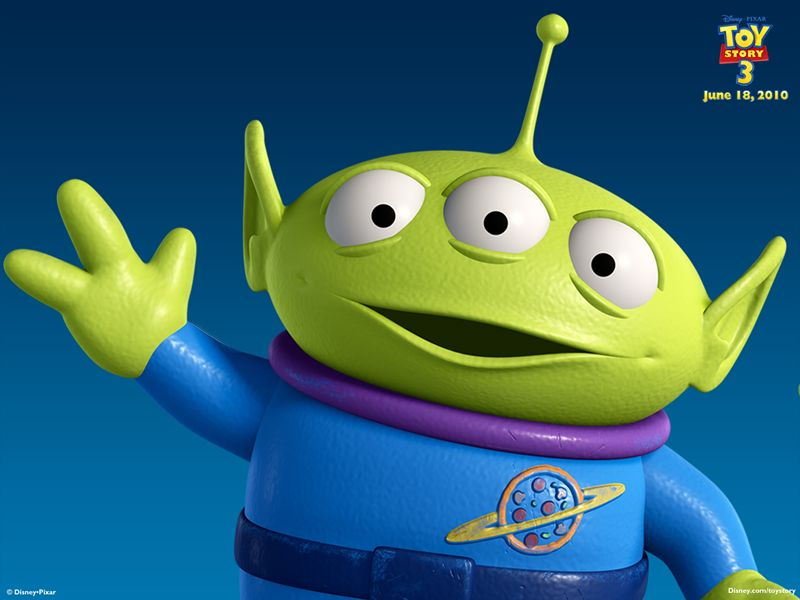

## Consciousness

Turing thought it obvious that the capacity to imitate a human was sufficient for a machine to enjoy mentality. It certainly is sufficient if mentality consists entirely in the abilty to ask questions, give answers, joke, tease, lament and symphatesize. In other words, if all there is to having a mind is the ability to hold a conversation, then machines could one day enjoy mentality (if they don't already). But Searle's thought experiment seems to show that there is something more to the mind than just the ability to have conversations; something that the machine is cruciall lacking. At this point, it should seem no surprise to learn that many think that this missing ingredient is consciousenss. And consciousness, whatever it is, is not something enjoyed by a machine regardless of how loquacious it may be. 

But why think that consciousness is not enjoyed by a machine? Isn't the machine aware of the people it is talking to? Isn't a robotic car aware of the obstacles it successfully navigates on the road? If being aware is sufficient for being conscious, then robotic cars are clearly conscious. In this section and the next, we will try get clearer on this question by asking about the nature of consciousness, what exactly is it that we take humans to possess and machines to lack? There are two distinct questions we will focus on, one in the each week: 

1. What is consciousness? What are its features? How best can they be described?
2. How does consciousness come to exist? If from the brain, how so?

Our first question asks us to identify the defining features of consciousness. Should it be characterized as mere awareness of the external world? If not, what else is it? Is there just one phenomeneon of consciousness or might there be several different phenomena that we use the same word to describe? If so, what are these different phenomena? 

Our second question asks how consciousness exists. The 19th century biologist puts the question as follows: 

> But what consciousness is, we know not; and how it is that anything so remarkable as a state of consciousness comes about as the result of irritating nervous tissue, is just as unaccountable as the appearance of the Djin when Aladdin rubbed his lamp in the story, or as any other ultimate fact of nature (Huxley). 

Humans are consciouss and our consciousness has something to do with our brains. But what is that 'something'? Just how could a brain produce consciousness in the first place? This second question is, of course, related to the first. If we learn that there are, in fact, two types of consciousness, then we will need to determine how the brain gives rise to each type. We will focus on the second question next week. 

## “What Is It Like to Be a Bat?”

Our entry point for our discussion of conscioussness if Thomas Nagel's seminal 1974 paper "What is it like to be a bat?". The paper restored consciousness as a central problem in philosophy and neuroscience, for, as Nagel convinced us:

  > The most important and characteristic feature of conscious mental phenomena is very poorly understood (436).

Nagel begins Conscious Creatures: 

> It is not analyzable in terms of any explanatory system of functional states, or intentional states, since these could be ascribed to robots or automata that behaved like people though they experienced nothing (436).

Nagel uses the examples of bats to argue for the 'what it's like' quality of consciousness: 

- Bats are mammals.
- They have conscious experience. 
- Bats use echolocation to navigate and perceive objects. 
- Both sonar and vision are regarded as perceptional experiences.
- What it's like to see a bug is different from what it's like to echolocate that bug. 
- What it's like to a human differs from what it's like to be a bat.

> The problem is not confined to exotic cases, however, for it exists between one person and another. The subjective character of the experience of a person deaf and blind from birth is not accessible to me, for example, nor presumably is mine to him. This does not prevent us each from believing that the other's experience has such a subjective character.(440)

## Qualia

“What it is like” refers to the specific qualitative character of experiences, e.g., the redness of a visual percept, the hurtfulness of a pain, the smell of fresh newsprint, the tactile feel of a cool marble surface, etc. An itch feels different from a tickle. A sharp pain feels different from a burning one. Thirst feels different from hunger. Seeing something that looks green is different from seeing something that looks blue. T

 Imagine a chili on your tongue. Now imagine a chocolate on your tongue. Not only can you tell the difference between the chocolate and the chili, the chocolate and chili cause  different conscience feelings in you. It feels a certain way when you taste chocolate, and it feels a certain way when you taste a chili, and those two feelings are different. Philosophers use the word 'qualia' to refer to these qualitative aspects of experiences, though the following are also used: 

1. Phenomenal properties
2. Phenomenological properties
3. Raw feels
4. What it's like

These terms are ways of getting you to identify something you are already familiar with it. They aren't meant to introduce you to something new. If you are not already familiar from your own mental life that mental states have a dis­tinctive feel, these words will mean nothing to you. 

Bodily sensations and perceptual experiences clearly have qualia. Cognitive states likes beliefs, hopes, and emotions don't clearly have such qualia, or, at least, they are not individuated by the qualia they have. So, for instance, anger and pride may have certain feelings associated with them, but they aren't merely certain feelings. Pride and anger also have different propositional contents associated with them, e.g., pride has some belief about merit attached. 

There is plenty of evidence for qualia. Consider first your experience of color:  

It is tempting to think that your experience of color is to be explained fully in terms of the properties and features of what you see. The content of your experience just is the external object and its features. But there seems to be something more to our expierences than the objects we experience and their properties. Imagine that a person, Ted, suffers an unusual brain injury. The parts of his brain responsible for vision inverts the colors of the objects they had experienced in the past: 

Before Ted's accident, he placed a strawberry in his fridge. That strawberry appeared red to him. After the injury, he returns to the fridge and takes out the strawberry. But it now looks green to him! He is very unsettled by this. Green looks so different than red. Obviously, there is more to Ted's experience of the strawberry than just the external object. His perceptual experience of the strawberry has properties, perceptual properties, or qualia, that are different from the properties of the strawberry. These properties changed after the brain injury. The strawberries did not. 

We don't need such a bizarre example to be convinced that there are qualia. Consider that sensational dress that caused such an internet outcry. What color is it? 

Some were adamant that the dress was white and gold. Others were adamant that it was blue and black. Neither group would budge. Both groups saw the same dress, but the qualia of their relevant perceptions of the dress were different. 

## Types of consciousness

The notion of qualia, or "what it's like" allows us draw some interesting distinctions about consciousness. Consider this claim by Nagel: 

> fundamentally an organism has **conscious mental states** if and only if there is **something that it is like to *be* that organism**-something it is like *for* the organism (436)

Nagel in fact is really pointing to two phenomena. 1) What it is like to be a creature of a certain sort, and 2) what it's like to have a mental state of a certain sort. 

State Consciousness: 
: a state of a creature is conscious if there is something it is like to be in that state.

Some conscious states
1. Pain: there is something it is like to experience pain in a burned finger. 
2. Vision: there is something it is like to see a large red circle painted on a white wall.
3. Smell:  there is something it is like to smell a rotten egg. 

Some non-conscious states
1. Bodily states: there is nothing that is like to have hair grow (though there is something that is like to *feel* your hair grow. 
2. Your age and weight. 

Creature (subject) Consciousness: 
: A conscious creature is one that is capable of having conscious states.

## Phenomenal and Access Consciousness

Noticing that there are qualia allows us to raise interesting questions about consciousness and ask some pressing questions. Consider these two cases: 

**Blindsight**

https://www.youtube.com/watch?v=R4SYxTecL8E
https://www.youtube.com/watch?v=GwGmWqX0MnM

(**Some optional extras**)
+ https://www.youtube.com/watch?v=ny5qMKTcURE
+ http://www.bbc.com/future/story/20150925-blindsight-the-strangest-form-of-consciousness

**Subconscious Thought**
https://www.youtube.com/watch?v=SomZ6aViWGY

The first video discussed cases of blindsight. You may, for instance, place a ball in the sphere of some blind person's vision and ask them to grasp it with their hand. They claim they cannot see the ball, but they succeed in grasping it anyway. And their success matches the success of the sighted, e.g., they grasp the ball as quickly and as reliably as those with vision grasp it. The second video introduce us to cases of subconscious thoughts. While driving to school or work with a friend, we may not be consciously focusing on the road. Nevertheless, we navigate the obstacles as if we were focusing like a new driver. We adjust our speed to the cars around us. We steer to avoid a pothole. But if anyone asked you what you were thinking about, you would respond that your mind was on the conversation. 

What is going on in both these cases? Ned Block has introduced the following important distinction: 

> Phenomenal consciousness is experience; what makes a state phenomenally conscious is that there is something “it is like” to be in that state (Block, “On a Confusion about a Function of Consciousness”, p.377)

A mental state is phenomenally conscious, then, just if it has qualia. This contrasts to the following: 

> A state is A-conscious [access-conscious] if it is poised for direct control of thought and action. To add more detail, a representation is [access]-conscious if it is poised for free use in reasoning and for direct “rational” control of action, and speech. An [access-conscious] state is one that consists in having an [access-conscious] representation (Block, “On a Confusion about a Function of Consciousness,”, p. 382.).

When you notice the swerving car, you can complain about that car to your friend. Since you were able to do something with the awareness of the car, i.e., think and talk about that car's behavior, your thought of that car is a-conscious (as well as p-conscious). So, a thought is a-conscious if it is broadcast to the creatures brain. Such thoughts are posed to interact with a wide variety of the creature's other thoughts and to directly drive its behavior. Access conscious thoughts are usually the ones you can report if someone were to ask you, what are you thinking now? 

There are three ways of relating access consciousness (a-consciousness) and phenomenal consciousness (p-consciousness). 

1. A-consciousness together with p-consciousness, e.g., driving successfully, you are p-conscious of the cars and report their behavior to your friend. 
2. P-consciousness without a-consciousness, e.g., driving successfully, you are p-conscious of the cars, but do not actively think about or report their behavior to your friend. Instead, you talk about your latest philosophy course. 
2. A-consciousness without p-consciousness, e.g., driving successfully, the robot car reports the behavior of the other cars to the neural network. But the robot car is not p-conscious of its surroundings. 

## Blindsight

Return now to our problematic cases. Blindsight is a case where you have a-consciousness without p-consciousness. How might this happen? The human visual system is divided into two separate subsystems - the ventral and dorsal subsystems. 

The ventral system is responsible for object recognition and classification. It is responsible for recognizing that an object is a chair as opposed to a dolphin, a tree as opposed to a building, etc. The dorsal system is is responsible for recognizing spatial features such as location and motion, e.g., for recognizing that the dog is moving and that the dog is closer to us than the cat. Block associates P-consciousness with the ventral system. It's noticeable that in blindsight there seems to be damage to the ventral system.

Of course, you might claim that these people don't have a-consciousness of the stimuli in their blind region. Blindsight patients must be prompted by an experimenter before they will 'take a guess'. But Block asks us to imagine a super-blindsighter who had acquired the ability to guess when to guess about the content of her blind field. Even though she doesn't see the objects in her blind field, she can spontaneously offer verbal reports about those objects. Information about her blind field just spring into her thoughts. A super-blindsighter would be a-conscious but not p-conscious.

## P-consciousness without A-consciousness

**Case 1: Damage**

Suppose the damage occurred the other way. That there was damage to the dorsal system, but not the ventral system. Block believes that in such cases we would have f P-Consciousness without A-Consciousness. Unlike the blindsight case, though, note that the person with p but not a conscious would not be able to report to us what they are p-conscious about. Lacking a-Consciousness implies that the content of the p-conscious state is not available for rational manipulation, including reporting things like "I see a blue goose". 

**Case 2: subconscious thoughts**

Our subconscious experiences have qualia and they may even cause us to behave in certain ways. But these subconscious states are not available for direct rational control. They are not immediately available for us to deliberate about and knowingly act upon. So even if they effect our behavior, they do not do so in the same way our rational deliberation effects our behavior. These states then are p-conscious without being a-conscious. Some of these states can, of course, become a-conscious. For instance, perhaps the sound of a jackhammer has caused you to grimace as you were absorbed in a good book. You didn't realize you were grimacing and you didn't give any of your attention to that noise. But once you put down the book, you might notice that you are grimacing and the cause is that noise. You can then deliberate about whether to call in a noise complaint, shut the window, or leave the house. In this case, you become a-conscious of the state that was previously causing your grimace. 

https://www.youtube.com/watch?v=UYSKW3IvZlQ
 

Do animals have phenomenal consciousness without access consciousness? 

