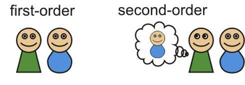

---
layout: mind-weekly
title: Self Knowledge
--- 

## Self-Knowledge

There are mental states we are aware of and mental states that we are not. How is this possible? This is the problem of self-knowledge, of how we can gain knowledge of our minds. The problem arises because of an apparent distinction between **first order mental states**--roughly those states about our body and the external world--and **second order mental states**--roughly, those states about our first order mental states. 

First order mental states: 
: States that are not about the mind, including states that are about the external world, e.g., seeing a tree, hearing music, etc. 

Second order mental states: 
: States that are about first order mental states, e.g., our awareness of our sight of the tree. 

Consider driving down a busy road with a friend. While you talk, you successfully stay in your lane and navigate around obstacles. You must, in some sense, be aware of the road and your surroundings. This awareness is a first order mental state. Suppose your friend tells you to focus on the road. You will do that by attending to what you had already somehow been aware of, i.e., you will focus on your perception of the road. 

By *self-knowledge*, we mean the knowledge we have of our own minds. It is the second-order mental state about our own minds. The importance of self-knowledge can be illustrated by relating it to our previous distinction between access and creature consciousness. 

Access consciousness: 
: Access consciousness involves an awareness of one's own mental states--the difference between a conscious and unconscious first order mental state is that we have awareness of the former, but not the latter. This awareness of a mental state is what is called a second order mental state.

*Example 1:* You see the road and hear the traffic, but you are not aware of what you see and what you hear when you are talking to your friend. You become aware of what you see and what you hear by becoming aware of your awareness of the car and the traffic. 

*Example 2:* The person in an agitated state does not notice the pain in their side when shot or injured during battle. When they become aware of their pain, they have a second order mental state about their first order mental state. 

Creature consciousness: 
: A creature is conscious just in case it is capable of being aware of its own first order mental states, i.e., a creature has creature consciousness only if it has second order mental states. 

*Example 1*: The robotic vacuum cleaner is aware of the wall and turns around. However, it is not aware that it is aware of the wall. Thus, it may have some conscious like states, but it does not have creature conscious---it is not a conscious creature. 

*Example 2*: A cat is aware of the fly and chases it around the room. So, some states of the cat count as conscious states. But does it have creature consciousness? This depends on whether the cat can be aware of its own mental states, on whether it can be aware that it is perceiving a fly. This is, of course, a highly debated question. 

## The Problem of Self-Knowledge

We do have access to  our first order mental states. Nobody doubts that we do. However, nobody really understands how we are aware of our own mental states, aware of our own minds. The problem, in part, is that awareness of our first order mental states has two mysterious features: 

1. Privilege: We have special authority over our mental states. Your belief that you are in a certain mental state has more epistemic weight than any third person judgement about your states, e.g., someone else could judge wrongly as to whether you are in pain, but you cannot judge wrongly as to whether you are in pain. 
2. Peculiarity: the manner by which you know what mental state you are in differs from the manner by which others know which mental states you are in. Others people watch your behavior, ask questions, etc., to investigate what you are feeling and thinking. But your knowledge of your own mind is not based on, or inferred from, evidence about other things. Your access to your mind is very different from the access anyone else has to your mind. 

The problem of self-knowledge is this: **How do we become aware of our first-order mental states?** What is this special way we have of coming to know our own minds? 

We will compare and contrast two answers. Both say that we become aware of our first order mental states by internally scanning those states, by being in a higher order meta-psychological state. But, they characterize this meta-psychological state in different ways. 

## Answer 1: Higher Order Perception 

Higher Order Perception Theory (HOP):
: A mental state is a conscious state just in case there is a higher order perception of it--or perception of being in that state. 

Our first theory states that higher order states are very much like perceptual states. To be in these higher order states is akin to seeing, or smelling, or hearing, etc. Just as we see the color,  so too we have an inner perception of our mental states. Such a view is often called an inner sense theory of consciousness because defenders of this view believe that we become aware of our mental states by sensing them, e.g., just as you can look around the room, so too you can 'look' around your mind. 

One way of defending HOP is to argue that the awareness of our mental states has the same features as our perceptions of the external world. Analogously, a person might try argue that some music belongs to a particular genre by arguing that the music appropriately resembles that genre. For instance, one might argue Joy Division's music belongs to the genre of post-punk as follows: post-punk music is experimental and anti-corporatist. Joy Divisions's music was experimental and anti-corporatist. Therefore, Joy Division's music was post-punk. 

The argument for HOP has a similar strategy:

+ P1. Perception has some features, x, y, z.
+ P2. Awareness of our own mind has features x, y, z.
+ C. Thus, we are aware of our own minds by perceiving them. 

What are the supposed features that are similar? Here are two:   

1. Sense modalities respond differentially to a range of stimuli. We see some things clearly and others not so clearly, e.g., the house in the distance is obscure and hazy, but appears clear and distinct as we approach. Our awareness of our own minds has a similar feature. Some mental states appear clear and distinctly. Others are hazy and nondescript, e.g., a nagging pain might have an unclear location, but a sharp pain is easy to locate. 
2. Sense modalities respond directly. Flash a bright light in someone's eyes and there is an immediate perception. Our awareness of our mind also seems to respond directly. Your attention can be brought immediately to the pain in your stubbed toe. 

Since our awareness of our mind is similar to our perceptual capacities in these two ways, one might conclude we are aware of our mental states by perceiving those states. That is, whatever we do when we become aware of our minds is just like what we do when we see a car, smell a rose, or taste some chocolate. 

The problems for HOP are acute. I argued that Joy Division's music was post-punk by claiming that their music has some features of post-punk music. One way of blocking this argument is to find some other important feature of post-punk that is not shared by Joy Division's music, e.g., post-punk is not melodic, but Joy Division's is. 

A similar strategy is used to show that we are not aware of our mental states by perceiving them. Following this strategy, we will identify important differences between our awareness of our minds and our perception of the external world:   

+ Mental states do not exemplify a single range of stimuli as sensory modalities do. Hearing is of sound. Vision is of color and shape. Smell is of odors. If we are aware of our mental states by strictly perceiving them, then it seems there should be some specific range of stimuli that this inner perception detects. But it detects a wide range of very disparate mental states, so it doesn't seem like perception at all.  

+ Since each perceptual experience has unique content, we expect our higher order perception to have some unique content, content that distinguishes it from first order mental states, in particular, first order perceptual states. But what is this content? 

+ Each sense modality has its own organ. So, higher order perception require its own organ. But there is no such organ. 

+ Ordinary perceptions sometimes malfunction. If we are aware of our mental states by perceiving them, then this perception should also be capable of malfunction. But it seems incoherent that someone could have an accurate first-order perception while having a false higher-order perception.

## Higher Order Thought

Our alternative theory denies that we are aware of our mental states by perceiving them. Rather, this theory claims that we are aware of our mental states by thinking about them. 

Higher Order Thought Theory (HOT): 
: A mental state is a conscious state just in case there is a higher order thought of it--or thought of being in that state. 

HOT claims that awareness of our mental states is conceptual (not perceptual). What does this mean? Ever had a silent conversation with yourself? How about a mind that seems over-critical of what you are doing? That inner-voice is an inner thought. It is the words that are silently occurring throughout our conscious life, and, at least for me, they are the most charcteristic feature of consciousness. HOT utilizes this inner-voice to explain our knowledge of our mind. According to this theory, I am conscious of my red experience, or the angry driver, or the chocolate smell, by saying to myself, 'I am experiencing something red', 'I see that angry driver, 'I smell chocolate.' It is saying these things to myself that makes me aware of the experiences. 

(Note that some believe that the higher-order thought accompanies the experience itself — it is actually occurring at the same time. Others believe that it does not need to actually occur at the same time, but believe that the first order mental state must be immediately available for us to think about (even if we aren't actually thinking about them). This distinction isn't that important for our purposes.) 

If we are aware of our mental states by thinking about them, but not perceiving them, then we need to characterize the difference between thinking and perceiving. What is the difference between seeing that the tree is green and thinking that the tree is green? The distinction is often made in terms of the contents of these different states; i.e., between the contents of perception and the contents of thoughts. 

On a standard way of drawing the distinction, the content of a thought is conceptual while the content of perception is not. But what does that mean? A standard dictionary entry isn't that helpful: 

> Conceptual content: 
> :  A semantically evaluable, redeployable constituent of thought, invoked to explain properties of intentional phenomena such as productivity and systematicity. Applied to an assortment of phenomena including mental representations, images, words, stereotypes, senses, properties, reasoning abilities, mathematical functions, etc. (Dictionary of Philosophy of Mind)

> Nonconceptual content:
: A content, possibly of a non- or sub- doxastic state, whose canonical specification employs concepts which the subject need not possess in order to entertain the content, but rather might, for instance, be canonically specified in terms of abilities and skills the subject possesses, or in terms of significant though nonconceptualized experience. (Dictionary of Philosophy of Mind)

Yikes! These definitions are hard, but the simple idea is that nonconceptual content is content that can be specified without words and concepts available to whoever or whatever is in that state. If insects have mental states, the content of those states are be nonconceptual. The reason is easy. Insects don't have concepts they can use to describe the content of their states. That content, whatever it is, could be described by us---as we have the words and concepts to talk about it. Conceptual content, on the other hand, is content that is characterizable by the words and concepts available to whoever is in that state. In other words, if a butterfly has a state with conceptual content, then the butterfly must have available to it the conceptual resources to characterize that content. This probably entails that butterflies do not have such states as they do not have the conceptual resources to put that state into words. 

Conceptual content is also often characterized as propositional concent and thought characterized as a propositional attitude. A proposition is whatever comes after a 'that' clause, e.g., in the sentence "Socrates said that Meno was at the party last night", the proposition *Meno was at the party last night* is one that Socrates apparently reported. Every proposition is either true or false. The sentence "Yeah for chocolate" is neither true nor false, so it does not express a proposition. "There is chocolate on the plate" is a proposition as this sentence is either true or false (unfortunately false as I write these notes). It's not important what language we use to express a proposition. Different languages can express the very same content. 

There are also different attitudes we can take towards one and the same propositions, e.g., hoping that the cat is on the mat, believing that the cat is on the mat, etc. 

The claim that a thought is a mental state with conceptual content is best understood then as the claim that thoughts are propositional attitudes where the content can be characterized with words that whoever is in that state possesses. The HOT theory say that our awareness of our first mental states---those mental states that are conscious as opposed to unconscious---just  consists in one's having a thought that one is in that very mental state, e.g., my awareness of my red experience just consists in my having the thought "I am having a reading experience", or perhaps "there is a red experience occurring." Notice that I have to possess these words and concepts in order to have this thought.

**In favor of HOT over HOP** 
1. Thinking is not limited to a single range of stimuli in the way perception is limited. 
2. Thinking is just as immediate as perception. 
3. Thinking does not require an internal sense organ.  
 

**Against HOT** 

The most significant problem with HOT is its claim that we can only be aware of those things that we have concepts for and thoughts about. If you are only aware of your mental states by thinking about them, then what you are can be aware of is determined by what you can think about (which in turn is limited by the concepts you possess). But I seem to be aware of things that I don't have any concepts for and thus cannot have any thoughts about. For instance, I am aware of my perception of various shades of green; I am aware that I am seeing various shades. However, I may not have the words to describe some of these shades. If HOT were true, I should not have awareness of my perception of those shades that I cannot describe. 

A second problem arises from how we are aware of our thought, of how we are aware of our second order mental states. Recall that HOT claims that we are aware of our first order mental states by having second order mental states about them. But, I also seem to be aware of my second order thoughts, e.g., I say to myself 'stop thinking about whether to eat the chocolate you smell and think instead about class tomorrow'. Here I have a second order thought about chocolate, or rather, I am aware of the sight of chocolate. But I also have a higher order thought about that second order thought, namely, I think to myself that I should stop having that second order thought. Is this a third order thought? HOT has difficulty answering this question. 
