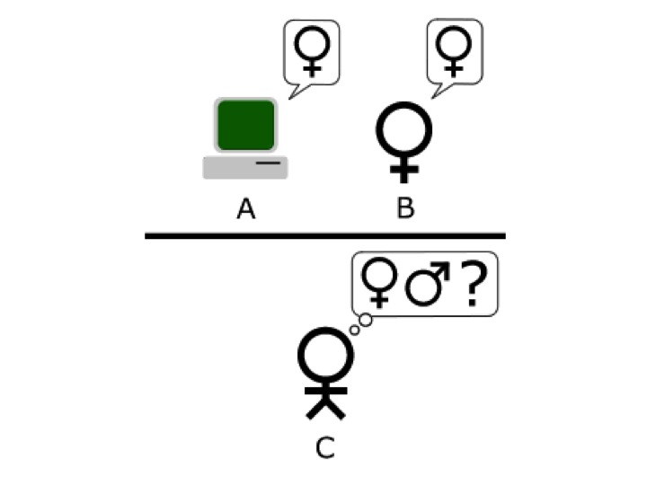

## Review

Let us take stock. We have reviewed three theories of mind so far: 

Dualism:
: mental states are separate from brain states. For instance, dualists claim that pain is not identical to any brain state. 

Identity Theory:
: mental states are identical to brain states. For instance, identity theorists claim that pain is identical to some brain state like c-fibers firing. 

Behaviorism: 
: mental state are identical to sets of behaviors and physiological responses. For instance, the behaviorist claims that pain is identical to some behavior like grimacing and groaning. 

We saw that dualists struggle to explain mental causation, to explain how the mind causes our bodies to move. We saw that the identity theorist has little difficult explaining mental causation, but struggles to explain how all the properties of our minds could really be properties of our brain. And, we saw that the behaviorist struggles to explain several features of mentality, including how mental states figure in the explanation of our behaviors. 

## Functionalism
Our final theory of mind is called **functionalism**. It is currently the most popular of the various theories of mind. Functionalism hopes to accommodate the strengths of all our previous theories while avoiding their weaknesses. We will define functionalism as follows: 

Functionalism: 
: mental states are defined by the causal roles they play in the cognitive system as a whole, i.e., what it is to be a particular state just is to bring about some result given some input.

Let's unpack this definition. What does it mean to define something by a causal role? There are many functions and roles that entities play. You may have a job and that job will have a description, e.g., what it is to be a full time professor is to *conduct research in a field*, *teach courses in a field*, and *contribute to the running of a department, college, and university*. Each of these italicized phrases describe jobs that full time professors have. Different job titles exist: contingent faculty teach courses in their fields but do not contribute to the running of their department, college, and university. 

Take a moment and consider any job you have had. Write out what *work* that job required of you; that description is a definition of your job's function. Notice that the definition does not include what you must wear or what time you must start; these are not part of the work you do. They may be requirements of the job, but they are not what defines the job. What defines the job is the work that it requires of you.  

It can be difficult to identify functional definitions because some phrases and terms admit of both a functional and non-functional definition. For instance, what do you think hearts are? If you had to define a heart, what would you say? You likely would  give one of two types of answers: 

Functional Definition:
: To be a heart is to pump oxygenated blood to the tissues and deoxygenated blood to the lungs. 

Material Definition: 
: To be a heart is to be a hollow muscular organ that has four chambers with two atria and two ventricles.

Our first definition describes the job that hearts perform. It makes no mention about the structure of the heart, about its parts and the materials it is constituted from. The second definition only mentions the structure and constitution of the heart. It says nothing about what the heart does, about what the job of the heart is. 

Which of these two definitions states the true nature of the heart? A functionalist about hearts claims it is the first. They believe this because they think that all of the following count equally as hearts:

Each item is composed of different materials. Some are composed of tissues. Others are composed of metals and plastics. But each of these entities can pump oxygenated blood to the tissues and deoxygenated blood to the lungs; you could have an artificial heart. According to the functionalist, since each plays the role described in the functional definition of a heart, they are each hearts. So, regardless of what it is made of, it is a heart if it does the job of a heart. 

You shouldn't find this too surprising. A person counts as occupying a position at a company if they do the work associated with that position. They do not count as occupying the position because they have blood and tissue as parts, or because they have are a certain height, weight, or appearance. Such considerations do not define a job; it's the work that defines the job and people of varying heights, weights, and appearance can often do the work of the very same job. 

The functionalist thinks that we need to be similarly careful when investigating the nature of the mind to distinguish between functional and physical descriptions of mental states. The identity theorist, for instance, really thinks that mental states are defined by some physical description; they think that a mental state is identical to some brain state. But the functionalist disagrees. They think that the nature of a mental state is the job it plays; the nature of a mental state is defined by a functional role and not what constitutes it. 

Consider pain. What job does pain play? That might seem an odd question, but pain does play a role, a role that even has a rich evolutionary history. Namely, when your body detects tissue damage, pain is that mental state that causes you to respond appropriately, e.g. causes you to remove your hand from the burning object. 

On this view, the pain state exists and is defined by the job that it does. It is, then, distinct from any behavior. Rather, pain is whatever causes you to behave in some distinctive way upon the detection of tissue damage. Pain is also distinct from any physical state. Just as what it is to be heart is not to be made of tissues, so too what it is to be pain is not to be made of some physical state. A physical state can play the role of pain just as some tissue can play the role of a heart. But the job and the thing that performs the job are distinct from one another. 

If functionalism is correct, then there is some role that each mental state plays. David Armstrong puts the point as follows: 

> the concept of a mental state is the concept of an internal state apt to be caused by certain sensory inputs and apt to cause certain behavioral outputs. A specification of input and output, <i, o>, will define a particular mental state: for example, <tissue damage, aversive behavior> defines pain, <skin irritation, scratching> defines itch, and so on.

So, each mental state will have some input and some output. The job of the mental state is to cause the output given the relevant input. The inputs can include other mental states. For instance, one of the inputs, or conditions, relevant in describing the role of being itchy might be that you are awake, where being awake is a mental state; you can't be itchy if you are asleep. The outputs too can include other mental states. Perhaps one of the outputs of belief is desire, e.g., a belief that eating kale is healthy might cause in you a desire to eat kale. 

Functionalists say that for every functionally defined mental state, there is something that plays the role given in the definition. We will say that any entity that plays the role *realizes* it. Kim's explanation is as follows: 

> F is a functional property (or kind) just in case F can be characterized by a definition of the following form: For something x to have F (or to be an F) = def for x to have some property P such that C(P), where C(P) is a specification of the causal work that P is supposed to do in x.

*And*

> Let F be a functional property defined by a functional definition, as above. Property Q is said to realize F, or be a realizer or a realization of F, in system x if and only if C(Q), that is, Q fits the specification C in x (which is to say, Q in fact performs the specified causal work in system x).

This is less complicated than it appears. Consider some examples: 

+ x is a mousetrap if x has some property P such that P enables x to trap and hold or kill mice.
+ x is a bread knife if x has some property P such that P enables x to cut bread. 
+ x is a heart if x has some property P such that P enables x to pump blood. 
+ x is a pain state if x has some property P such that P enables x to detect tissue damage and cause aversive behavior. 

So, there are two things to keep clearly before us. The first is the functional definition of whatever we are interested in. The second is the properties something must possess to allow it play the relevant role. In the case of mental states, the functionalist claims that brain states have properties that allow them perform the job specified in the description of the mental state. But, the brain states are not identical to those mental states; they just play the role of the mental state. 

## Argument for Functionalism
  
If functionalism is true, very different types of entities could realize the same role. Just as both plastic and organic materials can realize the role of a heart, we might then expect that different kinds of entities can realize mental states, e.g., that different types of things could play the role of pain. They could each play the role of pain if they have some property that allows them to realize the functional description of pain.

 The very best argument for functionalism is that different types of entities can and do realize the same mental state. We will look at one version of this argument that relies on the intuition that a sufficiently complex computer program could realize mental states. Since a computer is made of silicon and our brains are not, if a computer realizes some similar mental states as our brain does, then mental states cannot be identical to any of these physical states. Rather, mental states would be identical to various jobs or functions. Those jobs would be played by neurons in us and some silicon chips in a computer. 

You may not be surprised that computers are appealed to when investigating the mind. Whether it is Alexa or Siri, we regularly interact with apparently artificially intelligent machines. But a word of caution before we proceed. 'Artificial intelligence' could be understood in different ways when thinking about the mind:  
Weak Artificial Intelligence (WAI):
: Computers give us a powerful tool to study the mind. Thinking may be modeled by formal symbol systems, such as computer programs.
Strong Artificial Intelligence (SAI):
: Thinking is constituted by the manipulation of formal symbols, such as occurs in a computer program

WAI does not say that the computers really have a mind. It says only that such machines might resemble minds. It may also provide tools for investigating the mind by, for instance, giving us models that approximate the way the mind operates. But, WAI does not say that computers have mental states; it does not state that computers realize mental states. On this view, Siri and Alexa mimic what minds can do, but our iPhones and Amazon devices do not have mental states just by having Siri and Alexa on them.  So, WAI cannot be used to support functionalism. On the other hand, SAI would give strong support for functionalism. If what it is to think just is to manipulate formal symbols, then thinking is a collection of functionally defined states. And, if such functions can be performed by both computers and human brains, then functionalism will be vindicated.  

## The Turing Test
The best argument that computers can think comes from the Cambridge mathematician, Alan Turing. Turing is the parent of artificial intelligence and lived a truly remarkable life. During World War II, he worked at the Government Code and Cypher School in Bletchley Park and was key to breaking the German naval Enigma. In 1952, he was prosecuted for homosexuality, chemically castrated, and died in 1954 by suicide. In 2013, the British government righted this historic wrong and gave him a posthumous pardon.

Turing was interested in the question whether machines can think. He observed that it is difficult to define 'thought', so it is difficult to answer the question. He pointed out, though, that we can find out whether machines can do what we as thinking beings can do. In other words, he pointed out that evidence we have that another person is a thinking being could also be helpful in deciding whether a machine can think. What is that evidence? According to Turing, it is being able to hold a sufficiently intelligent conversation. Thus, he devises his famous Turing Test for artificial intelligence. Kim's explanation: 

> The idea is that if machines can do as well as humans on certain cognitive, intellectual tasks, then they must be judged no less psychological (“intelligent”) than humans. What, then, are these tasks? Obviously, they must be those that, intuitively, require intelligence and mentality to perform. Turing describes a game, the “imitation game,” to test for the presence of these capacities.

## Test 1: Man or Woman?
There are two tests we will perform. The first asks whether a computer could fool a person into thinking it was male. The second asks whether a computer could fool a person into thinking it was human.  

We will first develop a control test with three players: an interrogator, a man, and a woman. Each is in their own separate room. The man and woman are known only as “X” and “Y” to the interrogator. The interrogator asks them questions via keyboards and monitors. Each player has a distinct task: 

1. Interrogator: identity the sex of X and Y. 
1. Man: mislead the interrogator to make a false identification
2. Woman: help the interrogator make the correct identification. 

Our interrogators can ask any questions they like. They could ask, for instance, 'are you male or female?'. The man will do whatever he can to make the interrogator judge incorrectly. The woman will do whatever she can to help the interrogator judge correctly. There are no restrictions on the topics of the questions asked; the interrogator can ask anything. 

Suppose that we randomly select 1000 people to serve as interrogators and use that to decide how likely it is that someone can make the correct identification. Suppose 70% of our interrogators are tricked by the man; they judge incorrectly. Turing now asks us to replace the man with a machine, a machine which has been programmed to trick the interrogator into making the wrong guesses. If the machine consistently tricks interrogators into misidentifying it or the woman, then Turing claims that the machine is intelligent. In other words, if a machine can cause an interrogator to wrongly identify it to the same  degree that an ordinary man or woman could, then it is as intelligent as an ordinary man or woman. 

### Test 2 Human or Computer?

In our second test, our interrogators are told that they are talking to one computer and one human, and they have to judge correctly who is who. The roles of our participants are slightly different: 

1. Interrogator: determine which of X and Y is the computer and which is the human. 
2. Computer: cause the interrogator to judge incorrectly, i.e., cause the interrogator into thinking that the computer is, in fact, a human. 
3. Human: aid the interrogator into making the correct judgement. 

Our interrogator will again ask questions and have a rich conversation. Will they be able to identify the computer? Or will the computer be able to consistently fool them into thinking that they, the computer, is human?  If a computer can consistently fool us, then Turing believes that the machine has the kind of mentality that we grant to humans. And, even if machines aren't sufficiently complex to do so, Turing wrote: 

> I believe that in about fifty years’ time it will be possible to programme computers...to make them play the imitation game so well that an average interrogator will not have more than 70 percent chance of making the right identification after five minutes of questioning...I believe that at the end of the century the use of words and general educated opinion will have altered so much that one will be able to speak of machines thinking without expecting to be contradicted. (Alan Turing)

How does all this provide evidence for functionalism? Understanding a sentence is a mental state. And, according to the functionalist, this mental state has a functional role, a job to play: it disposes the entity who possess that state to respond in various ways given certain inputs. For instance, understanding the question 'where were you from?' disposes me to answer that 'I was born in Dublin.' Understanding does clearly have a job in conversations, and Turing's simple idea is that anything that can perform the job of understanding has understanding. Let us present this idea in argument form:  

1. For some arbitrary time period, there is no discernible difference between the linguistic behavior of a person and that of a machine.
2. If there is no discernible difference in linguistic behavior between man and machine, then there is no difference in the causes of that behavior.
3. Therefore, if understanding is the cause of the linguistic behavior in the person, understanding is the cause of the linguistic behavior in the machine.

It's a brilliant argument. If machines can do whatever mentality allows us to do, then machines must also have mentality. 

## Clarifying the Turing Test
I want to make one clarifying remark about the Turing Test: Distinguish these two questions: 

1. Is passing the Turing Test *necessary* for intelligence?
2. Is passing the Turing Test *sufficient* for intelligence?

Turing believes that the answer to both these questions in 'yes', but it is important to understand what that amounts to. Roughly, to say that passing the test is necessary for intelligence means that it is impossible to be intelligent without the ability to pass the test. This does not mean that passing the test is enough for intelligence. Perhaps more is required. But, it does mean that  the ability to pass the test is required. In contrast, to say that passing the test is sufficient for intelligence is to say that passing the test, all by itself, is enough for intelligence. Nothing else is required. Pass it and the machine is intelligent. But, this does not mean that passing the test would be required for intelligence. 

Confusing? The reason is that necessary and sufficient conditions are themselves confusing. Formally, we can present the difference as follows: 

P is necessary for Q:
:  Q entails P.

P is sufficient for Q:
:   P entails Q.

But that by itself may not help. Here are some examples: having access to a snowboard is necessary for competing in the snowboard contests at the Olympics; you cannot compete in that competition without a snowboard. But having access to a snowboard is not sufficient. If it were, then anyone without a snowboard could compete in the Olympics. But that's not the case. You must also win a variety of qualifying competitions as well as many other requirements. 

In contrast, winning a medal in a snowboard contest at the Olympics is sufficient for being an Olympic medal winner. If you win that competition, you do not need to do anything else to become a medal winner. You are guaranteed the medal if you win the competition. But, winning the snowboard competition is not necessary for becoming an Olympic medal winner; you could become a medal winner by winning some other competition like downhill skiing or ice-skating. 

Finally, being an unmarried man is necessary *and* sufficient for being a bachelor. Being unmarried is itself necessary for being a bachelor, but not sufficient. Being a man is also necessary for being a bachelor, but not itself sufficient. But being an unmarried man is both necessary and sufficient for being a bachelor; anyone who is a bachelor is an unmarried man, and anyone who is an unmarried man is a bachelor. 

So, Turing's main claim is that passing the Turing Test is both necessary and sufficient for intelligence. If anything passes the test, it is intelligent. If anything is unable to pass the test, it is not intelligent. We will see in the next note that there are reasons for doubting that passing the Turing Test is both necessary and sufficient; some think it is sufficient, but not necessary. Others think it is necessary, but not sufficient. 
