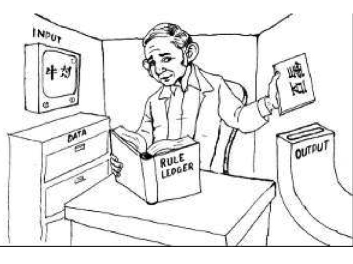
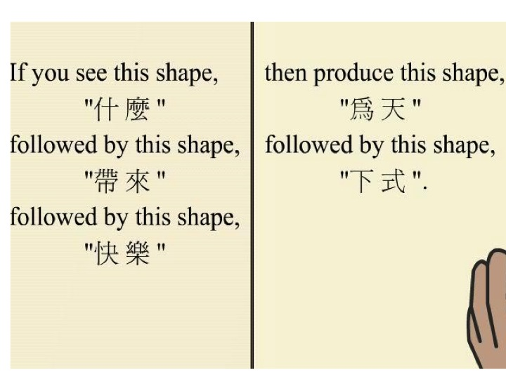
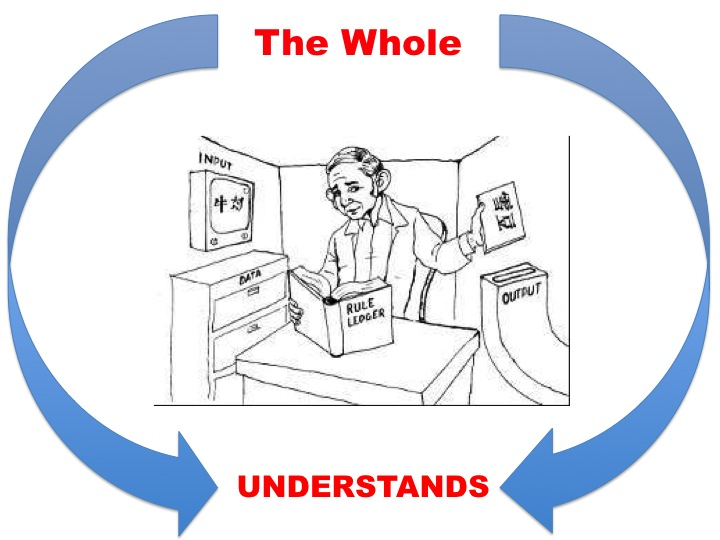
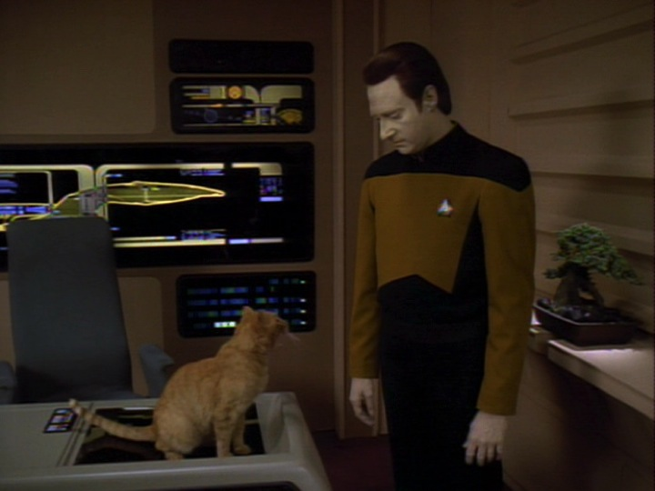

## Introduction

Turing claimed that passing the Turing Test is necessary and sufficient for intelligence. If we can identity some entity that passes the test but is not intelligent, then passing the test is not sufficient for intelligence. Similarly, if we can identify something that fails to pass the test but is still intelligent, then passing the test is not necessary for intelligence. Various attempts have been made to prove that passing the test is either not sufficient or not necessary for intelligence. For instance, some have asked whether there might be intelligent aliens who, nonetheless, cannot pass the test. The idea is that Turing may have excluded the possibility of there being very different types of intelligence in the universe. 

The best argument of this type, though, is called the **Chinese Room Thought Experiment** due to the philosopher of mind, John Searle. This argument challenged the claim that passing the test is sufficient for intelligence. Searle describes a situation where something performs the functional definition of understanding, but fails to possess understanding. This seems to show that understanding is not  merely a state which causes you to respond appropriately to certain inputs.

## The Thought Experiment 

The Chinese Room is designed to emulate a system that is analogous to a digital computer, a type of computing system. A Digital Computer is a machine intended to carry out any operation which could be done by a human computer. It has three parts. 

Store:
: a bank of information. It is like the paper or book that a human computer uses when doing their calculations.

Executive unit:
: carries out the various operations.

Control:
: like the rules or instructions for carrying out the calculation. Its job is to ensure that instructions are  obeyed correctly and in the right order.

Notice that we can dramatically increase the size and power of these three parts. So, even if we don’t yet have a powerful enough computer that passes the Turing Test, many think we might still  build one by increasing the power and size of these parts. However, Searle claims that no system with these parts has true intelligence, regardless of how powerful it is. In the thought experiment, Searle plays the role of the executive unit, the box of Chinese symbols plays the role of the store, the book of instructions is the control. Searle also adds two other features:  

Input:
:   Chinese symbols that unbeknown to Searle are questions in Chinese.

Output:
:   Chinese symbols that unbeknown to Searle are answers in Chinese.

Let us call the person in the room *Searle*. Searle will receive some symbol through the input box. Suppose those symbols represent a question. Searle does not know this, but he opens the very big and complicated instruction book. That book tells him that if he receives a certain symbol, or string of symbols, then he should take a different symbol, or string of symbols, and put it in the output box. Searle can do this. He even gets really quick and good at it. 

Now, suppose that the person who inputs the symbols is a fluent speaker of Chinese. They are also the person who receives the outputted symbols. They ask a question, like `who was Socrates?', and then read as the output something like `Socrates was a Greek philosopher in the 4th century BC. He never wrote anything, but was the teacher of Plato, who reported his teacher's conversations. Socrates was ultimately executed for corrupting the youth of Athens and inventing new Gods.'. Our Chinese speaker doesn't know anything about what happens inside the room; they are unaware that Searle outputs various symbols by following an instruction book. Surely, the objection goes, our Chinese speaker assumes that the person in the room understands Chinese. But, the person in the room, Searle, does not understand Chinese. Searle summarizes the objection as follows:  

> Imagine a native English speaker who knows no Chinese locked in a room full of boxes of Chinese symbols (a data base) together with a book of instructions for manipulating the symbols (the program). Imagine that people outside the room send in other Chinese symbols which, unknown to the person in the room, are questions in Chinese (the input). And imagine that by following the instructions in the program the man in the room is able to pass out Chinese symbols which are correct answers to the questions (the output). The program enables the person in the room to pass the Turing Test for understanding Chinese, but he does not understand a word of Chinese.

It's a clever argument. The thought-experiment models how computer systems work, how they output answers to the questions that we ask of them. But, if Searle doesn't understand Chinese and can still outputs the correct answers, we have little reason to think that a computer system that outputs the correct answer to our questions has understanding. In order for us to present this as a formal argument, let us recall the difference between Strong and Weak AI:

Weak Artificial Intelligence (WAI):
: Computers give us a powerful tool to study the mind. Thinking may be modeled by formal symbol systems, such as computer programs.

Strong Artificial Intelligence (SAI):
: Thinking is constituted by the manipulation of formal symbols, such as occurs in a computer program.

WAI does not say that the computers really have a mind. It says only that such machines might resemble minds. It may also provide tools for investigating the mind by, for instance, giving us models that approximate the way the mind operates. But, WAI does not say that computers have mental states; it does not state that computers realize mental states. On this view, Siri and Alexa mimic what minds can do, but our iPhones and Amazon devices do not have mental states just by having Siri and Alexa on them.  So, WAI cannot be used to support functionalism and Turing. On the other hand, SAI would give strong support for functionalism. If what it is to think just is to manipulate formal symbols, then thinking is a collection of functionally defined states. And, if such functions can be performed by both computers and human brains, then functionalism and Turing will be vindicated. Searle's objection to SAI be presented as follows: 

1.  If SAI is true, then there is a program for Chinese such that if any computing system runs that program, that system thereby comes to understand Chinese.
2.  I could run a program for Chinese without thereby coming to
    understand Chinese.
3.  Therefore, SAI is false.

Premise 2 is demonstrated by the experiment. I could easily output the right responses without understanding Chinese. Premise 1 may seem surprising. Humans don't seem computers. But, SAI claims that human minds really are computing devices. On this view, human brains and silicon chips are just two different ways of building the same thing: a computing device. Since we are a computing device, then we should understand Chinese if we fulfill the functional description of *understanding* Chinese, which is something like outputting the correct Chinese symbols when receiving questions in Chinese. Since we do not, satisfying this functional definition is not sufficient for intelligence. Therefore, no computing device, human or machine, is intelligent just be being able to satisfy the functional definition of intelligence. 

## Objections to Searle

Searle considers various worries with his  objection and responds to them. There are six objections: 

1.  The Systems Reply
2.  The Robot Reply
3.  The Brain Simulator Reply
4.  The Combination Reply
5.  The Other Minds Reply
6.  The Many Mansions Reply

I will run through a few of the more interesting one. 

### Systems Reply

The systems reply objects that even though the human inside of the
Chinese room doesn’t understand Chinese, nevertheless the entire system, including books and pieces of paper, does understand Chinese. 

The reply, in effect, complains that Searle is committing what is called the fallacy of composition. This fallacy arises when one infers that something is true of the whole from the fact that it is true of some part of that whole. For example, this is a fallacy:

1.  Searle’s hand weighs 2lb.
2.  Searle’s hand is a part of him.
3.  Thus, Searle weighs 2lb.

An advocate of SAI claims that it is the computer as a whole that understands, not some piece of the computer. Likewise, they claim that the entire system that has Searle as a part might understand Chinese without it thereby following that Searle, the person in the room, understands Chinese. Similarly, the fact that one part of the system does not understand Chinese does not entail that the whole system fails to understands it. 

But, Searle thinks that this objection, in addition to being incredible, overlooks the fact that the same thought-experiment can be run even if we assume that the human has internalized all of the books and other parts of the system.

### The Robot Reply

The Chinese Room represents a system that is meant to be similar to a computer system. Searle asks whether the system, or the person in the room, understands Chinese. Obviously, that person doesn't and so Searle concludes that computer systems do not possess understanding. The Robot Reply accuses Searle of developing too simple a system. A real Chinese speaker interacts with the world. They move around it and perceive it. An advocate of SAI may claim that a computer that was connected to cameras and was able to move around the world could also possess understanding. If that's the case, Searle's thought-experiment doesn't properly parallel the type of computer that could possess intelligence. 

But, Searle replies that we could easily change the thought experiment. Assume that the room is, in fact, part of the head of a gigantic robot. This robot moves around the world and has various parts that allow it gain information of that world. This information will update the data base--the store of symbols--and the program--the instructions for what do upon a certain input. Even when we make these changes, the person in the room does not understand Chinese. 

### The Many Mansions Reply

Even if current computers cannot understand, we will probably be able to build machines that process in whatever way is required for understanding.

Searle responds that even if we could build such computers, the reply trivializes the claims of SAI because SAI is supposed to give us insight into what understanding is, i.e., that it is a functionally defined state.

## Brain Simulator Reply

This reply concedes that Searle has shown that computer systems that work in the way that parallels the Chinese Room do have possess understanding. But, it claims that if we could make a computer that exactly parallels whatever goes on in a fluent Chinese speaker’s brain when he or she understands Chinese, then that computer would understand Chinese. What we need is for the electric circuitry of a computer to mimic the neural network of a Chinese speaker. 

Searle responds: 

But Searle says that we can change the thought experiment to show that such future computers would also not possess understanding. We will now change the experiment so that the man in the room turns on and shuts off water valves that correspond to the neural firings of a Chinese speaker. In such a case, the man is successfully outputting answers in Chinese and the mechanisms are parallell to the neural systems of a Chinese speaker. Nevertheless, the person in the room does not understand Chinese,
