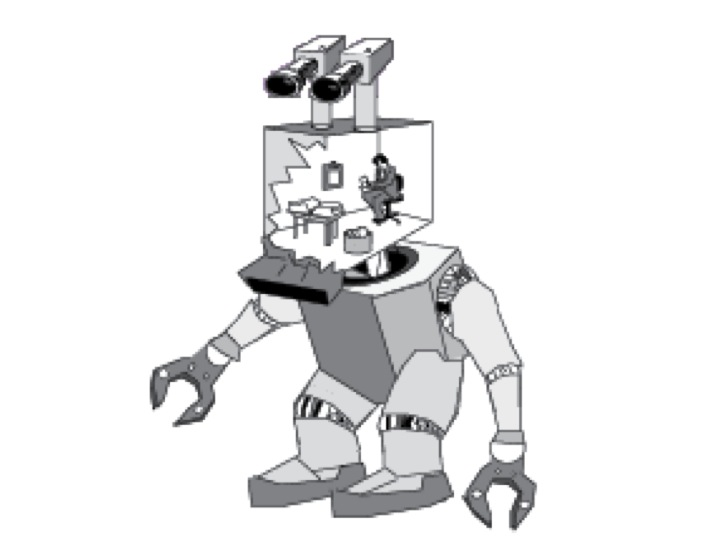

## Introduction

Turing claimed that passing the Turing Test is necessary and sufficient for intelligence. If we can identity some entity that passes the test but is not intelligent, then passing the test is not sufficient for intelligence. Similarly, if we can identify something that fails to pass the test but is still intelligent, then passing the test is not necessary for intelligence. Various attempts have been made to prove that passing the test is either not sufficient or not necessary for intelligence. For instance, some have asked whether there might be intelligent aliens, who, nonetheless, cannot pass the test. The idea is that Turing may have excluded the possibility of there being very different types of intelligence in the universe. 

The best argument of this type, though, is called the **Chinese Room Thought Experiment** due to the philosopher of mind, John Searle. This argument challenged the claim that passing the test is sufficient for intelligence. Searle describes a situation where something performs the functional definition of understanding, but fails to possess understanding. which seems to show that understanding is not   merely a state which causes you to respond appropriately to certain    inputs.

## The Thought Experiment 

Input:
:   Chinese symbols that unbeknown to Searle are questions in Chinese.

Data-Base:
:   Boxes of Chinese symbols.

Program/Instructions:
:   Book of instructions for manipulating the symbols.

Output:
:   Chinese symbols that unbeknown to Searle are answers in Chinese.

Imagine a native English speaker who knows no Chinese locked in a room full of boxes of Chinese symbols (a data base) together with a book of instructions for manipulating the symbols (the program). Imagine that people outside the room send in other Chinese symbols which, unknown to the person in the room, are questions in Chinese (the input). And imagine that by following the instructions in the program the man in the room is able to pass out Chinese symbols which are correct answers to the questions (the output). The program enables the person in the room to pass the Turing Test for understanding Chinese but he does not understand a word of Chinese.

1.  If Strong AI is true, then there is a program for Chinese such that if any computing system runs that program, that system thereby comes to understand Chinese.
2.  I could run a program for Chinese without thereby coming to
    understand Chinese.
3.  Therefore Strong AI is false.

## Objections to Searle

Searle considers various worries with his  objection and responds to them. There are six objections: 

1.  The Systems Reply
2.  The Robot Reply
3.  The Brain Simulator Reply
4.  The Combination Reply
5.  The Other Minds Reply
6.  The Many Mansions Reply

### Systems Reply

The systems reply objects that even though the human inside of the
Chinese room doesn’t understand Chinese, nevertheless the entire system, including books and pieces of paper, does understand Chinese.

### The Fallacy of Composition

The fallacy of composition arises when one infers that something is true of the whole from the fact that it is true of some part of that whole. For example, this is a fallacy:

1.  Searle’s hand weighs 2lb.
2.  Searle’s hand is a part of him.
3.  Thus, Searle weighs 2lb.

But Searle thinks that this objection, in addition to being incredible, overlooks the fact that the same thought-experiment can be run even if we assume that the human has internalized all of the books and other parts of the system.

### The Robot Reply

### The Many Mansions Reply

Even if current computers cannot understand, we will probably be able to build machines that process in whatever way is required for understanding.

Searle responds that even if we could build such computers, the reply trivializes the claims of SAI because SAI is supposed to give us insight into what understanding is, i.e., that it is a functionally defined state.

### Brain Simulator Reply

If we could make a computer that exactly parallels whatever goes on in a fluent Chinese speaker’s brain when he or she understands Chinese, then that computer would understand Chinese.

Searle responds: 

But Searle responds that even in such a case, there would be no
understanding, because you could just change the original thought
experiment so that the man in the room turns on and shuts off water valves that correspond to the neural firings of a Chinese speaker. In such a case, the man doesn’t understand.
