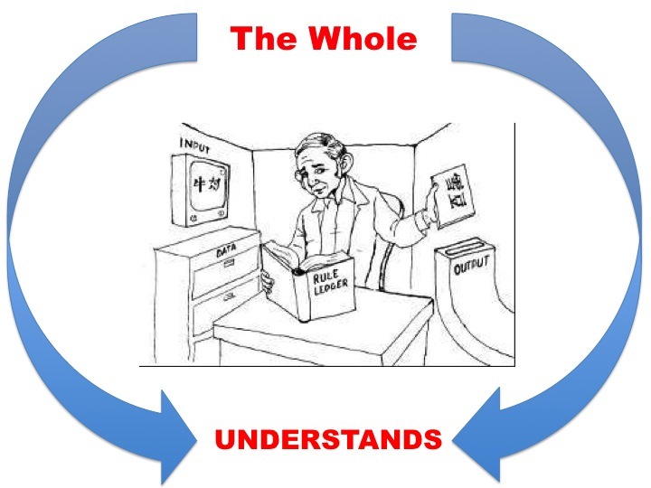

Turing defense

## Turing’s Defense of the Imitation Game

Turing defends his claim that passing the test is constitutive of being intelligent by responding to several objections.

1.  Argument from Extrasensory Perception

2.  Argument from Various Disabilities

3.  The Argument from Consciousness

4.  The Mathematical Objection

5.  Argument from the Informality of Behavior

6.  Lady Lovelace’s Objection

#### ESP Objection

Objection: If the human participant in the game was telepathic, then the interrogator, who is also human, could exploit this fact in order to determine the identity of the machine.

Response: Turing proposes that the competitors should be housed in a “telepathy-proof room.”

#### Argument from Various Disabilities

Objection
> Machines cannot do many things that humans can, e.g.,be kind, be resourceful, be beautiful, be friendly, have initiative, have a sense of humor, tell right from wrong, make mistakes, fall in love, enjoy strawberries and cream, make someone fall in love with it, learn from experience, use words properly, be the subject of its own thought, have as much diversity of behavior as a man, do something really new.

Response: The objection relies on an inductive inference. You know that particular machines have various disabilities and then infer that all present and future machines will have various disabilities. But induction can fail!

+  Induction is a non-deductive inference. We infer that since some instances of a certain group have a certain attribute that the next members of that group will have that attribute.
	+   The sun rose every day that I remember, hence, the sun will rise tomorrow.
	+   Every lion I have seen was a golden yellow color, hence every lion I will see will be a golden yellow color.

The Problem with Induction inferences is that they are difficult to justify. 

### The Argument from Consciousness

Objection

> “Not until a machine can write a sonnet or compose a concerto because of thoughts and emotions felt, and not by the chance fall of symbols, could we agree that machine equals brain—that is, not only write it but know that it had written in it.”

1.  A being can think only if it can know that it thinks.

2.  Computers cannot know that they think.

3.  Computers cannot think. (From 1 and 2)

Response: Reject 2

1.  The evidence we could have that a being is self-aware is either from their reports or from being that being.
2.  We cannot be another being.
3.  So the only evidence we have that another being is self-aware is their reports that they are self-aware. (From 1&2)
4.  Computers can report that they are self-aware. (From performance in Turing Test)
5.  So we have evidence that they are self-aware. (From 3&4)

In addition, if the machine gave sufficiently complex answers about how it wrote poetry, we would likely think that it is, in fact, conscious.

### The Mathematical Objection

Objection

1.  Within any consistent formal system there are statements that can neither be proved nor disproved within that system.
2.  Suppose that a computing machine is a formal system that operates by proving or disproving various statements put to it, i.e., by answering ‘yes’ or ‘no’ to various questions put to it.
3.  There will be questions a computing machine gives wrong answers to   (From 1 and 2; the machine, in some cases, should say that there is no correct answer.)
4.  Intelligent beings are not so limited.
5.  A computing machine is not intelligent. (From 3 and 4)

Response: Reject 4

1.  There are questions that humans can’t answer, yet they are
    intelligent.
2.  It could be that the inability to answer every question is due to precisely the same limitations that restrict the capacity of machines.

### Objection from the Informality of Behavior

Objection

> If each man had a definite set of rules of conduct by which he regulated his life he would be no better than a machine. But there are no such rules, so men cannot be machines.

Response: Distinguish

Laws of Conduct:
:   Precepts such as “Stop if you see red lights,” on which one 	can act, and of which one can be conscious.

Laws of Behavior:
:   Laws of nature as applied to a man’s body such as “if you pinch him  he will squeak.” (We do not act upon these laws, nor is it important that we are conscious of them.)

Turing agrees that if there is a definite set of laws of behavior that regulate X’s life, then x is a machine. But he denies that being regulated by laws of conduct are relevant for determining if X is a machine.

He then argues that humans are as much machines as computers. He agrees that there is no definite set of laws of conduct that regulate human life.  Denies that there is no definite set of laws of behavior that regulate human life.

-   It follows that humans are machines as much as computers.

### Lady Lovelace’s Objection

Objection: Machines have “no pretensions to *originate
anything*. It can do *whatever we know how to order it to perform*.”

Response: The objection assumes that machines cannot learn. But it is possible for machines to learn.

### Digital Computer

A Digital Computer is a machine intended to carry out any operation which could be done by a human computer. It has three parts. 

Store:
: a bank of information. It iss like the paper or book that a human computer uses when doing their calculations.

Executive unit:
: carries out the various operations.

Control:
:   is like the rules or instructions for carrying out the calculation. Its job is to ensure that instructions are  obeyed correctly and in the right order.

Notice that we can dramatically increase the size and power of these three parts. So even if we don’t yet have a powerful enough computer that passes the Turing Test, we might build one by increasing the power and size of these parts.

The Chinese Room Thought Experiment
===================================

Weak vs. Strong AI
==================

Weak Artificial Intelligence (WAI) Computers give us a
powerful tool to study the mind.

Strong Artificial Intelligence (SAI)

-   An appropriately programmed computer is a mind, where a computer is
    a machine whose operation is defined as an instantiation of a
    computer program.

-   Mental states are defined functionally, e.g., understanding a
    sentence is a mental state that plays a functional role, namely,
    disposes the entity who possess that state to respond in various
    ways given certain inputs.

-   Given certain inputs, the computer performs in the way specified in
    the functional definition of understanding. This means it must
    possess understanding, i.e. it’s possession of understanding is what
    explains why it responds appropriately to certain inputs.

Strategy
========

-   Accepts WAI.

-   Objects to SAI by describing a thought experiment, the Chinese Room
    Thought-Experiment, which seems to show that understanding is not
    merely a state which causes you to respond appropriately to certain
    inputs.

-   Responds to various objections.

Input:
:   Chinese symbols that unbeknown to Searle are questions in Chinese.

Data-Base:
:   Boxes of Chinese symbols.

Program/Instructions:
:   Book of instructions for manipulating the symbols.

Output:
:   Chinese symbols that unbeknown to Searle are answers in Chinese.

Imagine a native English speaker who knows no Chinese locked in a room
full of boxes of Chinese symbols (a data base) together with a book of
instructions for manipulating the symbols (the program). Imagine that
people outside the room send in other Chinese symbols which, unknown to
the person in the room, are questions in Chinese (the input). And
imagine that by following the instructions in the program the man in the
room is able to pass out Chinese symbols which are correct answers to
the questions (the output). The program enables the person in the room
to pass the Turing Test for understanding Chinese but he does not
understand a word of Chinese.

Digestion Time
==============

What does Searle think his Chinese Room thought-experiment shows?

-   Would SAI say that Searle understands the Chinese stories? Why, why
    not?

-   How exactly does Searle’s apparent lack of understanding threaten
    SAI?

Relation to Turing Test
=======================

Does Searle’s thought-experiment allow us to draw any conclusions about
the adequacy of Turing’s “imitation game,” which is supposed to stand in
for the question “Can machines think”?

Questions? General Comments?
============================

Objections & Responses
======================

1.  The Systems Reply

2.  The Robot Reply

3.  The Brain Simulator Reply

4.  The Combination Reply

5.  The Other Minds Reply

6.  The Many Mansions Reply

Systems Reply
=============

The systems reply objects that even though the human inside of the
Chinese room doesn’t understand Chinese, nevertheless the entire system,
including books and pieces of paper, does understand Chinese.

The Fallacy of Composition
==========================

The fallacy of composition arises when one infers that something is true
of the whole from the fact that it is true of some part of that whole.
For example, this is a fallacy:

1.  Searle’s hand weighs 2lb.

2.  Searle’s hand is a part of him.

3.  Searle weighs 2lb.

Response
========

But Searle thinks that this objection, in addition to being incredible,
overlooks the fact that the same thought-experiment can be run even if
we assume that the human has internalized all of the books and other
parts of the system.

Review
======

1.  If Strong AI is true, then there is a program for Chinese such that
    if any computing system runs that program, that system thereby comes
    to understand Chinese.

2.  I could run a program for Chinese without thereby coming to
    understand Chinese.

3.  Therefore Strong AI is false.

The Robot Reply
===============

Searle’s Response
=================

The Many Mansions Reply
=======================

Reply Even if current computers cannot understand, we will
probably be able to build machines that process in whatever way is
required for understanding.

Searle’s Response Even if we could build such computers,
the reply trivializes the claims of SAI because SAI is supposed to give
us insight into what understanding is, i.e., that it is a functionally
defined state.

Brain Simulator Reply
=====================

If we could make a computer that exactly parallels whatever goes on in a
fluent Chinese speaker’s brain when he or she understands Chinese, then
that computer would understand Chinese.

Searle’s Response
=================

But Searle responds that even in such a case, there would be no
understanding, because you could just change the original thought
experiment so that the man in the room turns on and shuts off water
valves that correspond to the neural firings of a Chinese speaker. In
such a case, the man doesn’t understand.
