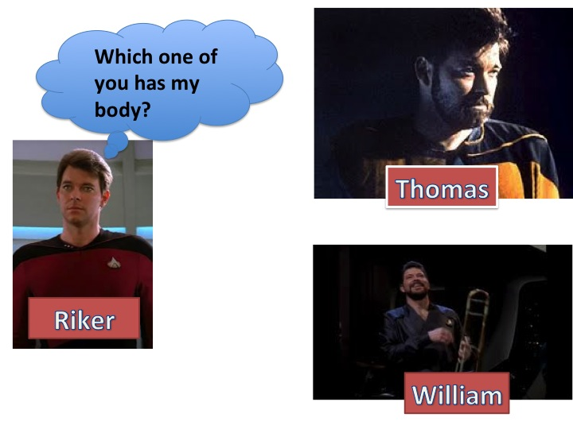
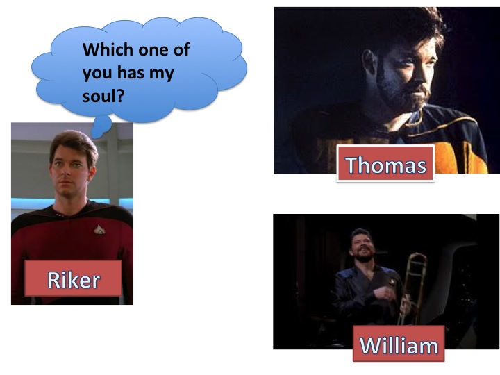
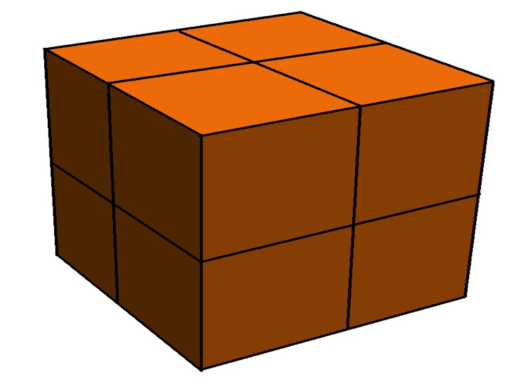
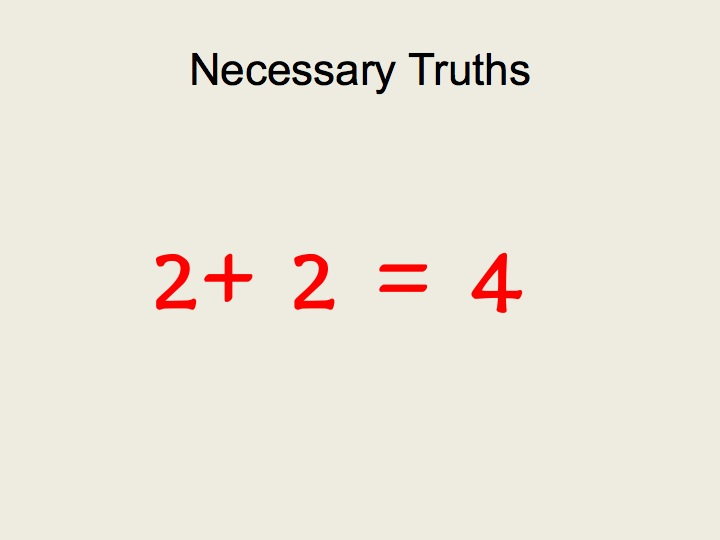
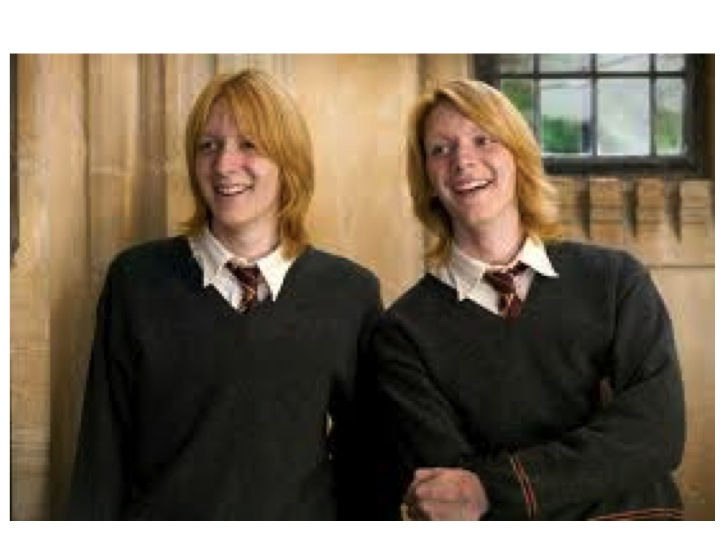
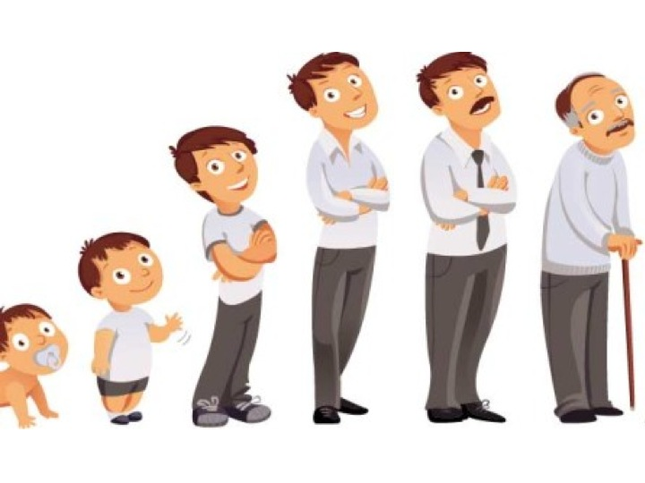
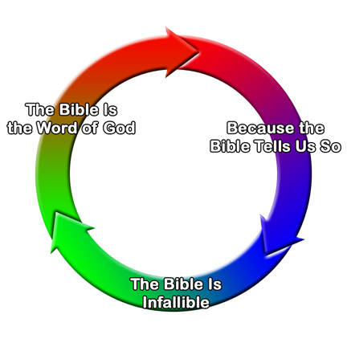

## Introduction

Compare a picture of you taken yesterday to a picture taken of you as a baby. Are the people depicted in the photographs the same person? They certainly seem different. One is small baby, just a few pounds in weight. The person from yesterday is heavier, taller, etc. That person can also think, read, and, well, do all the things that adults can do but babies cannot.  But, while they appear different, they also seem the same in some deeper way, e.g., the woman who is the mother to the baby is also the mother to the person from yesterday. So, are they the same person? 

English can mislead us when trying to answer questions about identity. The words 'identity', 'identical', 'similar', and 'same' are ambiguous; they can be used to describe different relations. And whenever a word can be used in several ways, we need to disambiguate those uses to answer questions that contain them. For instance, if a person told you they left their car near the bank, they could mean they left it near the money bank or the river bank. It's obviously important to identify which one they mean. 

'Same' (and our other words) can also be used in different ways. On the one hand, it can be used to speak about *qualitative similarity*. Qualitative similarity is something that distinct objects enjoy by sharing similar features. Two chairs are qualitatively similar in virtue of having a similar shape, size, and function. But they are still two chairs; if you buy both, you will have to pay twice the cost of one. Similarly, two ginger bread men made by the same cookie cutter are qualitatively similar in several respects, e.g., they have the same shape, the same weight, the same color, smell, and so on. But these are *two* cookies. 

We can also use these words to talk about what is called *numerical identity*, the relation that each thing holds to itself and nothing else. 'Numerical identity' is used when we want to say that there is just one entity to be counted. Suppose you know that Superman and Clark Kent were in the room. You would make a mistake if you counted them as two people; there is just one person there. 

Numerical identity is a relation that has three important features. It is *reflexive*, *symmetrical*, and *transitive*. I will speak about each in turn: 

+ A relation R is **reflexive** if and only if everything bears R to itself.
	+ Example 1: everything is the *same height* as itself. The same height is a reflexive relation.
	+ Example 2: *being shorter than* is not a reflexive relation. Ted cannot be shorter than himself. 

+ A relation R is **symmetric** if and only if, if x is related by R to y, then y is related by R to x.
	+ Example 1: if Susan is a sibling of Sarah, then Sarah is *a sibling of* Susan. *Being a sibling of* is a symmetrical relation.
	+ Example 2: if Susan is a parent of Ted, it does not follow that Ted is a parent of Susan. *Being a parent of* is not a symmetrical relation.

 + A relation R is **transitive** if and only if, if x is related by R to y, and y is related by R to z, then x is related by R to z.
	+ Example 1: if Susan is shorter than Sarah, and Sarah is shorter than Hannah, then Susan is shorter than Hannah. *Shorter than* is a transitive relation.
	+ Example 2: if John loves Mary and Mary loves Susan, it does not follow that John loves Susan. *Loving someone* is not a transitive relation. 

Humans obviously change their qualities over time. You and the baby you grew from share few, if any, features. You may have the same color eyes, but you are different sizes, different weight, made of different cells, different hair lengths, different tastes and dispositions, etc. Nevertheless, you and that baby are numerically identical: you are identical to it and it is identical to you, and if that baby is identical to some teenager then you too are identical to that teenager. 

It is important that you and that baby are numerically identical. Numerical identity undergirds many of our moral and social institutions. The social security number assigned to that baby belongs to whoever is numerically identical to her. Being only qualitatively similar does not suffice. That would mean a twin could get that baby's social security. The prison sentence delivered to a defendant should only be served by prisoners identical to that defendant. Suppose a prisoner is in the tenth year of a prison sentence for a crime committed by a person that they are only qualitatively similar to. What an injustice that would be! They would be serving a sentence for a crime that they did not commit. 

Numerical identity is also important for questions about survival after death. In the dialog assigned for this week, there are three participants, Gretchen Weirob, a philosophy professor,  Sam Miller, a chaplain and longtime friend of Gretchen’s, and Dave Cohen, a former student of Gretchen’s. Gretchen, who is dying in the hospital, challenges Sam, a chaplain and religious believer, to prove to her that survival after the death of her body is possible. If Sam can do that, Gretchen says that she will be comforted. Sam and Dave consider various arguments for thinking that persons can survive the death of the body, but Gretchen remains unconvinced. 

In order to convince her, they need to prove that there will exist a person after her bodily death that is numerically identical to the sick woman conversing in her hospital bed. In other words, Gretchen, G, our sick philosopher, survives if and only if there is some person F at a time after her body has died such that G is identical to F. F can't be merely similar to G. Living on in the hearts and minds of her friends is no way for Gretchen to survive her bodily death. G survives only if F is numerically identical to G. 

## Puzzling about Identity 

It seems obvious that you are numerically identical to that baby despite the many qualitative differences between you. Why should there a problem?  In the Star Trek episode assigned this week (see the main page), there is a terrible accident with some futuristic equipment, a transporter device. A transporter works by scanning and dematerializing your body in one spot before re-materializing you at some different spot. But in our episode the transporter malfunctions. After de-materializing one person, it subsequently re-materializes what appear to be two versions of that person. While a piece of fiction, this example helps illustrate something philosophical interesting (philosophers often use thought experiment to test and refine their theories, raise questions, etc.). Allow ‘=’ for ‘numerically identical to’ and allow the following names for our various characters in the episode:
+ “Riker” is the person who beams onto the planet 8 years ago.
+ “William” is the person who materialized on Potemkin ship after Riker was de-materialized.
+ “Thomas” is the person who materialized on the planet after Riker was de-materialized.

What happened to Riker after the accident?  Did he continue to exist as Thomas, or as William, or as both? Both of the following seem plausible:

1. Riker = Thomas 
2. Riker = William 

1-2 seem plausible. If we ignore William for a moment, none of us would doubt 1, that Thomas is identical to Riker, to the man who beamed down to the plant several years ago. If we ignore Thomas for a moment, none of us would doubt 2, that William is identical to Riker. But given the transitivity of identity, if 1 and 2 are true, then the following must also be true: 

3. Thomas = William

3 says that Thomas and William are numerically identical to one another. Again, if Riker is identical to Thomas and Riker is identical to William, then Thomas and William are identical to one another. But this is clearly false, as is easy to demonstrate with the following simple example: In the episode, Councilor Troy kissed Thomas. If 3 is true, if Thomas is identical to William, then Troy also kissed William. But William was in a different part of the ship altogether when the kiss occurred, so it is impossible that Troy kissed him when she kissed Thomas.

We can add to these many more examples. Suppose that William commits a crime. Suppose he steals a ship. Well, if William is identical to Thomas, Thomas too steals the ship. Thomas then is as liable for the theft as William. But this is clearly absurd. The two men can be in different places at the same time, they can perform different actions at the same time, they could even get into a fight at the same time. They are not numerically identical, i.e., 3 is false.  Since 3 is false, we know that our premises, 1 and 2, cannot both be true together. Why? Consider this simple example: 

+ P1. All humans are from Mars
+ P2. Socrates is human
+ C. Socrates is from Mars. 

'P' is used to label a premise of an argument. 'C' is used to label the argument's conclusion. P1 and P2 entail C. But since we know that C is false, we also know that one of P1 and P2 must be false too. In this case, the culprit is P1. 

## What does personal identity consist in?

To decide who Riker continues as we need to know what personal identity consists in, i.e., despite their qualitative differences, what is it about a person existing at one time that makes them identical to a person existing at a different time? Despite the qualitative differences between the baby picture and the adult picture, what makes the persons depicted in both numerically identical to one another. 

Three answers have been defended to this question. The first claim that personal identity consists in sameness of body. The second says that it consists in sameness of soul, and the third says that it consists in psychological continuity. While each view has some virtues, they are all problematic and constitute a live research project; many have staked their career on finding the answer.  I will explain each of the views and raise some objections. 

## Same Body

Our first view, the sameness of body view, says the following: 

+ A person A at one time is identical to a person B at a later time if and only if the body of A is identical to the body of B.

The view is straightforward. For instance, it states that Riker is identical to whoever has a body numerically identical to his. The view is also made plausible by reflecting on how we normally judge personal identity; I believe that the baby in my apartment is identical to the baby my wife gave birth to beceause I see that they have the same bodies. 

This view also has clear upshots for questions about immortality: we cannot survive our bodily death. It states that we survive our bodily death only if there exists a person some time after who has a body numerically identical to our own. But, obviously, if our body dies then there cannot be someone in the future whose body is numerically identical to our own. 

## Objections

### Objection 1
But the problems for the same body view are dramatic. On the one hand, it seems to answer our question by raising a further question that is as difficult to answer. If G is identical to F only if the body of G is identical to the body of F, then we would like to know what makes their bodies identical. Bodies do change their qualities over time. They grow ligther and heavier, taller, darker, paler, etc. And, so our question about personal identity gives way to this question: despite their qualitative differences, in virtue of what is a body existing at one time numerically identical to a body existing at a different time? This is a legitimate question that defenders of the same body view owe an answer to. But it is a question that is as difficult as the original question about personal identity. 

### Objection 2

Perhaps a deeper problem for the same body view lies in the fact that our concept of personal identity allows for the admittedly bizarre examples of bodily swaps as described in movies like 'Freaky Friday'. In the movie, a young daughter and her mother change bodies. We'll never live to see such a strange case. But what is important about the example is that we have no conceptual difficulty in allowing that persons to swap bodies; our concept of personal identity allows for such body swaps. If the same body view were correct, then personal identity would be essential tied to bodily identity. There could not then be a swap in bodies. 

The objection can be illustrated without appeal to science fiction: each of us could remain numerically one and the same as our bodies underwent significant transformations. Some lose limbs. Some lose organs. Some have artificial replacements. Some augment their appearance with plastic surgery. Some ink their skin. Some transition from one gender to another. In all of these case, the bodily changes do not hinder a person surviving from one time to another.  

## Sameness of Soul

Our second theory may seem familiar. It states the following: 

+ A person A at one time is identical to a person B at a later time if and only if the soul of A is identical to the soul of B.

So, according to this theory, William is identical to whoever has a soul identical to his own: 

The success of this view requires, of course, that there exists souls. Later in the semester, we will discuss a view that the mind is identical to the soul and talk in detail about what souls are meant to be then. For now, let us note the following few details about them.  

First, souls are supposedly *immaterial*. What does this mean? Bodies are extended in three dimensions. They have height, width, etc. In contrast, souls have no extension. Souls have no height or weight. Bodies are also basic bits of matter or composed of basic bits of matter, where bits of matter are governed by all the various laws that we study in physics. In contrast, souls are neither basic bits of matter or composed of basic bits of matter. Thus, they are immune from the laws that we study in physics. 

The Seat of Consciousness 

Second, souls are supposedly the *seat of consciousness*. What does this mean? For any thought and experience, there is some entity that does the thinking and experiencing. For instance, if a wish for ice-cream occurs on Monday at noon, there must be some entity which is doing the wishing. If souls are the seat of consciousness, then it is souls and not the body that is doing that wishing. The same goes for perceiving, remembering, fearing, etc. The soul is what is properly in each of these states.  

The same soul view does seem plausible. Our bodies undergo many changes, but our soul does not. It is more like a passenger in an ever changing vessel. Since the soul is not changing--it cannot get larger, for instance--it seems plausible that the soul is what personal identity consists in, it seems plausible that you are identical to the baby you came from because you and that baby have identical souls. 

The same soul view also allows for the possibility of survival after our bodily death. What is required for such survival is the persistence of our souls, which seems possible given that souls are not themselves material.

## Objections
We will discuss the soul in more detail later in the course and consider arguments for and against their existence. For now, I want to raise some problems for the claim that personal identity consists in sameness of soul; regardless of whether souls exists, there are problems with the claim that our identity is secured by the persistence of our souls. 

Consider again what the same soul view claims and let's use SSV for short: 
: A person A at one time is identical to a person B at a later time   if and only if the soul of A is identical to the soul of B.

Is SSV true? Our business is not merely throwing claims around. We are interested in the truth, in finding out which claims are true and which are false. In order to do that, we need evidence, or arguments, to establish the claims we are considering. So, what evidence is there for SSV? 

-   How could we know that the soul of A is identical to the soul of B?

    1.  Direct experience?

    2.  Indirect experience: Same Body

    3.  Indirect experience: Same Psychology

Indirect Experience 1 Claim

-   Same body entails same soul.

-   We directly perceive bodies.

-   We indirectly perceive souls.

Problems

1. If we can know that B is true, then B can be known either *a posteriori* or *a priori*

2. B cannot be known *a posteriori*.

3. B cannot be known *a priori*.

4. Therefore, we cannot know that B is true.

Discussion of P2 

With the chocolate, I can test. My test involves me perceiving both the chocolate and the inside. We keep checking and we come to know that certain wrapper is associated with certain filling. But we can’t check whether souls are associated with bodies.

Discussion of P3

Indirect Experience 2 Claim

-   Same psychology entail same soul.

-   We can directly know that the psychology of A is the same as the psychology of B.

-   Thus we can indirectly know that the soul of A is the same as the soul of B.

Problems

1. If same psychology entailed same soul, then exemplification of psychological traits would be infallible evidence for sameness of soul.
2. Exemplification of psychological traits are not infallible evidence for sameness of soul.
3. Same psychology does not entail same soul.

Fallible vs. Infallible Evidence for Personal Identity

Consider a scenario in which 1) a series of souls flow into and out of the same body, and 2) that same body exhibits the same psychological traits. If personal identity consists in sameness of soul, then there is a numerically distinct person every time a soul is exchanged. However, with every soul exchange there is no corresponding change in psychological traits. Thus, same psychology does not entail same soul.

### Psychological Continuity

# Introduction

Recall that our question is what personal identity consists in. We have already discussed two theories: 

Same Body Theory: 
: A person A at one time is identical to a person B at a later time if and only if the body of A is identical to the body of B.

Same Soul Theory: 
: A person A at one time is identical to a person B at a
later time if and only if the soul of A is identical to the soul of B.

In these notes, we will be focused on a third and radically different theory: 

Psychological Continuity Theory: 
: A person A at one time is identical to a person B at a later time if and only if B is psychologically continuous with A.

## Further Clarification of our Question 
In order to introduce our new theory, we need to think again about the question that we are trying to answer--what does personal identity consist in? Our first two answers said that there was some one thing that each of the earlier and later stages of a person share, this one thing is numerically identical between each stage, whether it be soul or body. Our third view suggests that we do not need some one identical thing shared by each stage, rather we need each of those stages to enjoy a certain *relationship* to one another. Look again at our picture representing personal identity:

Our first two theories stated that there will be some thing, either a soul or body, that is shared by each stage. This common thing shared will exist fully at each moment that the person exists. If, for instance, personal identity consists in sameness of soul, then the one same soul will exist fully at each moment that the person exists. Our third theory advises against looking for one same thing that exists fully at each moment that the person exists. Rather, it claims that we should look at the relationship between all the stages of the person. Consider the following image of a train:  

Appropriate Connection: Example 

Look at the engine. Look at the final carriage. Are you looking at one and the same train? They clearly aren't numerically distinct trains; the owner of that train you attend to when watching the engine is identical to the owner of the train you are attending to when you watching the final carriage. Suppose, now, we ask in virtue of what is the engine and final carriage numerically identical trains? I think we would all agree that identity of the train cars is not explained by any one identical feature intrinsic to each. The various train car are one and the same train by virtue of the fact that they are connected to one another---just notice the locks where each car connects with one another. 

When I claim that the cars are the same by virtue of being appropriately connected, I have subtly changed the focus of our initial investigation. The invdividual train cars are not numerically identical to one another; the engine is not identical to the coal car. And if by 'same train', I mean 'train car', the various trains cars are not numerically identical cars. But I don't mean this when asking whether the cars are identical. What I mean to ask is whether the train that the engine is part of is numerically identical to the train that the final carriage is part of. Likewise, I can ask whether the body that has my left hand is part is is numerically identical to the body that my right has part; I am not ask whether my left and right hand are identical to one another. I am asking whether they parts of one and the same way. 

Asked in this way, what we would like to know is whether the train cars compose one and the same train, are they parts of the same train. To answer this question, we must decide whether the carraiges are approrpiately related to compose a whole train. Likewise, instead of asking in virtue of what the various stages of person's life are identical to one another, we can in virtue of what all these stages compose one and the same person; the baby and the teenager are, on this view, numerically distinct person stages, but person stages that compose one and the same person that weaves its way through time. 

## Psychological Continuity--Version 1

In his 'Essay on Human Understanding' John Locke articulated our third theory of personal identity, and perhaps was the first person to do so: 

> “For as far as any intelligent Being can repeat the Idea of any past Action with the same consciousness it had of it at first, and with the same consciousness it has of any present Action; so far it is the same personal Self.” John Locke (§10)

Locke believes that you are you identical to your earlier self by you and that earlier self composing one and the same person. Your bodies are numerically distinct. Your personality could have subtly changed. But what's important is that the various different stages of compose one and the same person. Just as some connection between the train cars explained why the compose some one train, so too there must be some connection between person stage if they are to compose some one person. According to Locke, that connection was memory. A simple version of his proposal is as follows: 

Memory Continuity:
: A person A at one time is identical to a person B at a later time if and only if B *remembers* the *experiences* that A has.

This proposal seems plausible given the difference between two types of memories. First, there are *factual memories*. These are memories that some event occurred. They can be shared by several people, e.g., many remember President Obama’s inauguration in 2008, many remember President Obama handing over the reigns of power to President Trump in 2016. 

Factual memories, memories that many can share, differ from *personal memories*. These are the memories of experiencing the event itself. Such memories cannot be shared since personal experiences, are, well, personal. For example, only President Obama has the personal memory of *being inaugurated* at his 2008 inauguration. Only he knows what it was like for *him* to be inaugurated (even though many (factually) remember that he was inaugurated). Similarly, only President Obama can have a personal memory of handing over the reigns of power to President Trump (although many have the factual memory of that same event). 

So consider the imagine of Leonardo Di Caprio. Locke proposed that the famous actor is identical to that young boy because he had personal memories of what that boy experienced. If, for instance, the younger spilled a drink during his first audition, only the adult Leo has the personal memory of the younger Leo's experiences. Of course, many others could have a factual memory of that event. But only the adult Leo remembers what it was like to be that younger Leo experiencing that event. 

### Objections to Version 1

While version 1 seems plausible, it is not adequate as an explanation of personal identity. Allow ‘Leonardo’ to be the 12 year old who will grow up to be the adult actor we all know. We will use the name 'Leo' to refer to the adult.

1. Leo = Leonardo if and only if Leo remembers everything that Leonardo experenced.
2. Leo does not remember what Leonardo ate for breakfast on the second day after his 12th birthday, though Leonardo certainly had the experience of eating something
3. Riker $\neq$ Rike

Our first premise is an application of the first version of our third theory, which states that a person existing at one time is identical to existing at some earlier time just if the later person remembers all the earlier person's experiences. So, if the younger person ate a cake, the older person is identical to them only if they remember the experience of eating that cake. 

Our second premise is trivial. Can you remember every experience you ever had? I cannot! I remember important life events, some embarrasing ones, special moments with friends and family, etc. But I certainly do not remember what I ate for lunch, on say, June 11th, 1995. No idea! 

3 states our conclusion. Since Leo does not remember Leonardo's experience of eatng that birthday cake, Leo is not ientical to Leonardo. It should be fairly obvious to you why this simple version of our third theory fails. It is far too demanding. It requires you to have complete and perfect memory, and while a few lucky individual might have such a facility, the majaority of us do not. And even though you may have forgotten what you ate on your 12th birthday, surely you are still identical to your 12 year old self. 

## Version 2

While our first version was implausible, it can be fixed. A more sophisticated version of our third theory states the following: 

+ A person A at one time is identical to a person B at a later time if and only if B is psychologically continuous with A.

By 'psychological continuity', we mean that there is a chain of person-stages connected by episodic memory. What does this mean? The idea is that it is not required for you to remember what you ate on your 12th birthday to be identical to your earlier self, all that is required is that you remember some earlier self, say, your 15 your old self, and that 15 year old self remembers eating the cake on your 12th birthday. Consider again our picture depicting personal identity and allow us give letters to each of the personal stages. 

F, our oldest stage, remembers what the slightly younger stage, E, experienced. Now, F does not remember what an even younger stage, D, experienced, but E does remember D's experiences. So, on our sophisticated version of the theory, F is identical to D, not by remember D's experiences, but by remembering E's experiences who in turn remembers D's experiences. The chain can continue backward as follows:  

+ F remembers what E experienced.
+ E remembers what D experienced.
+ D remembers what C experienced.
+ C remembers what B experienced.
+ B remembers what A experienced.
+ Thus, A, B, C, D, E, and F are psychologically continuous with each other.

So, F may not remember what A experienced, but F is connected to A via a chain of person stages that remembers what the immediately preceding stages experience. Hence, F is identical to A. 

Version 2 obviously is immune to our objection to Version 1. That objection attacked the claim that later stages must remember every experience of every early stage all those stages to compose one and the same person. That was unrealistic. But version 2 does not require that the older stages remember every experience of every earlier stage. It requires only that there me an appropriate chain as described above. 

## Objections to Version 2

River Objection 

Problem: Apparent vs Real Memory 

I really remember X iff

-   I have an experience as though I remember experiencing X.

-   I did experience X.

I apparently remember X iff

-   I have an experience as though I remember experiencing X.

-   I did not experience X.

Distinguishing Real vs. Apparent Memories: Attempt 1

Internal Differences

-   If I could perceive a qualitative difference between a real and an
    apparent memory of X, then this qualitative difference would
    distinguish the real and apparent memory of X.

-   I can perceive no qualitative difference between a real and an
    apparent memory of X.

-   No qualitative difference distinguishes real and apparent memories
    of X.

Distinguishing Real vs. Apparent Memories: Attempt 2

Suggestion: If two persons A and B both have an experience as though
they remember the experiences of some person P, then the memory of A (or
B) is real and not apparent only if A (or B) is identical to P.

The problems is that it is circular to make both claims:

1.  A = P only if A really remembers what P experiences.

2.  A really remembers what P experiences only if A = P.

Circular Reasoning

Distinguishing Real vs. Apparent Memories: Attempt 3

Suggestion

-   A real memory is one that was caused in the right way.

-   An apparent memory is one that was not caused in the right way, e.g.
    hypnosis, implantation, etc.

Problem-Duplicates!

-   Two persons A and B both have memories of what P experienced that
    were caused in the right way.

-   A $\neq$ B.

-   Having memories caused in the right way is not sufficient for
    personal identity.

Riker Objection 

