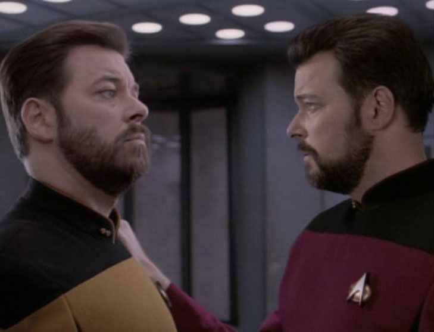

## Introduction

Allow the following names for our various characters:

-   “Riker” is the person who beams onto the planet 8 years ago.
-   “William” is the person who materialized on Potemkin after Riker was de-materialized on the planet.
-   “Thomas” is the person who materialized on the planet after Riker was de-materialized.

Who is Riker? William is. Thomas is.  Both are. Neither are.

-   Is the identity of Riker the same as the identity of Thomas and/or William?

-   Is Riker qualitatively similar to Thomas and/or William?

-   Is Riker numerically identical to Thomas and/or William?

Do they have the same identity?
===============================

Are they similar?
=================

Are they numerically identical?
===============================

Our Question Clarified
======================

