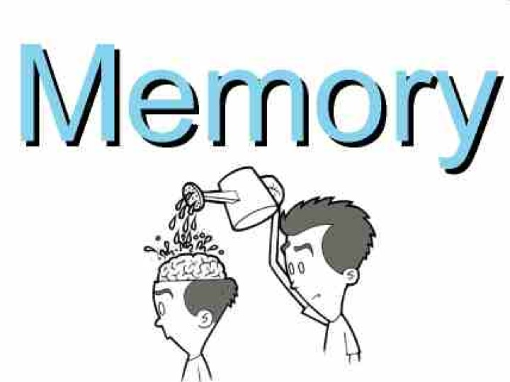

# Introduction

Recall that our question is what personal identity consists in. We have already discussed two theories: 

Same Body Theory: 
: A person A at one time is identical to a person B at a later time if and only if the body of A is identical to the body of B.

Same Soul Theory: 
: A person A at one time is identical to a person B at a
later time if and only if the soul of A is identical to the soul of B.

In these notes, we will be focused on a third and radically different theory: 

Psychological Continuity Theory: 
: A person A at one time is identical to a person B at a later time if and only if B is psychologically continuous with A.

## Further Clarification of our Question 
In order to introduce our new theory, we need to think again about the question that we are trying to answer--what does personal identity consist in? Our first two answers said that there was some one thing that each of the earlier and later stages of a person share, this one thing is numerically identical between each stage, whether it be soul or body. Our third view suggests that we do not need some one identical thing shared by each stage, rather we need each of those stages to enjoy a certain *relationship* to one another. Look again at our picture representing personal identity:

Our first two theories stated that there will be some thing, either a soul or body, that is shared by each stage. This common thing shared will exist fully at each moment that the person exists. If, for instance, personal identity consists in sameness of soul, then the one same soul will exist fully at each moment that the person exists. Our third theory advises against looking for one same thing that exists fully at each moment that the person exists. Rather, it claims that we should look at the relationship between all the stages of the person. Consider the following image of a train:  

Appropriate Connection: Example 

Look at the engine. Look at the final carriage. Are you looking at one and the same train? They clearly aren't numerically distinct trains; the owner of that train you attend to when watching the engine is identical to the owner of the train you are attending to when you watching the final carriage. Suppose, now, we ask in virtue of what is the engine and final carriage numerically identical trains? I think we would all agree that identity of the train cars is not explained by any one identical feature intrinsic to each. The various train car are one and the same train by virtue of the fact that they are connected to one another---just notice the locks where each car connects with one another. 

When I claim that the cars are the same by virtue of being appropriately connected, I have subtly changed the focus of our initial investigation. The invdividual train cars are not numerically identical to one another; the engine is not identical to the coal car. And if by 'same train', I mean 'train car', the various trains cars are not numerically identical cars. But I don't mean this when asking whether the cars are identical. What I mean to ask is whether the train that the engine is part of is numerically identical to the train that the final carriage is part of. Likewise, I can ask whether the body that has my left hand is part is is numerically identical to the body that my right has part; I am not ask whether my left and right hand are identical to one another. I am asking whether they parts of one and the same way. 

Asked in this way, what we would like to know is whether the train cars compose one and the same train, are they parts of the same train. To answer this question, we must decide whether the carraiges are approrpiately related to compose a whole train. Likewise, instead of asking in virtue of what the various stages of person's life are identical to one another, we can in virtue of what all these stages compose one and the same person; the baby and the teenager are, on this view, numerically distinct person stages, but person stages that compose one and the same person that weaves its way through time. 

## Psychological Continuity--Version 1

In his 'Essay on Human Understanding' John Locke articulated our third theory of personal identity, and perhaps was the first person to do so: 

> “For as far as any intelligent Being can repeat the Idea of any past Action with the same consciousness it had of it at first, and with the same consciousness it has of any present Action; so far it is the same personal Self.” John Locke (§10)

Locke believes that you are you identical to your earlier self by you and that earlier self composing one and the same person. Your bodies are numerically distinct. Your personality could have subtly changed. But what's important is that the various different stages of compose one and the same person. Just as some connection between the train cars explained why the compose some one train, so too there must be some connection between person stage if they are to compose some one person. According to Locke, that connection was memory. A simple version of his proposal is as follows: 

Memory Continuity:
: A person A at one time is identical to a person B at a later time if and only if B *remembers* the *experiences* that A has.

This proposal seems plausible given the difference between two types of memories. First, there are *factual memories*. These are memories that some event occurred. They can be shared by several people, e.g., many remember President Obama’s inauguration in 2008, many remember President Obama handing over the reigns of power to President Trump in 2016. 

Factual memories, memories that many can share, differ from *personal memories*. These are the memories of experiencing the event itself. Such memories cannot be shared since personal experiences, are, well, personal. For example, only President Obama has the personal memory of *being inaugurated* at his 2008 inauguration. Only he knows what it was like for *him* to be inaugurated (even though many (factually) remember that he was inaugurated). Similarly, only President Obama can have a personal memory of handing over the reigns of power to President Trump (although many have the factual memory of that same event). 

So consider the imagine of Leonardo Di Caprio

## Objections to the Simple View

-   Allow ‘Rike’ to be the 7 year old who will grow up to be Riker.

    -   Riker = Rike only if Riker remembers everything that Rike
        experenced.

    -   Riker does not remember what Rike ate for breakfast on the
        second day after his 7th birthday, though Rike certainly had the
        experience of eating something

    -   Riker $\neq$ Rike

## Psychological Continuity Version 2

+ A person A at one time is identical to a person B at a later time if and only if B is psychologically continuous with A.

Psychological Continuity: There is a chain of person-stages connected by episodic memory.

-   F remembers what E experienced.

-   E remembers what D experienced.

-   D remembers what C experienced.

-   C remembers what B experienced.

-   B remembers what A experienced.

-   Thus, A, B, C, D, E, and F are psychologically continuous with each
    other.

-   Hence, they are all stages of the one very same person.

## Objections to Version 2

River Objection 

Problem: Apparent vs Real Memory 

I really remember X iff

-   I have an experience as though I remember experiencing X.

-   I did experience X.

I apparently remember X iff

-   I have an experience as though I remember experiencing X.

-   I did not experience X.

Distinguishing Real vs. Apparent Memories: Attempt 1

Internal Differences

-   If I could perceive a qualitative difference between a real and an
    apparent memory of X, then this qualitative difference would
    distinguish the real and apparent memory of X.

-   I can perceive no qualitative difference between a real and an
    apparent memory of X.

-   No qualitative difference distinguishes real and apparent memories
    of X.

Distinguishing Real vs. Apparent Memories: Attempt 2

Suggestion: If two persons A and B both have an experience as though
they remember the experiences of some person P, then the memory of A (or
B) is real and not apparent only if A (or B) is identical to P.

The problems is that it is circular to make both claims:

1.  A = P only if A really remembers what P experiences.

2.  A really remembers what P experiences only if A = P.

Circular Reasoning

Distinguishing Real vs. Apparent Memories: Attempt 3

Suggestion

-   A real memory is one that was caused in the right way.

-   An apparent memory is one that was not caused in the right way, e.g.
    hypnosis, implantation, etc.

Problem-Duplicates!

-   Two persons A and B both have memories of what P experienced that
    were caused in the right way.

-   A $\neq$ B.

-   Having memories caused in the right way is not sufficient for
    personal identity.

Riker Objection 
