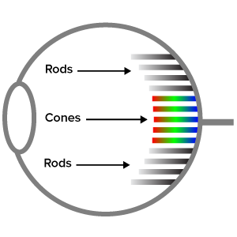
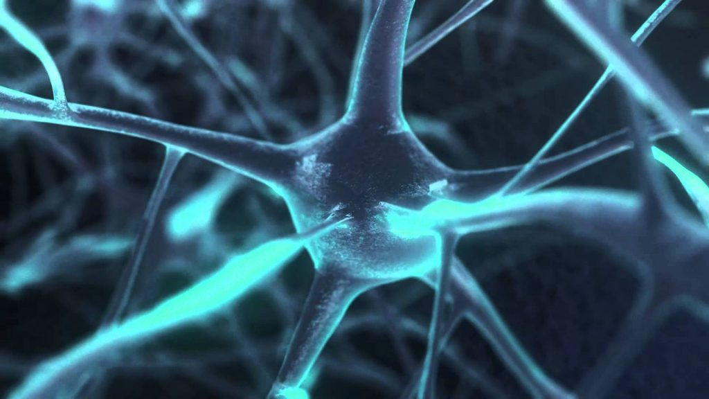

**Introduction**
You may have been convinced by the mind-brain identity theory; perhaps you are convinced that mental states are identical to brain states. But, there is a dramatic objection to this view. If the identity theory is true, then mental states are just physical states (because they are identical to brain states, which are themselves physical). Let us call such a view *physicalism*.

Physicalism:  
: everything is either physical or supervenes on the physical.

According to physicalism, everything has physical properties like mass and location, or if it does not have these properties, then it *supervenes* on things with these properties. What does this word mean? Here is one way to understand 'supervenience': 
> A dot-matrix picture has global properties — it is symmetrical, it is cluttered, and whatnot — and yet all there is to the picture is dots and non-dots at each point of the matrix. The global properties are nothing but patterns in the dots. They supervene: no two pictures could differ in their global properties without differing, somewhere, in whether there is or there isn't a dot (Lewis, 1986, p. 14).

Supervenience is a relation; one thing always supervenes on another. The analogy Lewis uses to illustrate this relies on a dot-matrix. You probably have seen one of these, but here is a reminder: 

The pattern or picture supervenes on the dots. The various dots can be indented or not. They have different locations and arrangements. To say that the picture supervenes on the dots is to say that all the features of the pictures are explained by various features of the dots. To see this, notice that if you change the dots, you will change the picture. Physicalists believes that everything that exists is either physical or explained by properties of the physical. 

Local features: 
: The physical features of the world are like the dots in the picture. These physical features of the world include fundamental elementary particles like quarks and leptons as well as 'force particles', the bosons. 

Global features:  
: Just as there are global features of the picture--features that supervene on the local features of the picture--so too there are global features that supervene on the physical features of the world.  

Notice that the global features of the picture are nothing but a pattern in the dots. You could only change the global features of the picture by changing the dots, i.e., by changing which dots are pressed and how far they are pressed. You could change how cluttered the picture is by changing which dots there are (or are pressed). 

Similarly, physicalism claims that all features of the world are physical features or are nothing but a pattern in the physical features. On this view, all biological, chemical, psychological, and social features, etc., of the world are nothing but a kind of pattern in the physical features of the fundamental entities. This entails that there are no biological, chemical, or social changes without a change in the pattern of physical features. If a heart stops pumping blood, some change will have occurred in the physical features that the heart supervenes on. If some nation changes its laws, some change will have occurred in the physical features that the nations ultimately supervenes on.

I have spoken of 'physical features', but this could be more precise. Let us clean the view up by distinguishing objects, properties, and relations.  Physicalism claims that every true sentence refers to fundamental physical objects, properties, and relations, or to non-fundamental physical objects, properties, and relations, where the non-fundamental supervene on the fundamental. For instance, the 'heart is pumping blood' refer to various non-fundamental things, and these non-fundamental things are as they are only in virtue of some fundamental entities being how they are, i.e., the heart is pumping blood only because there are some fundamental physical entities doing what they are doing. We will call facts about both these fundamental and non-fundamental things, 'physical facts'.  

**Knowledge and Physicalism**

If physicalism is true, then every fact you learn will be a physical fact. For instance, if you learn some facts in your biology class, those facts you learned are physical facts. If you learn some facts in your political science class, those facts too are physical facts. Again, the reason is that those facts are about physical entities and their relations, either fundamental or non-fundamental physical entities and their relations. 

Consider what this means about studying some object like a heart. When you learn everything there is to know about the heart, you learn every fact about the heart. If physicalism is true, each of those facts you learned is a physical fact. 

This may seem surprising when applied to, say, economics. If physicalism is true, then every fact you learn in economics is a physical fact. These are likely non-fundamental facts, e.g., facts about demand for a product changing as its price drops will be a non-fundamental fact because it holds in virtue of some facts about the most fundamental physical entities in the world. 

If physicalism is true, then every fact about human mentality is a physical fact. This is a dramatic claim. Consider the implication it has for the topics we focused on in this course. We first investigated personal identity. We asked under what conditions a person existing at one time is identical to a person existing at another. If physicalism is true, then personal identity consists in some physical facts. This precludes the possibility that personal identity consists in sameness of soul, an essentially non-physical entity. It also means that personal identity consists in psychological continuity only if facts about our psychologies are physical facts, i.e., fundamental physical facts or facts that supervene on fundamental physical facts. 

Physicalism also has significant implications for investigation of the mind-body problem. Not only would it show substance and property dualism to be false, but it likely gives support to those who think that we can build artificially intelligent creatures who enjoy as much mentality as we do. If all facts about our mentality are physical facts, then all we need do is build machines such that their inner workings provide a supervenience base for mentality. 

Finally, if physicalism is true, then every fact about consciousness is a physical fact. For instance, every fact about a bat's experience is a physical fact, including every fact about what it is like to be a bat. Every fact about self-knowledge is also a physical fact. If you are aware of the inner workings of your mind, this too is a physical fact, a fact about fundamental physical things or a fact about non-fundamental physical things that supervene on the fundamental physical thing. If, for instance, we become aware of our minds via an internal eye, then this is a physical fact that somehow must be grounded in the existence of fundamental particles and forces. 

## Frank's Jackson's Knowledge Argument

Is physicalism true? Many deny that physicalism applies to consciousness. They claim that facts about our consciousness are neither physical or supervene on the physical. The most famous argument against physicalism was offered  by Frank Jackson. He motivates it with the simple following thought-experiment: 

> Mary is a brilliant scientist who is, for whatever reason, forced to investigate the world from a black and white room via a black and white television monitor. She specializes in the neurophysiology of vision and acquires, let us suppose, all the physical information there is to obtain about what goes on when we see ripe tomatoes, or the sky, and use terms like ‘red’, ‘blue’, and so on. She discovers, for example, just which wavelength combinations from the sky stimulate the retina, and exactly how this produces via the central nervous system the contraction of the vocal chords and expulsion of air from the lungs that results in the uttering of the sentence ‘The sky is blue’.… What will happen when Mary is released from her black and white room or is given a color television monitor? Will she learn anything or not? It seems just obvious that she will learn something about the world and our visual experience of it. But then is it inescapable that her previous knowledge was incomplete. But she had all the physical information. Ergo there is more to have than that, and Physicalism is false. (Jackson, 1982)

The knowledge argument aims to establish that conscious experience involves non-physical facts. It rests on the idea that Mary has complete physical knowledge about some conscious experience, but lacks knowledge about what conscious experience is like “from the inside.” If she lacks suck knowledge, then something about consciousness is essentially non-physical. 

## What does Mary know? 

Let us go through the argument in detail and first ask what Mary in the black and white room might now. 

First, she knows that there are different wavelengths of light, and she knows which wavelengths of light are reflected by which surfaces. 

Second, she knows all the following facts about the eye: 
1. There are light-sensitive cells in the retina, some shaped like rods and some shaped like cones. 
2. Both rods and cones detect light. 
3. There are three types of cones, one type detects short wavelengths, one detects medium wavelengths, and the other detects long wavelengths. 
4. The rods and cones process the light into nerve impulses and pass them along to the cortex of the brain via the optic nerve. 

Third, Mary knows that there is an optic nerve and knows how the optic nerve transmits information about the wavelengths detected in the retina to the central nervous system. 

Finally, Mary knows which neurons are activated by each wavelength and know those neurons are activated. 

## The Billion Dollar Question ##

Suppose that Mary has been studying the mind of someone who sees red. She knows everything that I have just outlined. Suppose that Mary leaves the room for the very first time and sees, say, a red apple. Does Mary learn anything new about the experience of red when she leaves the room? Here's an oddly creepy video that explains the [two answers.](https://www.youtube.com/watch?v=gZy3Ky9y_fg)

If Mary learns something new, then physicalism is false. Recall that Mary knows all the physical facts before leaving the room. So, if she learns something new upon leaving it, then that new fact is not a physical fact. Jackson thinks that Mary clearly does learn something new. Let's say that Mary was studying John's vision of red and present his argument somewhat formally:  

+ **P1:** If physicalism is true, all the facts about John's experience of red are physical facts.
+ **P2:** Mary knows all the **physical facts** about John's experience of red before her release. 
+ **P3:** Thus, if physicalism is true, Mary knows **all the facts** about John's experience of red before her release. 
+ **P4:** Mary learns some **new fact**, F, about John's experience of red upon her release. 
+ **P5:** F is **not a physical fact**. 
+ **P6:** Thus, Mary does not know **all the facts** about John's experience of red before her release. 
+ **Conclusion:** Physicalism is false. 

## A different version of the argument ##

Instead of asking whether Mary learns something new upon her release, we can ask whether we would learn something new in the following scenario: suppose that Fred returns from a mission to space and reports a significant change in his perceptual experience. He says that he now sees a strange new color completely unlike anything he experienced before leaving Earth. He can see what is called a forbidden color--yellow-blue! What's more, he sees this color every time he looks at a blank piece of paper that appears white to everyone else. Suppose we study the physics of color and the neuroscience of color vision. We are tasked with studying Fred's yellow-blue perception. We learn everything about the relevant wavelength, cones, neurons, etc. Would we thereby know everything there is to know about Fred's experience of yellow-blue? If we did, then we would learn nothing new by seeing yellow-blue for the first time when our eyes too are changed by a trip to space. 

 

 
 
 

 

 
 
 
 
