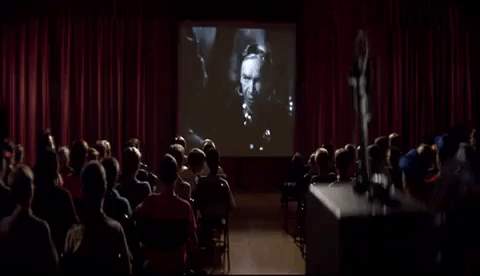
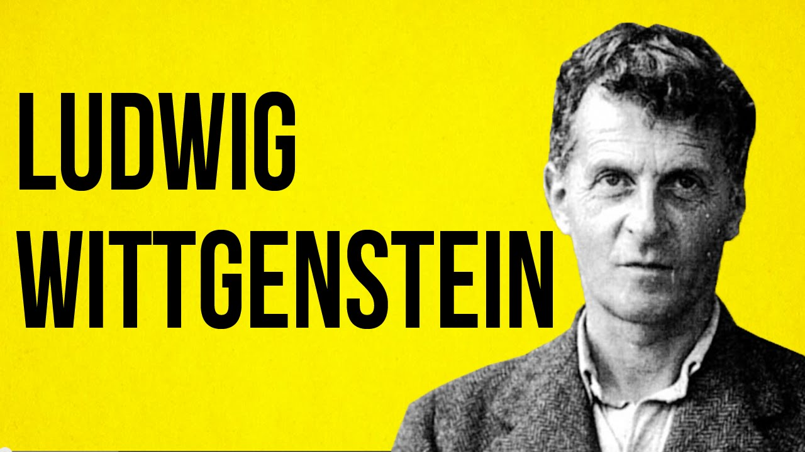

## Introduction

Those closest to us can read us the best. I can easily judge when my wife's thoughts are elsewhere or my brother is troubling over his mortgage. I seem to know their minds, and they seem to know mine. If Descartes were right, then my loved ones' minds are identical to their souls, immaterial and invisible entities. How then could I have knowledge of their minds? I cannot see their minds, but I often know what they are thinking and feeling without them telling me. How is this possible?  

This is the problem of other minds; how can I know about the existence of any other minds? How can I know that you, my wife, my brother, or anyone else has a mind? I do know that I have a mind. Access to my own mind seems **direct** and **infallible**. What does this mean? Take the following image as representing the access you have to your own mind. 

Suppose that the images represent your mental states, represent what is going on inside your own mind. There is currently some deliberation and comprehension of this material; you are reading these notes! There is likely some other visual and auditory information there too. Now suppose that the viewer represents, well, you. It is the entity viewing what is going on inside your mind right now. You witness what is happening inside your mind directly. You don't need to reason it out. You don't need some testimony. You can see it immediately and easily. Notice also that only you have this direct and immediate access to your own mind. Only you can tell that you are hungry by attending directly to what you feel. Nobody else can watch what is happening inside your mind in the way that you can. 

But how does anyone else know that you have experiences, thoughts, and feeling? How do you know this about anyone else? A natural answer is that we know about the existence of other minds because mental states correlate with outward, observable, behavior; I know my brother is troubling over his mortgage because he frowns and clenches his jaw in a certain way. I know my wife is puzzling about how best to cure her patient because she is studying a medical note, scratching her forehead, and biting her lip. Consider this picture:

 

Is the person depicted experiencing anything? Do they have thoughts, feelings, or emotions? If so, what are they? We do not have direct access to their thoughts and emotions; I cannot see their joy. What I can see is some facial movement. Eyebrows raise, a mouth opens, the head moves forward, etc. I *infer* that the person feels joy based upon these observations; I normally find people behaving like this when they feel joy. In general, our mental states seem correlated with our behaviors and attending to these behaviors seems to be how we judge what mental states others are in. A person in pain tends to wince and groan. A person that is excited tends to speak in a higher pitch and have dilated pupils. 

## Behaviors

In this module, we will be discussing *philosophical behaviorism*, the view that there is no internal mental life whatsoever. According to this view, all there is to the mind are observable behaviors. Students sometimes struggle with behaviorism because they struggle to understand what exactly is meant by 'behavior'. After all, you might think that you have seen people behave excitedly, or nervously, or happily, etc. But excitement, nervousness, happiness, etc., are not behaviors (assuming these are internal mental states). They might correlate with behaviors, but you never directly see anyone else's excitement, nervousness, etc. Why? 

For our purposes, there are two types of behavior, **physiological responses** and **bodily movements**. Physiological responses are automatic reactions to a stimulus, e.g., pupil dilation, sweating, etc. We are often unaware of many of these instinctive responses, e.g., flaring our nostrils, grinding our teeth, etc. Sometimes we can become aware of them, and sometimes we can stop. But, no matter how much control you have,  we all automatically undergo various observable physical changes to stimuli.

A bodily movement, on the other hand, is an observable motion of some or all parts of the body. These include extending and retracting our limbs, turning our head from left to right, etc. This image depicts the range of bodily movements that are characteristic of our species. 

If there are others near you, carefully watch how they are behaving. Can you see any kind, shameful, prideful, or calm behavior? If you answered 'yes', then re-read our definition of behaviors. What you can see are their physiological responses and bodily movements. You cannot see 'kindness'.  You might think you do because you associate various physiological responses and bodily movements with kindness.  But this is not the same as directly seeing their mental states.

## Behaviorism

The word *behaviorism* connotes a number of things and it will be important in what follows for us to isolate the philosophical position that goes by that name. But, setting aside the many intricacies and differences, behaviorists of all types approach the study of the mind via the study of behavior. A therapist who calls themselves a behaviorist does not plumb the depths of their patients' dreams and childhood memories. They are more likely to focus on problematic behaviors and their triggers. Therapy may consist in avoiding the triggers or being desensitized to them, e.g., treating a phobia by sensitizing the patient to whatever they fear. In both cases, the goal is really focused on changing the behavior. Likewise, animal psychologists who call themselves behaviorists study the minds of their favored animals via their behaviors. They learn how, say, a lion (my favorite), behaves when encountering a new situation. And they assume that the relevant reaction is all we need to focus on to learn about the mental states of that lion. 

But while many call themselves *behaviorists*, there are different theories that go by this name. Some think that behaviors give clues to the mind, while others think that behavior is all there is to the mind. We are interested in *philosophical behaviorism*, a claim about the nature of the mind. 

Philosophical Behaviorism:
: Mental states are numerically identical behavioral dispositions. 

This is the view that concerns us and it is radical theory about the nature of the mind. Namely, it claims that mental states are identical to sets of behaviors or behavioral dispositions. 

Such an identity may seem surprising. Just as Louise Lane was surprised to learn that Clark Kent and Superman were one and the same person, it would be surprising to learn that pain just is identical to some winces and moans. But that's what philosophical behaviorists believe. They do not think there are any mental states inside that skull of yours---your mental states just are all those external, observable behaviors. To say that a person has a belief that, say, it will rain later, just means that the person is likely to behave a certain way, e.g., carry an umbrella, say aloud the words 'it will rain', etc. The belief is not something inside their skull at all. 

Consider this example from the textbook: “Paul has a toothache”. This sentence is about Paul's pain. Initially, you may think that the pain is residing somewhere inside Paul, that the pain is the cause of his winces and moans. But the philosophical behaviorist denies this. They do not think that the pain is the cause of that behavior. They think that the pain just is that behavior. And, so, they will claim that we can re-write the sentence in a way that speaks only about physiological responses and bodily movements. Here is Kim's proposed translation: 

+ Paul weeps and makes gestures of such and such kinds.
+ At the question “What is the matter?” Paul utters the words, “I have a toothache.”
+ Closer examination reveals a decayed tooth with exposed pulp.
+ Paul’s blood pressure, digestive processes, the speed of his reactions, show such and such changes.

Notice that we have translated the sentence about pain so that we no longer refer to anything that is private, to anything that cannot be observed. If correct, we do not have private and immediate access to our own minds; you do not have special access to your mind because your mind is just the way you behave, which everyone can witness. We should replace the image above of a private theater with this one: 

Assume the image on the screen represents a person's thoughts, feelings, and emotions. According to behaviorism, these mental states are nothing other than observable behavior. The behavior is something we all have direct access to, and so have direct access to each others' mental states. Again, the behaviorist is not claiming that behavior is a clue to what we feel and think. They claim that there is nothing more to our feelings and thoughts than just the way we behave. 

## An Argument for Behaviorism

Philosophical behaviorism is a radical claim. Why accept it? Perhaps the best argument for it rests on some simple observations about the nature of language. Whatever else it may do, language is a means of communication, a means of directing other peoples' attention, a means of getting them to do something, a means of getting them to believe something, etc. How we use language to do all this is a rich area of study that we could devote several semesters to. All we need observe here is that language can only be used as a means of communication if the meanings of our phrases are publicly accessible. I can only succeed in directing your attention to the tiger with the word 'tiger' if we both agree upon what the word 'tiger' means. If you think it means a small plant with stripes, then I'll hardly succeed in ensuring you attend to the large mammal running at us when I say, 'look at that tiger!'. 

Spoken language is no different here than other forms of communication. Sign language too can be used to communicate only if we agree upon the meaning of the various shapes. Morse code can be used to communicate only if we agree upon what various sequences of dots mean. The same goes for even something as simple as traffic lights. We agree that a green light communicates that we are free to travel, while a red indicates that we must stop. Language too works only if we agree upon what the various words we use mean. 

If mental states exist and we can talk about them, then the words referring to mental states must be ones whose meaning we can agree upon. Just as a green light only successfully signals something because we all agree on what it signals, words like 'pain' and 'pleasure' can only communicate something if we all agree upon what they mean. But if mental states exist, they are by their nature accessible only to those that have them; they are not publicly accessible at all. Your pain is *viewable* to you, but it would not be viewable to anyone else. How could we ever then agree upon what a word like 'pain' means?  This is partly why the famous philosopher Ludwig Wittgenstein argues that mental states do not exist. Watch a short video about the argument below:

 

Wittgenstein argues as follows: 

> If I say of myself that it is only from my own case that I know what the word “pain” means – must I not say the same of other people too? And how can I generalize the one case so irresponsibly?
> Now someone tells me that he knows what pain is only from his own case! –Suppose everyone had a box with something in it: we call it a “beetle”. No one can look into anyone else’s box, and everyone says he knows what a beetle is only by looking at his beetle. –Here it would be quite possible for everyone to have something different in his box. One might even imagine such a thing constantly changing. –But suppose the word “beetle” had a use in these people’s language? –If so it would not be used as the name of a thing. The thing in the box has no place in the language-game at all; not even as a something: for the box might even be empty. –No, one can ‘divide through’ by the thing in the box; it cancels out, whatever it is.
> That is to say: if we construe the grammar of the expression of sensation on the model of ‘object and designation’ the object drops out of consideration as irrelevant. (Wittgenstein, *Philosophical Investigations*, Sec. 293)

This is a very innovative example, but let me change it a little. Suppose that each of you have a box and that each of you use the word 'baviga' to describe what is in that box. Only you can see into your own special box. If anyone else tries to take a peek, the box will implode and the peekers will fail. Just as nobody else can look inside your box, you cannot look inside anyone else's box either. Everyone, though, uses the word 'baviga' to talk about what is inside their boxes. They say things like, 'I have such a terrible baviga today', 'the baviga is not as bad today as yesterday', 'I wonder what will happen with my baviga tomorrow', etc. 

While each of you uses the word 'baviga', how do you know that you are each using the word 'baviga' to describe the same type of thing? How do you know that what we each have in our respective boxes is the same? We can't! There could be radically different types of things in our boxes such that I would never use the word 'baviga' to describe what is in your box. Likewise, you might never use the word to describe what is in my box. Then again, perhaps we would use the word 'baviga' to describe what is in each others' boxes. We just can't tell! The referent of the word 'baviga' is in principle accessible only to the person who uses the word. Thus, it is impossible for us to calibrate our language to ensure that we are referring to the same type of entity when we each use the word 'baviga'. 

'Baviga' is a silly word that is useless for communication. What about mental terms, words like 'pain', 'belief', 'pleasure', 'itch', 'taste', etc? Do you think that we can use these words to communicate with each other? If you do, then these words better not be like the word 'baviga'. If we all use the word 'pain' to communicate, then the word should have the same meaning; it should refer to the same thing. But how do we know that when you say, 'I am in pain', and I say, 'I am in pain', that the word 'pain' in both sentences refers to the same thing? How do we know that the thing I experience and call pain is anything like the thing you experience and call pain? If mental states are truly internal and private states, then we can never know this. We could be using the word to describe very different things altogether. 

If mental terms cannot have private meanings, what do they mean? If the word 'pain' does not refer to some internal mental state, what does the word refer to? We all use the word 'pain' and many other mental terms beside these. So, we must all agree on the meaning of 'pain' even if the behaviorist is right and the meaning is not some private mental state. If the word means the same for everyone, then this meaning comes solely from its use in some public context and not from any private sensation, i.e., it derives its meaning from something that we can all access and agree upon. According to the behaviorist, this publicly accessible thing is observable behavior, i.e., our mental terms like 'pain' refer to behaviors. 

## Conclusion

A behaviorist thinks that terms like 'pain', 'itch', etc., are meaningful because they refer to observable behaviors and not internal states of the mind.    So, for instance, 'John feels confused' is a meaningful sentence because it means something like John wears a certain facial expression, will write a question into google if he has access to the internet, will ask an expert if one is around, etc. John's puzzlement, then, is not something inside  John's skull. It is a particular way that we observe him behaving, both his physiological responses and bodily movements. 

 		

