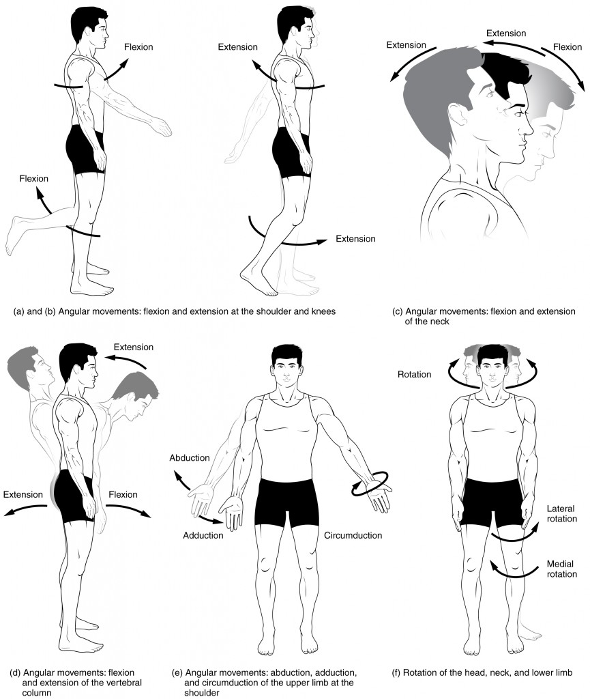
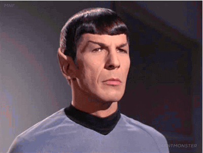
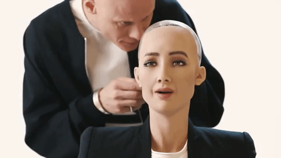

## Objections to Behaviorism

Philosophical behaviorism claims that mental states are identical to sets of behaviors (or, more precisely, sets of dispositions to behave). On this view, a mental state like surprise is not some internal and private state, observable directly only to you. Philosophical behaviorism claims that your surprise is merely the way you behave. And by 'behave', we recall that we distinguished two types of behavior,  **physiological responses** and **bodily movements**. Physiological responses are things like pupil dilation, sweating, grinding teeth, raising eyebrows,  etc. A bodily movement, on the other hand, is an observable motion of some or all parts of the body. These include extending and retracting limbs, turning the head from left to right, etc. This image depicts the range of bodily movements that are characteristic of our species. 

If philosophical behaviorism is true, then your surprise at, say, winning the lottery is not some feeling. It is merely some set of physiological responses and bodily movements, e.g., the raising of your eyebrows, the lifting of the corners of your lips, etc. Proponents of such a view readily defend the so-called art of reading body-language. A pundit who claimed to know what Melanie Trump felt in this picture would find much sympathy with behaviorism: 

Likewise, those who train police officers, interviewers, etc., to interpret body language, may also find behaviorism a very congenial philosophical position. Consider the following two examples: 

<iframe width="560" height="315" src="https://www.youtube.com/embed/eriCgClnJzo" frameborder="0" allow="accelerometer; autoplay; encrypted-media; gyroscope; picture-in-picture" allowfullscreen></iframe>

<iframe width="560" height="315" src="https://www.youtube.com/embed/IEYsIJoTGuU" frameborder="0" allow="accelerometer; autoplay; encrypted-media; gyroscope; picture-in-picture" allowfullscreen></iframe>

In this handout, we survey some objections to philosohpical behaviorism. 

## Linguistic Problems 

Assessing an argument for a claim requires asking several questions: 1) Is the reasoning valid, i.e., if we assume the pemises are true, does the the conclusion follow? 2) Are the premises, in fact, true? 3) Is there any direct evidence against the conclusion? If the answer is 'yes' to the third question, then the answer must be 'no' to at least one of the first two questions. In general, you cannot just reject a conclusion. Even if you have an argument against the conclusion, you must identify the mistake in the argument that lead to that conclusion. 

We used Wittgenstein's private language argument as support for behaviorism. I want to assess that argument by focusing on the general theory verificationism, a position in the philosophy of language. The view was often articulated with the slogan of one of its proponents, Schlick, who claimed the following: 

> The meaning of a statement consists in its method of verification.

So also A.J Ayer in ‘Language, Truth and Logic’ claimed: 

> A sentence is only factually significant to a person if he or she knows what observations would lead him to accept the proposition as being true or false...

> No statement which refers to a reality transcending the limits of all possible sense-experience can possible have any literal significance.

The basic idea is that sentences, at least those that are true or false, have clearly identifiable tests of their truth. Consider, for instance, 'the cat is on the mat'. This sentence is either true or false. I might not currently know if the sentence is true. I might be in the coffee shop unaware of what my cat is doing. Nevertheless, I know what observations could settle the matter. If I were to walk into my apartment and observe a grey, 12lb cat, breathing and sitting on a mat, I would know that the sentence is true. If I observe no creature on the mat, the sentence is false. Verificationists claim that sentences are meaningful only if there are possible observable tests of their truth; they even claim that the meaning of a sentence consists in these verification conditions, i.e., consists in these observations that prove the sentence true or false.  

My sentence about the cat was an easy one. The observations that verify it are straightforward and clearly connected to cats and mats. But the observations that verify a sentence can be more elaborate and indirect. For instance, many of the sentences in physics are verified by what you might consider indirect observations. We may not be able to see subatomic particles directly, but we can observe the tracks they make in a cloud chamber like this: 

 

So, the observations that verify sentences about subatomic particles will likely be observations about their effects, i.e., the sentence 'a sub-atomic particle A has P' is verified by some observation about the ionized gas particle in the cloud chamber. 

Don't worry too much about this example from physics. I include it only to stress that verificationism allows for many subtle and indirect observations to verify a sentence; they don't think a term is meaningful only if you can directly see what it refers to.  You might indirectly see its referent by, for instance, seeing what effects the thing has. What is important is that 1) there are some clearly identifiable observations that would verify these sentences, 2) these observations are in principle possible by everyone--something is confirmable only if in principle confirmable by everyone, and 3) the meaning of a sentence consists in the set of these observations that prove it true or false. 

Verificationism has an obvious upshot: if no observation can verify a sentence, the sentence is meaningless. And, by 'meaningless', I mean it is a string of sounds as meaningful as, say, 'blah wah doo efle fople wittle.' That's obviously a non-sensical string of words. If no observation could confirm a sentence, the verificationist claims that sentence is similarly non-sensical. There are interesting questions about how to understand sentences about God according to verificationism. But we can set that aside and show how verificationism provides an argument for behaviorism: 

- P1. The meaning of a sentence is given by the conditions that must be verified to obtain if the sentence is true--call these *verification conditions.*
- P2. If a sentence has a meaning that can be shared by different speakers, its verification conditions must be accessible to each speaker—that is, they must be publicly observable.
- P3. Only behavioral and physical phenomena (including physiological occurrences) are publicly observable.
- C. Therefore, the sharable meaning of any psychological sentence must be specifiable by statements of publicly observable verification conditions, that is, statements describing behavioral and physical conditions that must hold if the psychological statement is true.

But P1 and P2 are problematic. Do you think that they are true? If so, they must be verifiable? But what are their verification conditions? The problem for verificationists is that the language they use to state their theory has no obvious verification conditions. 

## Counterexamples

Suppose that surprise is identical to raising eyebrows, upturning lips, and gasping. If this is correct, two things follows: 1) any entity which displays these behaviors feels surprise, and 2) any entity which is not displaying these behaviors is not feeling surprise. In other words, these behaviors would be *necessary* and *sufficient* for feeling surprise. Here we can raise two distinct one objections, one to the claim that such behaviors are necessary for surprise and the other to the claim that such behaviors are sufficient for surprise. 

Consider first those who are excellent at controlling their reactions and behaviors. Here is a picture of someone we could imagine just hearing the most incredible news but pretending not to be shocked. 

 

This woman is surprised by the news; she just chooses not to show it. If philosophical behaviorism were true, this would be impossible. It would be impossible to be surprised while suppressing surprised behavior. This seems very implausible. All of us have occasion to control our behaviors and reactions. Perhaps we don't want to appear nervous in a job interview or seem too eager on a date. I try very hard to suppress some behavior in front of my one year old, e.g., I try not to show frustration or worry when he cries incessantly, I avoid showing my fear when we encounter a bug that gives me the shudders, etc. Likewise, while one person screams when they feel pain, another might bite their tongue and remain silent--perhaps they are training to be an army ranger and need to prove themselves. These are clear examples of having a mental state without displaying the associated behaviors. If philosophical behaviorism were true, this would be impossible; you could not have the mental state without behaving in the relevant way. 

Again, if philosophical behaviorism were true, then anyone who displays the behavior identified with some mental state should, in fact, have that mental state. Our second objection says that it is possible to display the behaviors associated with a mental state without being in the state. Consider the advanced robot, Sophia.  

Sophia here displays the behavior associated with joy, surprise, and disgust but is not in any of these mental states; robots can be made to behave as if they had mental states even though they do not. This would be impossible if philosophical behaviorism were true. If it were true, Sophia really would feel surprise, joy, and disgust just because she displays the associated behaviors. But this seems implausible. A similar problem arises with acting. Regardless of whether you have acted in a play, all of us have occasionally faked our reactions. I must act surprised during a game of peek-a-boo with my son even though I certainly don't feel surprise. But if philosophical behaviorism were true, this would be impossible. If I act surprised, I really would be surprised.  Again, this seems implausible. 

## Knowledge of our own minds

Behaviorism is driven by a desire to explain our knowledge of other minds, to explain how we know what others are feeling and thinking. Their explanation of this knowledge is simple: since mental states are identical to observable behaviors, we directly observe others' mental states just by observing their behavior. 

How does the behaviorist explain the knowledge we have of our own minds? I know that I am feeling tired from a long day of caring for my teething son. How do I know that I feel tired? If behaviorism were true, then all there is to my tiredness is the particular way I am behaving. It seems that the behaviorist must claim that I know that I am tired in exactly the same way as my wife knows it, i.e., by observing my behavior. This seem implausible. 

Consider this picture an analogy for the behaviorist's explanation of self-knowledge. I would find out what mental state I am in by observing myself, e.g., I would find our I am confident by seeing myself act confidently in a mirror. But this seems wrong. We don't need to observe our behavior to know how are feeling, e.g., I don't need to look at myself grimacing in a mirror to know that I am in pain. Whether I am in pain, or want ice-cream, or hope for rain, seems to be something I can directly and immediately be aware of; I know I am in pain by introspecting and not by observing my behavior.

## Mental Causation

Consider how the mind and body seem to causally influence one another. Our decision to throw the ball causes our limbs to move. The cat biting our finger causes us to feel pain. These are all cases of mental causation. Mental causation is common place and include all of the following: 

- Mental to mental causation.
- Physical to mental causation.
- Mental to physical causation.

The first type of case involves one mental state causing another mental. Suppose, for instance, your desire for chocolate causes you to desire the money to buy chocolate. Here one desire is the cause of another desire. The problems that faced Descartes also arise for the behaviorist, and they concern the second and third phenomena. The second occurs whenever any bodily changes cause changes to our mental states, e.g., stubbing our toe causes pain, a feather across our skin causes a tickle, etc. The third occurs whenever our mental states cause a change in our bodies, e.g., our desire for chocolate causes us to walk to the store, our feeling of itchiness cause us to scratch ourselves, etc. Every time we act on a choice, a mental state is causing something physical to happen. For example, when I choose to stand up, my choice causes my body to move. When I fear my hand is too close to the fire, my fear causes my hand to move away. But how does this mental causation work according to the behaviorist? They don't believe in an immaterial soul, so they are immune from the particular problems that beset Descartes. But they still have a problem.  

Consider these two claims:

1. My surprise is the cause of me arching my eyebrows, upturning my lips, and gasping. 
2. My surprise = arching my eyebrows, upturning my lips, and gasping. 

Behaviorists defend 2; they believe there is nothing more to surprise than the associated behaviors. If this correct, our surprise does not cause our surprised behavior; our mental states do not cause our behavior. Similarly, my pain does not cause me to grimace. My pain just is the grimacing. The grimacing is caused by, say, stubbing my toe, or spraining a muscle. 

But this violates many of our standard intuitions about mental causation.  We think we buy the ice-cream because we want the ice-cream. We don't think our desire is just the purchase. Again, we treat our partners well because we love them. Our love isn't reducible to all the various ways we treat them. But if behaviorism is true, we are wrong to think these things. Our love, desires, pains, and hopes cannot be the cause of anything. They are just the ways we behave.  

## Mental states are needed to define mental states

Our final objection claims that it is impossible to describe the behavior associated with a mental state without making assumptions about what other mental states the person has. Consider the behaviorist's account of wanting ice-cream. S wants ice-cream if and only if S reads the dessert menu, says 'I want ice-cream' when there are several options, uses a voucher for ice-cream if they receive one, etc. But each of these behaviors by its nature involves other mention states. For instance, if saying 'I want ice-cream' is really a behavior associated with a desire for ice-cream, we have to assume that the S speaks sincerely. But 'sincerity' is itself a mental state. Or take the claim that S's purchase of ice-cream is the associated behavior. This behavior is associated with that desire only if S believes that the voucher will work, whether S intends to keep his weight in check, etc. So, here we have explained what it is to want ice-cream by appealing to more mental states like belief and intent. 

The problem is that we can't reduce mental states to behavior by merely relying on physiological reactions and bodily movements. For instance, the behavior associated with the desire for ice-cream is not merely making certain noises. It  involves making those noises intentionally and sincerely. But if our analysis of the desire for ice-cream mentions other mental states, we have failed to analyze the desire for ice-cream in purely behavioristic terms. 

