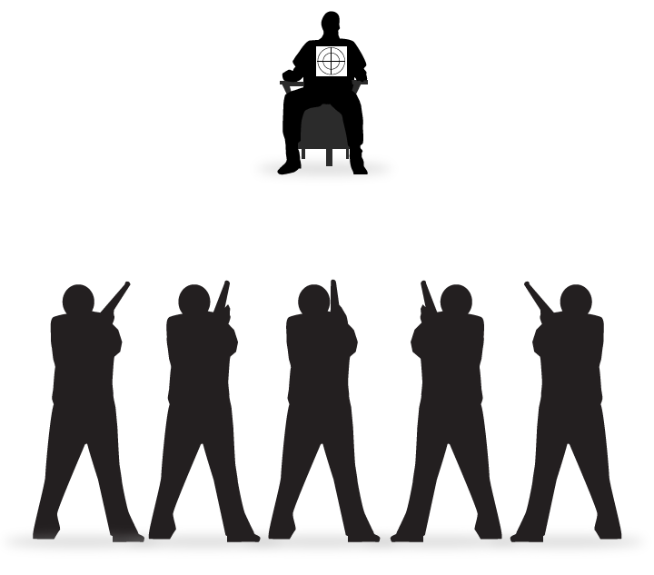

## Introduction

Mental causation is common place. Every time we act on a choice, a mental state seens to cause something physical to happen. For example, when I choose to stand up, my choice causes my body to move. When I fear my hand is too close to the fire, my fear causes my hand to move away. Since my body is a physical thing, my fear, a mental state, has moved a physical thing. 

Mental causation is important to our concepts of agency, to our idea of performing actions intentionally. An action is not a mere bodily motion like involuntarily blinking your eye. It is something you do intentionally. We can only distinguish mere bodily movement from an action if there exists mental causation, i.e., if there are intentions, mental states, that cause physical movements. For instance, there is difference between murder, intentionally killing someone, and accidentally causing death, non-intentionally killing someone. We distinguish murder from accidents by the fact that the murderer intends to kill while our unfortunate accident prone person does not. If intentions could not move the body, then we could not distinguish a murder from a mere accident.  

There are three type of phenomena that might constitute an instance of mental causation: 

+ Mental to mental causation, e.g., beliefs lead to another belief

+ Physical to mental causation, e.g., perception causes a perceptual experience

+ Mental to physical causation, e.g., beliefs and desires cause actions

Our main interest is mental to physical causation. We would like to know how a mental state can be a link in a causal chain of physical events. It certainly seems that mental states insert themselves into such causal chains, but we will see that is hard to explain how this is so unless mental states are identical to physical states. In light of the problems below, philosophers have defended four basic models of mind-body interaction. These are as follows:

Interactionism:
: the view that the mind and the body directly cause things to happen in each other. This was Descartes' view. We saw that he argued that the mind and body directly interact via the pineal gland. We also saw that he had difficulty explaining this interaction.  

Parallelism:
: the view that the mind and the body act "in parallel," but never casually interact directly. Versions of this view were defended by Malebranche and Leibniz in response to problems they saw with Descartes' substance dualism. In different ways, both claim that God explains why mind and body act in parallel, e.g., God causes your hand to move to the Ben & Jerry's when you desire ice-cream. Your desire is not the cause of the movement. God is. He ensures that your body moves as you wish it to.

Reductionism:
: the view that the mind just is the body, and so whatever causal efficacy the physical has, the mental also has. This is the view of those who defend the identity theory of the mind. If mental states are identical to psycho-neural states, mental causation is not mysterious at all.

Epiphenomenalism:
: the view that only the body has causal powers, but the mind is causally inert, i.e., the view that mental events cannot cause physical events. Versions of this view are defended by those who agree that our minds and bodies are numerically distinct---either different substances or different properties---but deny either that God exists or that he causes our bodies to act in parallel with our wishes. On this view, we are akin to passengers in our bodies unable to influence or control it (even though we might delude ourselves that we can.)

The main problem we will focus on is called the *exclusion argument*, which claims that mind is excluded from playing any causal role if the mental is distinct from the physical. If the argument succeeds, we will either have to accept that the mind is not something distinct from the brain, or, if we insist that they are so distinct, agree with the epiphenomenalist that we have no power over our bodies. Neither option seems a good one! 

## Causation
To motivate the causal exclusion argument, we need to first talk generally about causation. Causation is standardly taken as a relation that holds between two events, whereby the first event, e1, is the cause of the second event, e2. Examples include: the cue striking the cue ball is the cause of the ball moving, the heat radiating from the heater is the cause of the temperature rising, the wind blowing is the cause of the windmill turning, etc. 

There are many interesting questions we can ask about causation, about what the relation is, about how one event could ever bring about another, etc. But here we will focus on some common, but not universally accepted, claims about causation. We have already said that causation occurs between two events. Many also agree that for one event e1 to be the cause of event e2, the following must obtain: 

1. e1 and e2 are spatially contiguous. 
2. e2 immediately succeeds e1 in time. 
3. e1 necessitates e2.

Claim 1 states that causation requires spatial contact. Consider the cue moving the cue ball. The cue touches the ball and energy is transferred from one to the other. Claim 1 does not state that all causation requires energy transfer, but it does require that events in a causal relation are in the same location. Two events separated by millions of miles cannot enter into direct causal contact.  

Claim 2 states that a cause must occur immediately prior to its effect. Consider the cue moving the cue ball. The event of the cue touching the cue ball happens immediately before the ball begins to move. Likewise, my hand touching the glass occurs immediately before the glass falls over. In both cases, the cause of the outcome was an event that immediately preceded the outcome. Note that claim 2 is a claim about immediate and direct causes. There can be chains of indirect causes that are separated by a period of time. For instance, my friend dares me to play pool; I accept; I move the cue against the cue ball; the cue ball moves. My friend's dare happened well before the ball moved, but you might still think that the dare caused the ball to move. But this is not in tension with claim 2. Claim 2 does not apply to remote or indirect causes. It is a claim about immediate and direct causes.

Claim 3 states that the occurrence of one event, e1, necessitates the occurrence of the other event, e2. What does this mean? First, it means that if e1 occurs, e2 occurs. This is the simplest way of putting the point. If the cue striking the ball causes the ball to move, then the former event entails the occurrence of the latter event. It would be impossible for the former event to occur and the latter not to occur.  

It also means that if e2 had not occurred, e1 would not have occurred. Consider the cue striking the cue ball. This causes the ball to move. Imagine a world exactly like our world, but it is a world in which the cue ball is not moving. Claim 3 tells us that there will be at least one further difference between our world and that imaginary world: there will be no cue striking that cue ball either. In other words, claim 3 states that if one thing genuinely causes some later thing, then if the later thing hadn't happened, the earlier thing wouldn't have happened either. 

## The Causal Exclusion Argument

We are now in a position to explain the causal exclusion argument. The argument relies on two principles: 

Causal Closure of the Physical Domain:
: If a physical event has a cause (occurring) at time t1, it has a sufficient physical cause at t1.

This principle is easy. It simply says that if some **physical** event has a cause, it has some (sufficient) **physical** cause. So, if the glass breaking at 10am has a cause, the glass breaking has a sufficient physical cause at 10am. Again, if the water boiling at 2pm has a cause at 2pm, the water boiling has a physical cause at 2pm. Finally, if my leg moving at 9am has a cause, my leg moving has a sufficient physical cause at 9am. It follows from this principle that even if a mental state causes some physical state, there must also be a sufficient physical cause of that physical state, e.g., if my choice causes my body to move, there must also be a sufficient physical cause of body moving such as neurons firing, etc.

Our second principle is called the causal exclusion principle:
 
Causal Exclusion Principle:
: No event has two or more distinct sufficient causes, all occurring at the same time, unless it is a genuine case of overdetermination.

Causal overdetermination would occur if some event had more than one independently sufficient cause. This is best illustrated with an example. Consider execution by firing squad. Suppose that multiple bullets hit the prisoner at the same time.

 

Which bullet killed the prisoner? It's not an easy question to answer. The prisoner being killed is an event. Call it e2. This event is caused by some other event, e1. What is e1? Each shooter is an expert. Any of them alone could hit the target. If only the left most shooter was there, his shot would have killed the prisoner. This suggests that e1 is the shot fired from the left most shooter. But the right most shooter too is an expert shot. If only he had shot, his shot would have killed the prisoner too. This suggests that e1 is the shot fired from the right most shooter. The same goes for each of our shooters in the picture. Each of their shots is sufficient by themselves for bringing about e2. So, each is a good candidate for e1, the sufficient cause of e2. 

Above we stated that each event has only one sufficient cause. So e2 must have only one event as its cause. Of course, it can be true that e2 has only event as its cause and still be true that something else could have sufficed. For instance, Socrates died from drinking hemlock. The hemlock was the one cause of his death. While this was sufficient for the effect, something else could have played this role if things had gone differently, e.g., the poisoner used arsenic instead. The picture depicted above is different. It does not describe a situation where, say, if things had gone differently, the executioner would have used a noose rather than a bullet. It is not a cause where there might have been a different sufficient cause.  Our diagram suggests that there were 5 independently sufficient causes at the very same time! That is, it seems that each bullet independently killed the prisoner. This is counterintuitive. Presumably, it is only one bullet that caused the death. Overdetermination would occur if there were more than one sufficient cause. Overdetermination does not seem possible. 

So, here is our argument against mental causation. 'm' is a mental event like wanting to scratch your head. 'p' is a physical event like your hand scratching your head. 'c' stands for some other physical event. 

+ P1. m is a cause of p
+ P2. Therefore, c is a cause of p...from causal exclusion principle
+ P3. m ≠ c
+ P4. Mental causation is not an instance of overdetermination.

P1 says that my feeling itchy caused me to scratch my head; the mental state caused a bodily movement. Since any physical event that has a cause must also have a sufficient physical cause, it follows from our first premise that the scratching also has some sufficient physical cause. This sufficient physical cause might be the various neurons that fire when my arm moves to my head and scratches. P3 says that my itch and those neurons firing are numerically distinct. P4 says that mental causation, just like any causation, is not an instance of causal overdetermination. 

P1-P4 cannot be all true together. P1--P3 entail that p has two sufficient causes, both m and c (which are distinct from one another). P4 says that such overdetermination is impossible. Since there is a contradiction between P1-P4, at least one of these claims is false. 

Which should we reject? The epiphenomenalist claims that we should reject P1. They claim that we erred when assuming that a mental state like itch could cause anything physical. If we reject P1, then we do not face a contradiction. The mind-brain identity theorist rejects P3. They claim that we err in thinking that mental states are anything other than brain states; our itch really just is some set of neurons firing. P2 and P4 are fundamental principles that apply to everything in the physical world. Rejecting either would have ramifications for physics, chemistry, etc. It seems far more likely that the culprit is either P1 or P3. 

## Epiphenomenalism
If the argument succeeds, then we must endorse epiphenomenalism or the mind-brain identity theory. A previous note already discussed the problems with the mind-brain identity theory. So, should we just endorse epiphenomenalism? Again, recall that epiphenomenalism says that our mind has no control over the physical. Of course, we believe that our choices can cause our body to move, but the epiphenomenalist thinks we are mistaken. Just as we were mistaken to believe that Santa Claus exists, the epiphenomenalist claims we are mistaken to think that mental causation exists. There are two striking reasons against accepting epiphenomenalism. 

First, some believe that all existing things share at least one important feature: each existing thing can enter into causal relations, i.e., it can affect or be affected by something else. This is called **Alexander's Dictum**. So, if mental events have no causal powers, then they are in total causal isolation from the rest of the world---they would have no causes, and they would make no difference to anything else since they have no effects. By 'causal power', I mean the ability to either affect something else or be affected by something else. So, here is the argument: 

2. If epiphenomenalism is true, mental events have no causal powers. 
2. If something has no causal power, then it does not exist.
4. Therefore, if epiphenomenalism is true, mental events do not exist. 

The argument is straightforward and I won't dwell on it. Ask yourself whether you agree with each premise. Does the epiphenomenalist say that the mental has no causal power at all? Or do they just say that the mental has no power to cause the body to move? Might this be compatible with the mental having the passive power to be affected by the body? 

Second, if epiphenomenalism is true, then we are not truly agents; we are never truly the causes of our behavior. No voter's desire is the cause of them voting for a certain candidate. No defendant's anger is the cause of their striking someone. No lover's love is the cause of their wedding proposal. Why? Consider what it means to perform an action rather than habitually or spontaneously move your body. Actions are performed for reasons; reasons are the causes of our actions. This is a problem for epiphenomenalism: 

1. We perform actions for reasons. 
2. The reasons for which we perform an action are the cause of that action.
3. Actions involve bodily movements. 
3. Therefore, reasons are the cause of bodily movement. 
4. Therefore, mental events cause bodily events. 
5. Therefore, if epiphenomenalism is true, mental events cannot cause bodily events.
6. Therefore, if epiphenomenalism is true, we do not perform actions for reasons. 

## Conclusion

We are in a bind! Mental causation seems common place; surely our minds are able to affect our bodies. That is very difficult to deny. But if our mental states are numerically distinct from our brain states, it is very difficult to explain how the mental could interact with the physical. On the one hand, this seems very good support for the mind-brain identity theory. But we have also discussed the problems for this view. It seems we either must accept the flaws in that theory or face the daunting possibility that mental causation is impossible. Neither option is a pleasing one. 

