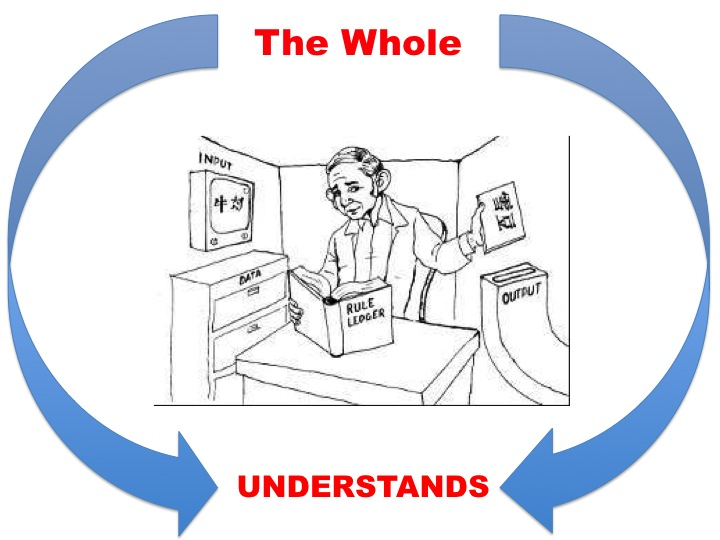
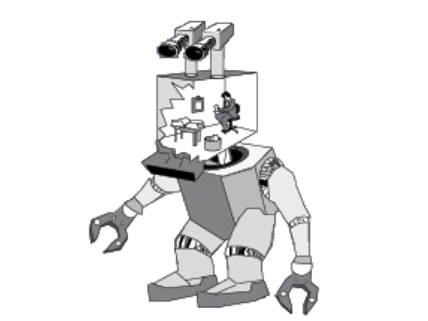

## Introduction

Turing claimed that 1) being able to pass the Turing Test is necessary and sufficient for being able to think, and 2) there are imaginable digital computers that could pass this test. I will paraphrase 1) as the claim that passing the Turing Test is necessary and sufficient for thought. Turing defends 2 by considering and responding to possible objections to it. We will briefly examine these objects before discussing the main difficulties with 1. 

## ESP Objection

Objection:
: If the human participant in the game was telepathic, then the interrogator, who is also human, could exploit this fact in order to determine the identity of the machine.

Response:
: Turing proposes that the competitors should be housed in a “telepathy-proof room.”

## Lady Lovelace’s Objection

Objection:
: Machines have “no pretensions to originate anything. It can do whatever we know how to order it to perform.” 

Response:
: The objection assumes that machines cannot learn. But they can; ask any computer scientists about machine learning! 

##Argument from Various Disabilities

> Machines cannot do many things that humans can, e.g., be kind, be resourceful, be beautiful, be friendly, have initiative, have a sense of humor, tell right from wrong, make mistakes, fall in love, enjoy strawberries and cream, make someone fall in love with it, learn from experience, use words properly, be the subject of its own thought, have as much diversity of behavior as a man, do something really new.

Response:
: The objection relies on an inductive inference. You know that particular machines have various disabilities and then infer that all present and future machines will have various disabilities. But induction can fail. 

Induction is a non-deductive inference. It is an inference that since some instances of a certain group have a certain attribute that the next members of that group will have that attribute. Examples:

+ The sun rose every day that I remember, hence, the sun will rise tomorrow.
+ Every lion I have seen was a golden yellow color, hence every lion I will see will be a golden yellow color.

Neither inference is deductively valid. Induction will tell us only what is probable; they succeed if they get judge the probability correct. 

## The Argument from Consciousness 

> Not until a machine can write a sonnet or compose a concerto because of thoughts and emotions felt, and not by the chance fall of symbols, could we agree that machine equals brain—that is, not only write it but know that it had written in it. 

1. A being can think only if it can know that it thinks.
2. Computers cannot know that they think.
3. Computers cannot think...(from 1&2)

Turing responds by rejecting 2:

1. The evidence we could have that a being is self-aware is either from their reports or from being that being.
2. We cannot be another being.
3. So the only evidence we have that another being is self-aware is their reports that they are self-aware...(from 1&2)
4. Computers can report that they are self-aware...(from performance in the Turing Test)
5. So we have evidence that they are self-aware...(from 3&4)

In addition, if the machine gave sufficiently complex answers about how it wrote poetry, we would likely think that it is, in fact, conscious. Talk to Mitsuku about poetry to see how convincing her responses are. 

## The Mathematical Objection

1. Within any consistent formal system there are statements that can neither be proved nor disproved within that system.
2. Suppose that a computing machine is a formal system that operates by proving or disproving various statements put to it, i.e., by answering ‘yes’ or ‘no’ to various questions put to it.
3. There will be questions a computing machine gives wrong answers to, i.e., in some cases the machine should answers that there is no correct answer, but it is unable to do that. 
4. Intelligent beings are not so limited.
5. A computing machine is not intelligent...(from 3&4)

Turing responds by reject 4:
1. There are questions that humans can’t answer, yet they are intelligent.
2. It could be that the inability to answer every question is due to precisely the same limitations that restrict the capacity of machines.

## Necessary and Sufficient Argument

Since Turing died, there has been many new objections to his claim that passing the Turing Test is necessary and sufficient for thought, some challenging the necessity condition and others the sufficiency condition. If we can identify something that fails to pass the test but can still think, then passing the test is not necessary for thought. And if we can identify some entity that passes the test but cannot think, then passing the test is not sufficient for thought. 

The general strategy used to attack the claim that passing the test is necessary for thought is to try identify some thinking being that would never be able to convince us that they are human, e.g., aliens, animals, etc. If such creatures exist, passing the test is not necessary for thought.  The strategy is weak; we are asked to accept that beings who we are unable to communicate with still have thought. 

The best argument against the Turing Test, then, challenges the claim that passing the test is sufficient for thought, i.e., showing that something may deceive us into thinking it is human without it having thought. The best argument  of this type is the **Chinese Room Thought Experiment** by John Searle. Searle describes a situation where something satisfies the functional definition of understanding but fails to possess understanding. Since understanding is required for thought, it seems something could do some of the things associated with thought without being able to think. 

Before we examine the details, a simple illustration of Searle's strategy will help. Suppose that we have defined a heart functionally as anything whatsoever that pumps oxygenated blood to the tissues. Anything that performs that job should be a heart. Suppose, though, we find some machine that is being used to pump the blood of sick patient to their tissues. And further suppose that we are convinced that this machine is not a heart. We should conclude that being a heart is not merely defined by the job of pumping oxygenated blood to the tissues. Similarly, Searle focuses on the functional definition of understanding. He shows that at least some things can do the job of understanding without being a genuine instance of understanding. If Searle's argument succeeds, he has shown that mental states are not defined functionally.   

## The Thought Experiment 

The Chinese Room is designed to emulate a system that is analogous to a digital computer, a type of computing system. A Digital Computer is a machine intended to carry out any operation that could be done by a human computer. It has three parts: 

Store:
: a bank of information. 

Executive unit:
: carries out the various operations.

Control:
: like the rules or instructions for carrying out the calculation.

Notice that we can dramatically increase the size and power of these three parts. So, even if we don’t yet have a powerful enough computer that passes the Turing Test, many think we will build one by increasing the power and size of these parts. However, Searle claims that no system with these parts has true thought, regardless of how powerful it is. If successful, Searle shows our inability to create a truly intelligent machine is not a failure in our engineering prowess. If successful, he shoes that it cannot be done in principle.  

Instead of focusing on a machine, Searle's thought experiment proceeds by showing that a human being may successfully communicate without understanding what they communicate. The point is to show that performing the function of understanding is insufficient for understanding in us. So too it should be insufficient for understanding in a machine. In the experiment, Searle plays the role of the executive unit, a box of Chinese symbols plays the role of the store, the book of instructions is the control. Searle also adds two other features:  

Input:
:   Chinese symbols that unbeknown to Searle are questions in Chinese.

Output:
:   Chinese symbols that unbeknown to Searle are answers in Chinese.

Let us call the person in the room *Searle*. Searle will receive some symbol through the input box. Suppose those symbols represent a question. Searle does not know this, but he opens the very big and complicated instruction book. That book tells him that if he receives a certain symbol, or string of symbols, then he should take a different symbol, or string of symbols, and put it in the output box. Searle can do this. He even gets really quick and good at it. 

Now, suppose that the person who inputs the symbols is a fluent speaker of Chinese. They are also the person who receives the outputted symbols. They ask a question like 'who was Socrates?', and then read as the output something like 'Socrates was a Greek philosopher in the 4th century BC. He never wrote anything, but was the teacher of Plato, who reported his teacher's conversations. Socrates was ultimately executed for corrupting the youth of Athens and inventing new Gods.' Our Chinese speaker doesn't know anything about what happens inside the room; they are unaware that Searle outputs various symbols by following an instruction book. Surely, the objection goes, our Chinese speaker believes that the person in the room understands Chinese. But the person in the room, Searle, does not understand Chinese. Searle summarizes the objection as follows:  

> Imagine a native English speaker who knows no Chinese locked in a room full of boxes of Chinese symbols (a data base) together with a book of instructions for manipulating the symbols (the program). Imagine that people outside the room send in other Chinese symbols which, unknown to the person in the room, are questions in Chinese (the input). And imagine that by following the instructions in the program the man in the room is able to pass out Chinese symbols which are correct answers to the questions (the output). The program enables the person in the room to pass the Turing Test for understanding Chinese, but he does not understand a word of Chinese.

It's a clever argument. The thought-experiment models how computer systems work, how they output answers to the questions that we ask of them. But, if Searle doesn't understand Chinese and can still outputs the correct answers, we have little reason to think that a computer system that outputs the correct answer to our questions has understanding. In order for us to present this as a formal argument, let us recall the difference between Strong and Weak AI:

Weak Artificial Intelligence (WAI):
: Computers give us a powerful tool to study the mind. Thinking may be modeled by formal symbol systems, such as computer programs.

Strong Artificial Intelligence (SAI):
: Thinking is constituted by the manipulation of formal symbols, such as occurs in a computer program.

WAI does not say that the computers really have a mind. It says only that such machines might resemble minds. It may also provide tools for investigating the mind by, for instance, giving us models that approximate the way the mind operates. But WAI does not say that computers have mental states; it does not state that computers realize mental states. On this view, Siri and Alexa mimic what minds can do, but our iPhones and Amazon devices do not have mental states just by having Siri and Alexa on them.  So, WAI cannot be used to support functionalism. On the other hand, SAI would give strong support for functionalism. If what it is to think just is to manipulate formal symbols, then thinking is a collection of functionally defined states. And, if such functions can be performed by both computers and human brains, then functionalism and Turing will be vindicated. Searle's objection to SAI can be presented as follows: 

1.  If SAI is true, then there is a program for Chinese such that if any computing system runs that program, that system thereby comes to understand Chinese.
2.  I could run a program for Chinese without thereby coming to
    understand Chinese.
3.  Therefore, SAI is false.

Premise 2 is demonstrated by the experiment. I could easily output the right responses without understanding Chinese. Premise 1 may seem surprising. Humans don't seem to be computers. But, SAI claims that human minds really are computing devices. On this view, human brains and silicon chips are just two different ways of building the same thing: a computing device. Since we are a computing device, then we should understand Chinese if we fulfill the functional description of *understanding Chinese*, which is something like outputting the correct Chinese symbols when receiving questions in Chinese. Since we do not understand Chinese but do satisfy the functional definition for understanding Chinese, then satisfying this functional definition is not sufficient for such understanding. Generalizing, no computing device, human or machine, can think just by being able to satisfy the functional definition of thought. 

## Objections to Searle

Searle considers various worries with his  objection and responds to them. There are six in total: 

1.  The Systems Reply
2.  The Robot Reply
3.  The Brain Simulator Reply
4.  The Combination Reply
5.  The Other Minds Reply
6.  The Many Mansions Reply

I will run through a few of the more interesting one. 

### Systems Reply

The systems reply objects that even though the human inside of the
Chinese room doesn’t understand Chinese, nevertheless the entire system, including books and pieces of paper, does understand Chinese. 

The reply, in effect, complains that Searle is committing what is called the fallacy of composition. This fallacy arises when one infers that something is true of the whole from the fact that it is true of some part of that whole. For example, this is a fallacy:

1.  Searle’s hand weighs 2lb.
2.  Searle’s hand is a part of him.
3.  Thus, Searle weighs 2lb.

The executive unit, control, and store are all parts of the computing device. An advocate of SAI may object that Searle is assuming that the inability of the executive unit to understand entail that the whole computing device also fails to understand Chinese. On their view, it is the computer as a whole that understands, not some piece of the computer. Likewise, they claim that the entire system that has Searle as a part might understand Chinese without it thereby following that Searle, the person in the room, understands Chinese. Similarly, the fact that one part of the system does not understand Chinese does not entail that the whole system fails to understands it. 

But, Searle thinks that this objection, in addition to being incredible, overlooks the fact that the same thought-experiment can be run even if we assume that the human has internalized all of the books and other parts of the system.

### The Robot Reply

The Chinese Room represents a system that is meant to be similar to a computer system. Searle asks whether the system, or the person in the room, understands Chinese. Obviously, that person doesn't and so Searle concludes that computer systems do not possess understanding. The Robot Reply accuses Searle of developing too simple a system. A real Chinese speaker interacts with the world. They move around it and perceive it. An advocate of SAI may claim that a computer that was connected to cameras and was able to move around the world could also possess understanding. If that's the case, Searle's thought-experiment doesn't properly parallel the type of computer that could possess intelligence. 

But, Searle replies that we could easily change the thought experiment. Assume that the room is, in fact, part of the head of a gigantic robot. This robot moves around the world and has various parts that allow it gain information of that world. This information will update the data base (the store of symbols) and the program (the instructions for what do upon a certain input). Even when we make these changes, the person in the room does not understand Chinese. 

### Brain Simulator Reply

This reply concedes that Searle has shown that computer systems that work in the way that parallels the Chinese Room do not possess understanding. But, it claims that if we could make a computer that exactly parallels whatever goes on in a fluent Chinese speaker’s brain when he or she understands Chinese, then that computer would understand Chinese. What we need is for the electric circuitry of a computer to mimic the neural network of a Chinese speaker. According to this reply, if we could build such a computer, then it would understand Chinese. 

Searle's response: we can change the thought experiment to show that such future computers would also not possess understanding. We will now change the experiment so that the man in the room turns on and shuts off water valves that correspond to the neural firings of a Chinese speaker. In such a case, the man is successfully outputting answers in Chinese and the mechanisms are parallel to the neural systems of a Chinese speaker. Nevertheless, the person in the room does not understand Chinese,
