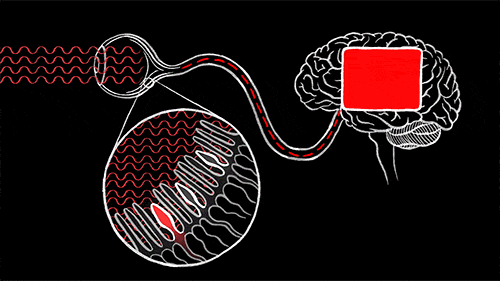
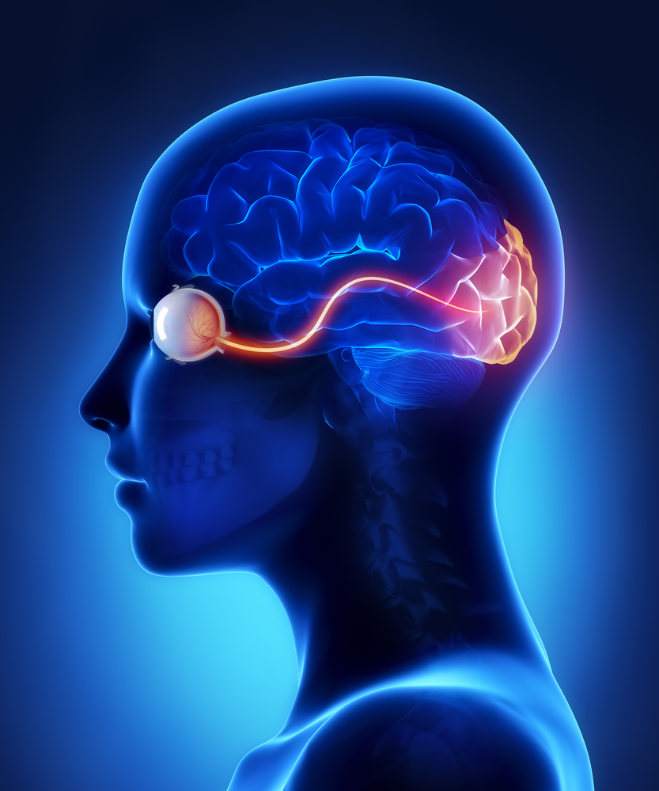
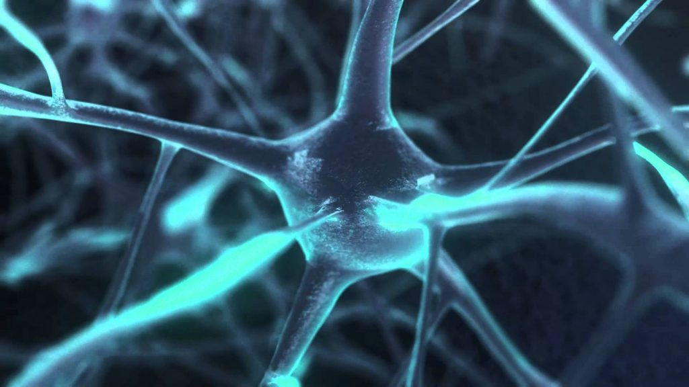
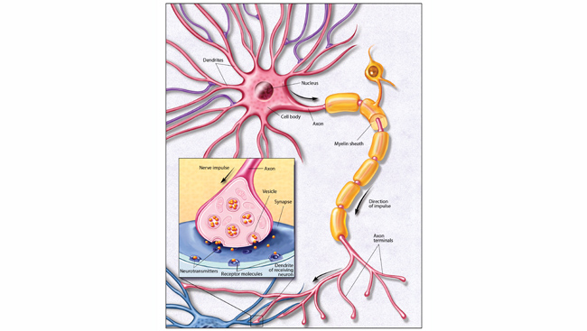

**NB: These notes are a supplement to ch. 4 of the textbook. They are not comprehensive. This is by design. Read the textbook first.**

## Precursor

This note uses the concept of numerical identity, a concept that was first introduced when we discussed personal identity. The note below assumes you understand what 'numerical identity' means. If you cannot remember, or if you would like a reminder, please read the note that explains the concept [here](http://www.scottoconnor.org/self/personalidentity/notes/).

## Introduction
The behaviorist defines a mental state in terms of physiological responses and bodily movements. On this view, pain just is a characteristic set of such responses and movements. A radically different view defines mental states in terms of brain states, defines the mind as merely being the brain. A brain state is what is *going on* in your brain, more specifically a set of neurons firing in some characteristic pattern. A mental state is a state or condition your mind is in, e.g., seeing, thinking, pain, etc. Pains, desires, beliefs, etc., are all mental states. The mind-brain identity theory claims that each mental state is identical to some brain state, e.g., the pain you feel when stubbing your toe is identical to some neurons, in particular c-fibres, firing in some particular way. The view goes by various names, including the *mind-brain identity theory*, the *psycho-neural identity theory*, and even just *identity theory*,  

How should we understand this view? There is clearly a correlation between mental states and brain states. When you stub your toe, the physical damage detected by your brain correlates with a feeling of pain: 

The correlation between mental states and brain states is studied by the natural sciences. Consider what happens in vision: 

First, different wavelengths of light are reflected by different surfaces. 

Second, the eye processes these wavelengths: 
1. There are light-sensitive cells in the retina, some shaped like rods and some shaped like cones. 
2. Both rods and cones detect light. 
3. There are three types of cones, one type detects short wavelengths, one detects medium wavelengths, and the other detects long wavelengths. 
4. The rods and cones process the light into nerve impulses and pass them along to the cortex of the brain via the optic nerve. 

Third, the optic nerve transmits information about the wavelengths detected in the retina to the central nervous system. 

 

Finally, specific neurons are activated by each wavelength. When they activate, they fire in a particular pattern, e.g., there are short or long intervals between each firing. Compare this to clapping your hands. Assume that the intensity remains constant. You can clap at different speeds and patterns. Similarly, neurons fire at different rates and patterns. Various patterns correlate with different mental states.

There is an abundance of evidence for such a correlation. (See the video on the main page for this week about the technology being developed to read thoughts from brain activities.)

<iframe width="560" height="315" src="https://www.youtube.com/embed/9oka8hqsOzg" frameborder="0" allow="accelerometer; autoplay; encrypted-media; gyroscope; picture-in-picture" allowfullscreen></iframe>

The scientists here have discovered that when you think of, say, the letter 'A', a particular neuron fires in a certain way. Since they can detect that firing, they can infer that you are thinking about the letter. Eventually, these machines will be able to read more complex thoughts by detecting the relevant brain activity associated with those thoughts. There is much to be said about the science behind this view, but, fortunately, we need not focus on those details here. All we need observe is that defenders of the view think that each mental state is identical to some central neural processes, namely, a set of neurons firing in some characteristic way. 

## Mind-Brain Correlations

The mind and brain are clearly interconnected. If you suffer a brain injury, your mental states will change. If you feel fear, your brain too will change. In other words, our mental states correlate with our brain states. Putting this a bit more formally:

Mind-Brain Correlation Thesis (MBCT):
: For each type M of mental event that occurs to an organism o, there exists a brain state of kind B (M’s “neural correlate” or “substrate”) such that M occurs to o at time t if and only if B occurs to o at t. (Kim, ch.4)

This says that there is a certain *type* of mental state, say, fearing, such that this type of mental state always occurs with some *type* of brain state, e.g., some characteristic firing of c-fibres. This correlation between brain states and mental states is strict. Whenever you have a certain type of mental state, you should have a certain type of brain state. Whenever you have a certain type of brain state, you should have a certain type of mental state. If there is such a correlation, no change in the mind can occur unless there is a change in the brain, and vice versa. This has the obvious upshot that the mind cannot exist independently of the brain. 

The mere fact that mental and physical states are correlated does not entail that they are identical. Every enclosed figure that has three equal angles is also an enclosed figure with only three sides of equal length, and vice versa. But having three equal angles and three equal sides are not identical features, even though they strictly correlate with one another. So what explains the MBCT? Why are mental states and brain states correlated with one another? Different explanations could be offered. Let us use Kim's example of clocks to help illustrate the options. Consider two clocks that are synchronized. 

Why are the clocks synchronzied? Why is the time they keep correlated with one another? Different possibile explanations present themselves. Perhaps the clocks directly influence each other. Imagine, for instance, that there is a string between the two pendulums, such that whenever the pendulums swing to the left, the right one drags the left to the right, and whenever the pendulums swing to the right, the left pendulum drags the right to the left. If there were such a mechanism, the numerically distinct clocks would be synchronized because they interact with one another. Descartes would explain MBCT in a similar way. He believed that the mind and brain are numerically distinct, but they are correlated because of how they interact with one another. 

An alternative way that the clocks could be synchronized is through the action of some external agent. For instance, suppose that a watch maker winds the clocks every morning to insure they keep time with one another. Here the clocks do not interact with one another; they remain synchronized due to the action of some external agent. This is similar to a view, popular in the time after Descartes, that denies that the mind and brain interact with one another at all. Rather, these philosophers explained MBCT by God's intervention. On their view, God causes you to feel pain whenever you are in the relevant brain state. Similarly, God causes your hand to move whenever you will your arm to move. Your mind and brain never affect each other at all! While it offers a different explanation of MBCT than Descartes, both agree that mental states and brain states are numerically distinct from one another. 

Suppose that you learned that this image of the what appears two clocks is really two conjoined images of the same clock, that there is one clock represented twice. This would offer a different and very simple explanation of the fact that they are synchronized. They are one and the same clock, so of course they keep the same time as one another! In a similar way, the mind-brain identity theory claims that MBCT is explained by the simple fact that mental states are identical to brain states. The feeling of pain and the c-fibers firing may appear two things that are correlated. But they aren't two things. They are one and the same! This provides a neat and easy explanation for mind brain correlation. 

We are familiar with this kind of inference. Consider the property of being water and the property of being H20. We can imagine that chemists started to notice that whenever something had the property of being water it also had the property of being H20. What explains this correlation? They may have initially thought it was a mere accident. Perhaps they thought that something about being water causes an entity to be also H20. But eventually they realized that this correlation, the fact that both properties always co-occur, is explained by the fact that these are not two properties at all. The property of being water is numerically identical to the property off being H2O.  Likewise, after we entertain various ways of explaining MBCT, the mind-brain identity theory claims we should realize that the property of being in a certain mental state is identical to the property of being in a certain brain state. There is no surprise that both properties co-occur; they are one and the same property, so of course they co-occur. The mind-brain identity theory, then, denies the following claim: 

+ C-fibres firing in my brain are the cause of my feeling pain. 

And the theory defends this claim: 

+ C-fibres firing in my brain = my feeling pain

## Argument for Mind-Brain Identity Theory

One argument for the mind-brain identity theory is an argument  from simplicity. The argument arises from an application of **Occam's razor**. Occam's (or Ockham's) razor is a principle attributed to the 14th century logician and Franciscan friar William of Ockham. (Ockham was the village in the English county of Surrey where he was born.) The Latin version of the principle comes in a variety of forms: 

> Pluralitas non est ponenda sine neccesitate.
> Frustra fit per plura quod potest fieri per pauciora.
> Entia non sunt multiplicanda praeter necessitatem

And, roughly translated: 

> Entities should not be multiplied unnecessarily.  
> What can be down with fewer assumption should not be done with more. 
> Adopt the simplest ontology possible. 

Simply put, the simpler explanation should be preferred over the more complex one. What do I mean by 'simple explanation?' When comparing two explanations, Occam's razor asks us compare the assumptions the various explanations ask of us. Think of an assumption as a questionable claim you must *also* accept if you accept that explanation, e.g., the claim that aliens were experimented upon in Area 51 assumes that there exists sentient, space traveling aliens. The existence of space traveling aliens is assumed by those who insist aliens were experimented upon in Area 51. Similarly, if you believe the claim that physicians have established that the MMR vaccine can cause autism, you must also believe that Andrew Wakefield did not fake the one and only piece of research that suggests a link,   that he should not have had his medical license revoked for faking that 1995 study, that *The Lancet* should not have retracted the publication, that all the investigative work uncovering the original raw data shouldn't be believed, and that all the subsequent peer-reviewed research establishing no link is flawed.  

To see how Occam's razor works in practice, consider a person reporting that they saw a ghost during the night. They are met with skepticism. Some respond that this is a common hallucination, especially as we shift in and out of sleep. Just like a dream, the brain creates an image of a ghost. A true believer hates such explanations and insists that the ghost was real. So there are two explanation for the appearance of the ghost. 

1. The ghost exists. 
2. The ghost was hallucinated.

Which explanation should we accept? Occam's razor tells us to accept the simplest explanation. Let us, then, compare the assumptions of the various explanations. 1 assumes that there exists immaterial and supernatural beings. It also requires that we accept that such beings can interact with the physical world, e.g., that our perceptive capacities allow us to see such things. This explanation, then, is asking us to believe in many different kinds of things in addition to the ordinary physical things that we believe in. 2 requires far less of us. We all agree that people dream, hallucinate, and have illusions. Such occurrences are more likely at night, when we are tired or stressed, and are specially likely when we shift between dream states. Occam's razor requires the rational person to accept the simpler theory. In this case, we should accept 2, that our sleeper hallucinated and did not see a real ghost.

Many dislike Occam's razor. People are often wedded to a conspiracy theory, a myth, a superstition, etc. They are often unwilling to adopt an alternative explanation just because it is simpler than the one they currently hold. But imagine approaching these issues like a poker player. Each explanation requires us to believe a set of assumptions. If you were required to bet $1000 on each assumption being true, the safest bet, the least risky bet, is the one that has you betting on the fewest and most plausible assumptions. Calculated in this way, the bet that the sleeper experienced a hallucination would be smaller and so safer than the bet that the sleeper saw a real ghost. So, think of Occam's razor not as an infallible guide to reality. Rather, think of it as a way of minimizing the chances of making a mistake. Perhaps there are times when the more complex explanation ends up being the right one, but, if we are to play it safe, we should believe, as a general rule, the simpler of competing explanations. 

When Occam's razor is applied to mind brain correlations, it requires of us to accept the simplest explanation for those correlations. The simplest explanation is clearly that mental states are identical to brain states. All this explanation asks of us to accept is the existence of the brain and accept that brain states cause our bodies to move in a variety of ways. This is easy to accept! Every other explanation for mind brain correlations requires that we accept something in addition to the existence of brains. That's much more complex! It requires we accept the existence of different types of entities and accept that these interact with the physical world. So, it seems we should play it safe and accept that the mind is nothing other than the brain. 

## Objections to the Mind-Brain Identity Theory

There are many objections to the mind-brain identity theory. Each objection relies on the following basic principle: 

Leibniz’ Law:
: If A and B are identical, then whatever properties A has B must have too, and *vice versa*. (Read 'numerically identical' whenever you see 'identical' below.)

Consider Superman and Clark Kent. Since they are identical, Leibniz' Law tells us that any feature of Clark Kent is also a feature of Superman, and *vice versa*. So, if Clark Kent is wearing glasses, so too is Superman. If Superman is flying, so too is Clark Kent. Leibniz's Law says simply that numerically identical things have exactly the same features. 

Leibniz's Law is really helpful for adjudicating questions of identity. Identical things must have the same properties. So, if A and B have different properties, they cannot be numerically identical. If, for instance, Jekyll and Hyde have different properties, they are numerically distinct persons (residing in the same body). 

Leibniz's Law tells us that if a mental state is identical to a brain state, then the states will have exactly the same properties. Conversely, if they have different properties, they are numerically distinct. In other words, if the mind-brain identity theory is correct, then Leibniz Law requires the following:

+ If mental state A and brain state B are numerically identical, then A and B have exactly the same properties. 

If, on the other hand, A and B vary in even one property, then A and B are not numerically identical. In order, then, to decide whether mental states are identical to brain states, we can investigate whether properties of the one are always properties of the other. There are at least some properties where this does not seem to hold. 

### Property 1: mental states are such that I can be certain of them

We have direct and private access of our mental states; I can easily and reliably know when I feel pain---it feels really sore! I can also reliably know when I'm seeing a red bicycle--there is an image of a red bicycle before me (even though I might be dreaming, hallucinating, etc.) It seems that our mental states are such that we can be certain that we are in them. But this is not a property of brain states. I have no idea what is happening in my brain right now. Do you? What neurons are firing as you read this page? What is their characteristic pattern? This is something that neuroscientists can now discover with the help of sophisticated machines, but people knew the contents of their mind well before they knew anything about brains or neurons. So, the argument against the mind-brain identity theory is this: 

1. I can be certain of my mental states (e.g., pain).
2. I cannot be certain of my brain states.
3. Therefore, mental states have properties (of being such that I can be certain of them) that brain states lack.
4. Therefore, mental states are not identical to brain states.

The argument appears straightforward but raises a very difficult question about Leibniz's Law: does it apply to *intensional* properties like 'belief', 'knowledge', etc. Consider Lois Lane before she learns that Superman and Clark Kent are identical. Lois Lane believes that Superman saves the city. So, Superman has the property of being believed by Lois Lane to have saved the city. Does Clark Kent have that property? If he is identical to Superman, then he should also have that property. But Lois Lane doesn't think that Clark Kent saved the city!

So, Leibniz's Law has a problem. If it includes properties of being believed to be a certain way, then it is obviously false. But the Law shouldn't include those properties; the beliefs that we have about something shouldn't affect what that thing is or is not identical to. So, perhaps Leibniz's Law should be formulated as stating that if A and B are identical, then A and B have the same intrinsic properties, where intrinsic properties do not involve beliefs about it. 

When Leibniz's Law is reformulated in this way, our first argument against the mind-brain identity theory falls flat. The fact that I know or believe different things about mental states and brain states is irrelevant to questions about their identity. 

### Property 2: having a color
Some other arguments against the mind-brain identity theory are harder to escape. Stare at a bright green piece of paper for thirty seconds, then look up towards a blank and white wall. You will likely experience a green after-image; there will be a greenish hue to the wall that fades after a moment. It seems that our mental states have various color after-images. Can brain states have these same colors? Neurons do have colors, but those colors do not vary by whatever experience they correlate with. The neuron has the same color regardless of whether I am having a green, red, or purple after image. So, here is our next argument against the mind-brain identity theory:  

1. I am experiencing a green after-image.
2. No brain states are green.
3. Therefore, my after-image is not identical to any brain state. 

If my after-image were identical to a brain state, then the properties of the after-image must also be properties of the brain state. One property of the after-image is that it is green. But this is not a property of the brain state correlated with that image! 

This argument assumes that the after-image is literally green, and I will leave you to decide whether you think that it is true. If it is not literally green, then the argument fails. If it is literally green, then the argument succeeds. 

### Property 3: Multiple Realizability 

<iframe src="https://giphy.com/embed/SZzKe0HhRlthC" width="100%" height="100%" style="position:absolute" frameBorder="0" class="giphy-embed" allowFullScreen></iframe>

<a href="https://giphy.com/gifs/shark-shortfin-mako-SZzKe0HhRlthC">via GIPHY</a>

The multiple realizability thesis states that a single mental kind can be realized by many distinct physical kinds. Sharks feel pain, but sharks do not have c-fibres. Their brains are just very different from humans. An alien made of different stuff than we are might still experience pain. A very sophisticated robot might too experience pain. This poses a problem for the mind-brain identity theory:

1. Pain has the property of being correlated with c-fibres firing in humans. 
2. Pain has the property of being correlated with something other than c-fibres firing in sharks. 
3. Therefore, pain is not identical to c-fibres firing. 

Premise 2 could be replaced with examples of plants feeling pain, non-carbon based life-form feeling pain, synthetic creatures (robots) feeling pain, etc. The point is that there are things that feel pain and their pain is not correlated with the kind of brain states that are correlated with our pain. So, mental states just cannot be identical to brain states. An identity theorist might respond that plants, animals, and robots do not feel pain. Or they might claim that their pain is not the same type of mental state that we call pain. But I will leave you to decide how plausible these responses are. 

 

