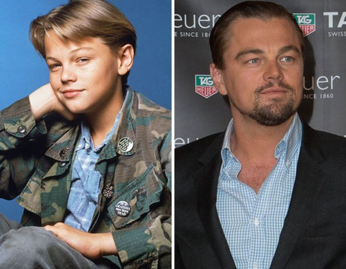
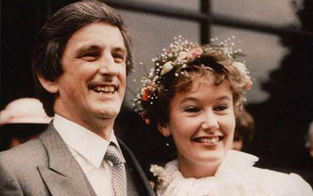
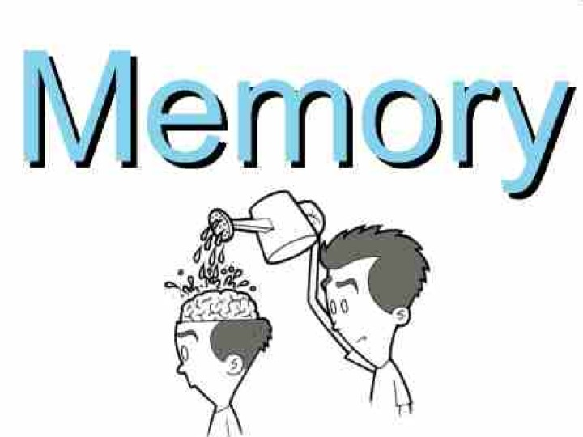
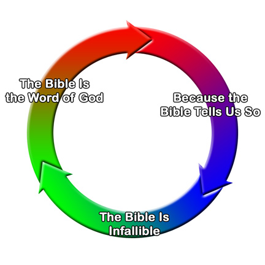
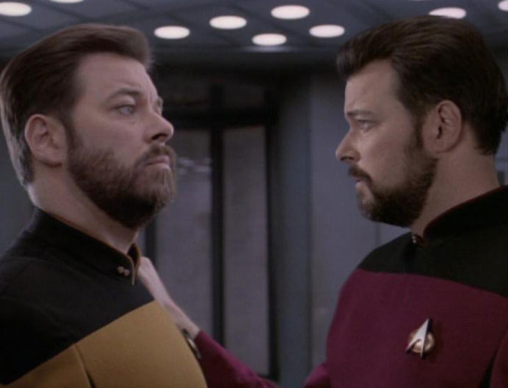

## Introduction

Recall that our question is what personal identity consists in. We have already discussed two theories: 

Same Body Theory: 
: A person A at one time is identical to a person B at a later time if and only if the body of A is identical to the body of B.

Same Soul Theory: 
: A person A at one time is identical to a person B at a
later time if and only if the soul of A is identical to the soul of B.

Our third, and perhaps most plausible theory, says that personal identity consists in psychological continuity.

Psychological Continuity Theory: 
: A person A at one time is identical to a person B at a later time if and only if B is psychologically continuous with A.

In order to introduce our new theory, we need to think again about the question that we are trying to answer--what does personal identity consist in? Our first two answers said that there was something that each of the earlier and later stages of a person share; this one thing is numerically identical between each stage, whether it be soul or body. Our third view denies that some one identical thing shared by each earlier and later stages of a person is required for them to be identical to one another. It claims that the earlier and later stages must enjoy a certain *relationship* to one another. Look at the following image: 

Our first two theories stated that there is something, either a soul or body, that is shared by each stage. This common thing shared will exist fully at each moment that the person exists. If, for instance, personal identity consists in sameness of soul, then the one same soul will exist fully at each moment that the person exists. Our third theory advises against looking for one same thing that exists fully at each moment that the person exists. Rather, it claims that we should look at the relationship between all the stages of the person. Consider the following image of a train:  

Look first at the engine. Now look at the final carriage. Are you looking at one and the same train? They seem the same; the owner of that train you are attending to when watching the engine is identical to the owner of the train you are attending to when watching the final carriage. Suppose, now, we ask in virtue of what are these trains identical to one another? I think we would all agree that their identity is not explained by any one identical feature intrinsic to each. The various train cars are one and the same train by virtue of the fact that they are connected to one another---notice the locks where each car connects with one another. 

When I claim that the cars are the same by virtue of being appropriately connected, I have subtly changed the focus of our initial investigation. The individual *train cars* are not numerically identical to one another; the engine is not identical to the coal car. And if by 'same train', I mean 'train car', the various trains cars are not numerically identical to one another. But I don't mean this when asking whether the cars are identical trains. What I mean to ask is whether the train that the engine is part of is numerically identical to the train that the final carriage is part of. Likewise, when I ask whether my left hand and right hands are the same body, I am not asking whether my left and right hands are identical to one another. I am asking whether the body that my left hand is part of is numerically identical to the body that my right hand is part of. 

Asked in this way, what we would like to know is whether the train cars compose one and the same train. Are they parts of the same train? To answer this question, we must decide whether the carriages are appropriately related to one another so as to compose a whole train. Likewise, instead of asking in virtue of what the various stages of person's life are identical to one another, we can ask in virtue of what all these stages compose one and the same person. On this view, the baby and adult are numerically distinct person stages, but they  are stages of one and the same person as it weaves its way through time. 

## Psychological Continuity--Version 1
Just as some connection between the train cars explains why they compose some one train, so too there must be some connection between person stages if they are to compose some one person. In his 'Essay on Human Understanding' John Locke articulated one famous account of this connection: 

> “For as far as any intelligent being can repeat the idea of any past action with the same consciousness it had of it at first, and with the same consciousness it has of any present action; so far it is the same personal self.” John Locke (§10)

According to Locke, the appropriate connection between your later and earlier selves is memory. A simple version of his proposal is as follows: 

Memory Continuity:
: A person A at one time is identical to a person B at a later time if and only if B *remembers* the *experiences* that A has.

This proposal seems plausible if we notice a difference between two types of memories. First, there are *factual memories*. These are memories that some event occurred. They can be shared by several people, e.g., many remember President Obama’s inauguration in 2008 and many remember President Obama handing over the reigns of power to President Trump in 2016. 

Factual memories, memories that many can share, differ from *personal memories*, which are called **episodic memories**. These are the memories of experiencing the event itself. Such memories cannot be shared by many people because personal experiences are, well, personal. For example, only President Obama has the personal memory of *being inaugurated* at his 2008 inauguration. Only he knows what it was like for *him* to be inaugurated (even though many (factually) remember that he was inaugurated). Similarly, only President Obama can have a personal memory of being the one handing over the reigns of power to President Trump (although many have the factual memory of that same event). 

The distinction between factual and episodic memory is clearly evidenced in unusual cases. Here's the story of Susie Mckinnon, who has factual memories but not episodic memories: 

You can hear more about Susie's story [here.](https://www.cbc.ca/player/play/2670406429) If personal identity consists in continuity of memory, it consists in personal memories, in memories that are unique to each of us. 

Consider this image of Leonardo Di Caprio. Locke proposed that the famous actor is identical to that young boy because he has personal memories of what that boy experienced. If, for instance, the younger Leo spilled a drink during his first audition, only the adult Leo has the personal memory of the younger Leo's experiences. Of course, many others could have a factual memory of that event. But only the adult Leo remembers what it was like to be that younger Leo experiencing the spill. On this view, then, you are identical to your younger self because only you have the personal memories of what that younger person experienced.  

## Objections to Version 1

While version 1 of the psychological continuity theory seems plausible, it is not adequate as an explanation of personal identity. Allow ‘Leonardo’ to be the 12 year old who will grow up to be the adult actor we all know. We will use the name 'Leo' to refer to that adult actor. Here is our problem: 

1. Leo = Leonardo if and only if Leo remembers everything that Leonardo experienced.
2. Leo does not remember what Leonardo ate for breakfast on the second day after his 12th birthday, though Leonardo certainly had the experience of eating something
3. Leo # Leonardo

Our first premise is an application of the first version of our third theory, which states that a person existing at one time is identical to existing at some earlier time just if the later person remembers all the earlier person's experiences. So, if the younger person ate a cake, the older person is identical to them only if they remember the experience of eating that cake. 

Our second premise is trivial. Can you remember every experience you ever had? I cannot! I remember important life events, special moments with friends and family, etc. But I certainly do not remember what I ate for lunch, on say, June 11th, 1995. No idea! 

3 states our conclusion: Leo is not identical to Leonardo. This is clearly false, so there must be a problem with our first two premises. It should be fairly obvious to you why this simple version of our third theory fails. It is far too demanding. It requires you to have complete and perfect memory. And, while a few lucky individuals have such a facility, the majority of us do not. Nevertheless, even though you may have forgotten what you ate the day after your 12th birthday, you are still numerically identical to your 12 year old self. 

## Psychological Continuity Theory-Version 2

While our first version was implausible, it can be fixed. A more sophisticated version of our third theory states the following: 

+ A person A at one time is identical to a person B at a later time if and only if B is psychologically continuous with A.

By 'psychological continuity', we mean that there is a chain of person-stages connected by episodic memory. What does this mean? The idea is that it is not required for you to remember what you ate on your 12th birthday to be identical to your earlier self. All that is required is that you remember some earlier self, say, your 15 your old self, and that 15 year old self remembers eating the cake on your 12th birthday. Consider again our picture depicting personal identity and let us give letters to each of the personal stages. 

F, our oldest stage, remembers what the slightly younger stage, E, experienced. However, F does not remember what an even younger stage, D, experienced, but E does remember D's experiences. So, on our sophisticated version of the theory, F is identical to D. But F is identical to D not by remembering D's experiences but by remembering E's experiences, who in turn remembers D's experiences. The chain can continue backward as follows:  

+ F remembers what E experienced.
+ E remembers what D experienced.
+ D remembers what C experienced.
+ C remembers what B experienced.
+ B remembers what A experienced.
+ Thus, A, B, C, D, E, and F are psychologically continuous with each other.

So, F may not remember what A experienced, but F is connected to A via a chain of person stages where each stage remembers what the immediately preceding stage experienced. Hence, F is identical to A. 

Version 2  is immune to our objection to Version 1. That objection attacked the claim that later stages must remember every experience of every early stage for all those stages to compose one and the same person. That was unrealistic. But version 2 does not require the older stages to remember every experience of every earlier stage. It requires only that there be an appropriate chain as described above. 

## Objections to Version 2

###Objection 1
While our second version is more plausible than our first, it faces two distinct problems. The first is that continuity of memory does not seem **necessary** for personal identity. That is, it seems that personal identity can be preserved even if memory continuity is not preserved. That this is possible is demonstrated by some very famous cases of amnesia, cases where the links in personal memory have been broken. Consider the tragic case of Clive Wearing: 

 

One and the same man is depicted in these photographs; they are numerically identical to one another. But they are not connected by any chain of episodic memories. Why? In March, 1985, Wearing suffered from a brain infection--herpes encephalitis. The result was a terrible form of amnesia. Not only has he no personal memories of his past, he cannot form any new memories either. His wife described his case as follows: 

> His ability to perceive what he saw and heard was unimpaired. But he did not seem to be able to retain any impression of anything for more than a blink. Indeed, if he did blink, his eyelids parted to reveal a new scene. The view before the blink was utterly forgotten. Each blink, each glance away and back, brought him an entirely new view. I tried to imagine how it was for him...Something akin to a film with bad continuity, the glass half empty, then full, the cigarette suddenly longer, the actor’s hair now tousled, now smooth. But this was real life, a room changing in ways that were physically impossible. ('Forevery Today', by Deborah Wearing)

This case, and there are others, show that memory continuity is not necessary for personal identity;  personal identity can continue even in the absence of memory continuity. 

###Objection 2

Even if personal identity can be enjoyed in the absence of memory continuity, we might think that memory continuity is **sufficient** for personal identity, i.e., that memory continuity always guarantees  personal identity. But there are also problems for this claim, problems for the claim that you are identical to your earlier self if you have personal memories of that younger person's experiences. 

Unfortunately, memory is horribly unreliable and contemporary researchers have shown the degrees to which personal memories can be modified and hacked. (See the main page for this week for videos on the topic.) These researchers have shown that there are fake personal memories. I thought I had a personal memory of attending a Michael Jackson concert as a 5 year old, but I discovered from my parents that this was a false memory; I loved Michael Jackson as a child and watched a recorded concert of him over and over. At some stage, I must have convinced myself that I had attended that concert in person and a fake memory was created. But it was fake! Scientists are learning how to manipulate memories today: 

Fake personal memories, or implanted personal memories, are utilized to good effect in science fiction. 

Fake personal memories pose a threat to the psychological continuity view. If F is identical to E because F remembers what E experienced, then F should have genuine and not fake memories of E's experiences. Suppose a fake memory was implanted in F of E's experiences (researchers already know how to do this). F remembers E's experiences, but F is not identical to E.

So, the second version of the psychological continuity theory requires that the memories that explain personal identity be genuine and not mere fake memories. But distinguishing fake from genuine memories is incredibly difficult. We cannot distinguish them via some internal difference. A fake and genuine memory may be exactly the same from the *inside*. If you inspect their contents, nothing will indicate to you which is real. 

It might be tempting to distinguish genuine from fake memories by appeal to the people who have the memories in the following way:  

+ If two persons A and B both have an experience as though
  they remember the experiences of some person C, then the memory of A (or B) is genuine and not fake only if A (or B) is identical to C.

On this view, what makes a memory genuine is that the person who has the memory is identical to the person who had the relevant experience, e.g., my memory of eating a salad last night is a genuine one because I am identical to the person who ate the salad. But if we try to distinguish genuine from fake memories in this way *and* use memory to explain personal identity, then we commit a simple logical mistake, namely it is circular to make both of these claims:

1.  A = C because A really remembers what C experiences.

2.  A really remembers what C experiences because A = C.

Claim 1 explain personal identity in terms of genuine memories. But claim 2 explains genuine memory in terms of personal identity. This is an instance of what is called circular reasoning. You can see a famous example of this type of mistake illustrated in this diagram: 

The Bible may very well contains truths about God's existence. But you cannot prove that the Bible contains such truths by claiming that you know the Bible is the word of God because the Bible says so. 

Finally, the psychological continuity view perhaps most obviously fails if we return to the case of Riker again: 

Both Thomas and William seem to have genuine memories of Riker's experiences. Both remember what it was like to step on to that malfunctioning transporter 8 years previously. Both have the same personal memories of Riker's childhood. If the psychological continuity view is correct, then at least one of Thomas or William's memories must be, in fact, fake (since it cannot be the case that both Thomas and William are identical to Riker). But we have no good reason to think that both men's memories are fake. Each were caused in the right way and each seems to have as much claim on Riker's previous life as the other. 

## Conclusion
Impasse! I hope you have enjoyed your introduction to this topic. Don't be disheartened that we don't know yet what personal identity consists in. Physicists are still learning about the basic constituents of matter and they have been studying that since at least the time of the Presocratics over two millennia ago. Some questions just take many lifetimes to answer. Questions about what persons are and what our identity consists in could easily be a question that takes many more years to answer.