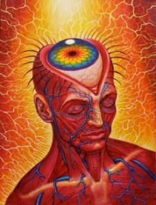

## Self-Knowledge

We have a peculiar capacity to attend to our minds, to shift our awareness to different mental states. To illustrate this capacity, try out a simple yoga technique called yoga nidra described in this video. 

<iframe width="560" height="315" src="https://www.youtube.com/embed/b1ruq-2Rr7Y" frameborder="0" allow="accelerometer; autoplay; encrypted-media; gyroscope; picture-in-picture" allowfullscreen></iframe>

The technique asks us to shift our awareness to various mental states, and when practiced systematically for long enough, it promises a great degree of mental well being. The technique works by systematically bringing our awareness to all our mental states, whether it is what we are hearing, what we are smelling, how we are breathing, what are body parts feel like, etc. At each step, we try to focus exclusively on some mental state. At the next step, we shift our awareness to a new mental state. The technique is useful for us because it illustrates two important things: 

1. There are mental states we are currently aware of and mental states that we are not currently aware of.
2. We can become aware of mental states that we are not currently aware of; we can cease to be aware of those that we are currently aware of. 

1 and 2 comprise the phenomenon of self-knowledge, the fact that humans have a capacity to gain insight and knowledge of their own minds. Our interest is how this is possible. How do we become aware of mental states that we were not previously aware of? In other words, how are humans able to use the technique described in this video? 

## First and second order mental states

Self-knowledge requires that there are both **first order mental states**--roughly those states about our body and the external world--and **second order mental states**--roughly, those states about our first order mental states. This distinction between these two orders of mental states is key to this week's topic, so it is important to get clear on it. 

First order mental states: 
: States that are not about the mind, including states that are about the external world, e.g., seeing a tree, hearing music, etc. 

Second order mental states: 
: States that are about first order mental states, e.g., our awareness of our sight of the tree. 

The left image in both pictures represents first order mental states, while the right image represents second order mental states. In the first image, the first order mental state is just seeing the dog. The second order mental state is being aware that you are seeing the dog. Notice the crucial difference between being *aware* of **the dog** and being *aware* of your **awareness of the dog**. The distinction between first and second order mental states is intended to capture this difference between our awareness of the world and the fact that we are aware of that awareness. 

Notice that you could be aware of the dog not merely by seeing it. You could have felt it or smelt it. Smelling, seeing, and feeling a dog are all first order mental states; they are all different ways of being aware of something that exists independently of you. But you aren't merely aware of the dog; you are also aware of the way that you are aware of the dog. You can tell that you are seeing and not feeling, or that you are feeling and not smelling it. This awareness of how you are aware of the dog is a second order mental state; it is an awareness of facts about you and not just the dog, e.g., it is an awareness that you are *seeing* the dog.

One more example will hopefully drive home the distinction. Consider driving down a busy road with a friend. While you talk, you successfully stay in your lane and navigate obstacles. In some sense, you must be aware of the road and your surroundings. This awareness is a first order mental state; it is not awareness of your mind. Suppose your friend tells you to focus on the road. You will do that by attending to what you had already somehow been aware of, e.g., you will focus on your seeing of the road, your hearing of the traffic, etc.

By *self-knowledge*, we mean this awareness, these second order mental states, we have of our own minds. The importance of self-knowledge can be illustrated by relating it to our previous distinction between access and phenomenal consciousness. Recall that phenomenal consciousness is the property that mental states have when there is something “it is like” to be in that state, i.e., a state is p-conscious if that state has qualia. In contrast, a state is access conscious if it is poised for direct control of thought, speech, and action, e.g., a state is a-conscious if it is available for us to report, reflect, and act upon. We also recall that a state can have one of these properties but not the other: it can be both a-conscious and p-conscious, a-conscious and not p-conscious, or p-conscious and not a-conscious. 

*Example 1:* You see the road and hear the traffic, but you are not aware of what you see and what you hear when you are talking to your friend. Your various mental states about the road are p-conscious but not (yet) a-conscious; those states have phenomenal properties but you are not accessing those states. When you become aware of what you see and what you hear, you become aware of your awareness of the car and the traffic, i.e., you gain a-consciousness of what you previously had only been p-conscious about. 

*Example 2:* The person in an agitated state does not notice the pain in their side when shot or injured during battle. When they become aware of their pain, they have a second order mental state about their first order mental state, i.e., they become a-conscious about what they had previously only been p-conscious about. 

*Example 3*: A cat is aware of the fly and chases it around the room. So, some states of the cat count as conscious states. But does it have second order mental states? This depends on whether the cat can be aware of its own mental states, on whether it can be aware that it is perceiving a fly. This is a highly debated question. It clearly is p-conscious of the room. The question is whether it also enjoys a-consciousness.

This chart may help you understand these distinctions:

| External world and our bodies (object) | 1st order mental state          | Second order mental state                                    |
| -------------------------------------- | ------------------------------- | ------------------------------------------------------------ |
| My cat                                 | Worrying that my cat needs food | Being aware of my cat worries                                |
| My cat                                 | Hearing my cat purr             | Being aware of my auditory experience of my cat purring      |
| A broken foot                          | The pain (in my foot)           | Being aware of the pain in my foot, e.g., being aware that it is a sharp pain |
| The pothole on the road                | Seeing the pothole              | Being aware that I see a pothole                             |

Our first order mental states include thoughts about the external world and our bodies. Our second order mental states include thoughts about our first order thoughts. To put it another way, your second order mental states are not primarily about the external world or about your body. They are about your own mind. They are directed inwards, towards your own mind. Our theories below are theories about this awareness of our minds, about the nature and source of our second order mental states. They do not try to explain our first order mental sates, i.e., they do not try to explain our low-level awareness of the external world and our bodies.

## The Problem of Self-Knowledge

We do have access to  our first order mental states. Nobody doubts that we do. However, we do not yet understand how we are aware of our own mental states, how we are aware of our own minds. The problem, in part, is that second order mental states, the awareness of our first order mental states, have two mysterious features: 

1. Privilege: We have special authority over our first order mental states. Your belief that you are in a certain mental state has more epistemic weight than any third person judgement about your states, e.g., someone else could judge wrongly as to whether you are in pain, but you cannot judge wrongly as to whether you are in pain. 
2. Peculiarity: the manner by which you know what mental state you are in differs from the manner by which others know which mental state you are in. Others watch your behavior, ask questions, etc., to investigate what you are feeling and thinking. But your knowledge of your own mind is not based on, or inferred from, evidence about other things. Your access to your mind is very different from the access anyone else has to your mind. 

The problem of self-knowledge is this: **How do we become aware of our first-order mental states?** What is this special way we have of coming to know our own minds? What mechanism could give us both privileged and peculiar access to our own minds? How are second-order mental states possible? We will compare and contrast two answers. Both say that we become aware of our first order mental states by internally scanning those states, by being in a higher order meta-psychological state. But they characterize this second-order mental state in different ways. 

It is key to what follows that you don't take these theories as explaining our first order mental states, our low-level awareness of the external world and our bodies. The theories below are theories about the nature and source of second order mental states, about the awareness of our own minds (and not our bodies and the external world). Students sometimes struggle to understand this. If you believe that these theories explain how we perceive the external world, then you don't understand them.  

## Answer 1: Higher Order Perception 

Higher Order Perception Theory (HOP):
: A mental state is a conscious state just in case there is a higher order perception of it--or perception of being in that state. 

Our first theory states that second order mental states are very much like perceptual states. To be in these higher order states is akin to seeing, or smelling, or hearing, etc. Just as we see the color,  so too we have an inner perception of our mental states. Such a view is often called an inner sense theory of consciousness because defenders of this view believe that we become aware of our mental states by sensing them, e.g., just as you can look around the room, so too you can 'look' around your mind. If you are familiar with the phrase 'the third eye', or 'the inner eye', then you are familiar with HOP. Just as our ordinary eyes provide us information about the external world and our bodies, so too an internal eye is meant to give us information about our own minds. Our ordinary eyes see the world around them. The inner eye 'sees' the internal mind. 

One way of defending HOP is to argue that the awareness of our mental states has the same features as our perceptions of the external world. Analogously, a person might try to argue that some music belongs to a particular genre by arguing that the music appropriately resembles that genre. For instance, one might argue that Joy Division's music belonged to the genre of post-punk as follows: post-punk music is experimental and anti-corporatist. Joy Divisions's music was experimental and anti-corporatist. Therefore, Joy Division's music was post-punk. 

The argument for HOP has a similar strategy:

+ P1. Perception has some features, x, y, z.
+ P2. Awareness of our own mind has features x, y, z.
+ C. Thus, we are aware of our own minds by perceiving them. 

In other words, if the act of perceiving our own minds has the same features as the act of perceiving the external world, then *perceiving* our mind must be the same sort of act as *perceiving* the external world. What are the supposed features that are similar? Here are two:   

1. Sense modalities respond differentially to a range of stimuli. We see some things clearly and others not so clearly, e.g., the house in the distance is obscure and hazy, but it appears clear and distinct as we approach. Our awareness of our own minds has a similar feature. Some mental states appear clear and distinctly. Others are hazy and nondescript, e.g., a nagging pain might have an unclear location, but a sharp pain is easy to locate. 
2. Sense modalities respond directly. Flash a bright light in someone's eyes and there is an immediate perception. Our awareness of our mind also seems to respond directly. Your attention can be brought immediately to the pain in your stubbed toe. 

Since our awareness of our mind is similar to our perceptual capacities in these two ways, one might conclude we are aware of our mental states by perceiving those states. That is, whatever we do when we become aware of our minds is just like what we do when we see a car, smell a rose, or taste some chocolate. 

## Against HOP

The problems for HOP are acute. I argued that Joy Division's music was post-punk by claiming that their music has some features of post-punk music. One way of blocking this argument is to find some other important feature of post-punk that is not shared by Joy Division's music, e.g., post-punk is not melodic, but Joy Division's music is very melodic. Since Joy Division's music lacks one essential feature of post-punk music, we can conclude that it does not belong to that genre of music after-all. 

A similar strategy is used to show that we are not aware of our mental states by perceiving them. Following this strategy, we will identify important differences between our awareness of our minds and our perception of the external world:   

+ Mental states do not exemplify a single range of stimuli as sensory modalities do. Hearing is of sound. Vision is of color and shape. Smell is of odors. If we are aware of our mental states by strictly perceiving them, then it seems there should be some specific range of stimuli that this inner perception detects. But it detects a wide range of very disparate mental states, so it doesn't seem like perception at all. For instance, it detects seeings, hearings, hopes, desires, pains, thoughts, etc.

+ Since each perceptual experience has unique content, we expect our higher order perception to have some unique content, content that distinguishes it from first order mental states. But what is this content? Consider the difference between (A) thinking about a dog and (B) thinking about your thought about the dog. What is the discernible difference between (A) and (B)? When you inspect both (A) and (B), they seem to have the same content, namely, various representations of a dog.

+ Each sense modality has its own organ. Sight uses the eyes. Hearing uses the ears. Smell uses the nose. So, higher order perception would require its own organ, i.e., we should be able to identify in the brain something anbalagous to eyes, ears, and noses. But we do not discover such an organ when we dissect the brain. 

+ Ordinary perceptions sometimes malfunction. When driving long distances, my eyes often play tricks on me. What appears a building in the distance turns out to be a parked truck. What appears a sign for McDonalds in the distance turns out to be some trees that have collided. If we are aware of our mental states by perceiving them, then this perception should also be capable of malfunction. But it seems incoherent that someone could have an accurate first-order perception while having a false higher-order perception. In other words, our access to our own minds is infallible in a way that our access to the external world via perception is not. 

## Higher Order Thought

Our alternative theory denies that we are aware of our mental states by perceiving them. Rather, this theory claims that we are aware of our mental states by thinking about them. 

Higher Order Thought Theory (HOT): 
: A mental state is a conscious state just in case there is a higher order thought of it--or thought of being in that state. 

HOT claims that awareness of our mental states is conceptual (not perceptual). What does this mean? Ever have a silent conversation with yourself? How about a mind that seems over-critical of what you are doing? That inner-voice is an inner thought. It is the words that are silently occurring throughout our conscious life, and, at least for me, they are the most characteristic feature of consciousness. HOT utilizes this inner-voice to explain our knowledge of our mind. According to this theory, I am conscious of my red experience or the chocolate smell by saying to myself, 'I am experiencing something red', 'I smell chocolate.' It is saying these things to myself that makes me aware of the experiences. 

(Note that some believe that the higher-order thought accompanies the experience itself — it is actually occurring at the same time. Others believe that it does not need to actually occur at the same time. Rather, they believe that the first order mental state must be immediately available for us to think about (even if we aren't actually thinking about it). This distinction isn't that important for our purposes.) 

If we are aware of our mental states by thinking about them, but not perceiving them, then we need to characterize the difference between thinking and perceiving. What is the difference between seeing that the tree is green and thinking that the tree is green? The distinction is often made in terms of the contents of these different states, i.e., between the contents of perception and the contents of thoughts. On a standard way of drawing the distinction, the content of a thought is conceptual while the content of perception is not. But what does that mean? The simple idea is that non-conceptual content is content that can be specified without words and concepts available to whoever or whatever is in that state. If insects have mental states, the contents of those states are non-conceptual. Why? Insects don't have concepts they can use to describe the content of their states. That content, whatever it is, could be described by us--we have the words and concepts to talk about it. Conceptual content, on the other hand, is content that is characterizable by the words and concepts available to whoever is in that state. In other words, if a butterfly has a state with conceptual content, then the butterfly must have available to it the conceptual resources to characterize that content. This probably entails that butterflies do not have such states as they do not have the conceptual resources to describe such states. 

Conceptual content is also often characterized as propositional content and thought characterized as a propositional attitude. A proposition is whatever comes after a 'that' clause, e.g., in the sentence "Socrates said that Meno was at the party last night", the proposition *Meno was at the party last night* is one that Socrates apparently reported. Every proposition is either true or false. The sentence "Yeah for chocolate" is neither true nor false, so it does not express a proposition. "There is chocolate on the plate" is a proposition as this sentence is either true or false (unfortunately false as I write these notes). It's not important what language we use to express a proposition. Different languages can express the very same content. 

There are also different attitudes we can take towards one and the same propositions, e.g., hoping that the cat is on the mat, believing that the cat is on the mat, etc. 

The claim that a thought is a mental state with conceptual content is best understood then as the claim that thoughts are propositional attitudes where the content can be characterized with words that whoever is in that state possesses. The HOT theory say that our awareness of our first mental states---those mental states that are conscious as opposed to unconscious---just  consists in one's having a thought that one is in that very mental state, e.g., my awareness of my red experience just consists in my having the thought "I am having a red experience", or perhaps "there is a red experience occurring." Notice that I have to possess these words and concepts in order to have this thought.

**In favor of HOT over HOP** 
1. Thinking is not limited to a single range of stimuli in the way perception is limited. 
2. Thinking is just as immediate as perception. 
3. Thinking does not require an internal sense organ.  

## Against HOT

The most significant problem with HOT is its claim that we can only be aware of those things that we have concepts for and thoughts about. If you are only aware of your mental states by thinking about them, then what you are can be aware of is determined by what you can think about (which in turn is limited by the concepts you possess). But I seem to be aware of things that I don't have any concepts for and thus cannot have any thoughts about. For instance, I am aware of my perception of various shades of green; I am aware that I am seeing various shades. However, I may not have the words to describe some of these shades. If HOT were true, I should not have awareness of my perception of those shades that I cannot describe. 

A second problem arises from how we are aware of our thought, of how we are aware of our second order mental states. Recall that HOT claims that we are aware of our first order mental states by having second order mental states about them. But, I also seem to be aware of my second order thoughts, e.g., I say to myself 'stop thinking about whether to eat the chocolate you smell and think instead about class tomorrow'. Here I have a second order thought about the smell of chocolate. But I also have a higher order thought about that second order thought, namely, I think to myself that I should stop having that second order thought. Is this a third order thought? HOT has difficulty answering this question. Watch this video and try identify the first and second order mental states. Notice the thoughts about the second order mental states. What are these? 

<iframe width="560" height="315" src="https://www.youtube.com/embed/s-NiJzwdN0Y" frameborder="0" allow="accelerometer; autoplay; encrypted-media; gyroscope; picture-in-picture" allowfullscreen></iframe>